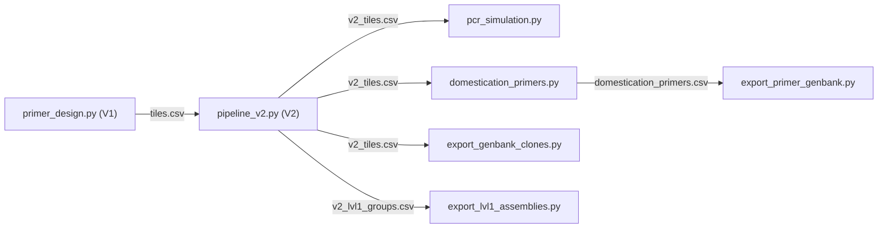
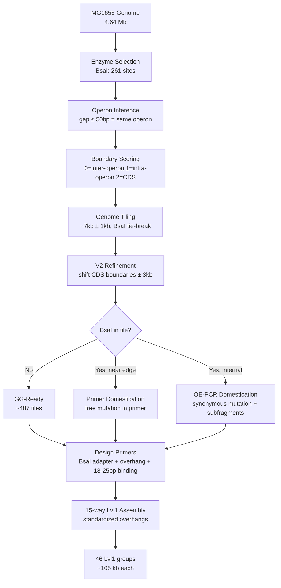

# MoClo Pipeline — Code Design Review

**Experiment:** EXP_001  
**Date:** 2026-02-26  
**Purpose:** Document every algorithmic decision in the MoClo genome tiling pipeline, with direct links to the code for review.

> [!TIP]
> **How to use this document:** Every function name is a clickable link that opens the code at the right line. Read a section, click the link to inspect the implementation, then come back.

---

## Table of Contents

1. [Pipeline Overview](#1-pipeline-overview)
2. [Enzyme Selection](#2-enzyme-selection)
3. [Genome Tiling Strategy](#3-genome-tiling-strategy)
4. [Primer Design](#4-primer-design)
5. [Restriction Site Domestication](#5-restriction-site-domestication)
6. [PCR Simulation & Validation](#6-pcr-simulation--validation)
7. [Lvl1 Assembly Design](#7-lvl1-assembly-design)
8. [GenBank Export](#8-genbank-export)
9. [Potential Issues & Open Questions](#9-potential-issues--open-questions)

---

## 1. Pipeline Overview

The pipeline exists in **two versions** that evolved over the project:

| | `primer_design.py` (V1) | `pipeline_v2.py` (V2) |
|---|---|---|
| **Tiles/Lvl1 group** | 11 (~77 kb) | 15 (~105 kb) |
| **Overhangs** | Genome-native (4 bp at each junction) | 16 standardized positional overhangs |
| **Boundary optimization** | 3-tier scoring (inter-operon > intra-operon > CDS) | Simple CDS-avoidance (shift in-CDS boundaries to nearest intergenic) |
| **Tm calculation** | Nearest-neighbor (SantaLucia 1998) | Wallace rule (simplified) |
| **BioPython** | Yes (record parsing, restriction analysis) | No (manual GenBank parsing) |

> [!IMPORTANT]
> V2 ([pipeline_v2.py](file:///Users/michaelsedbon/Documents/PhD/experiments/EXP_001/scripts/pipeline_v2.py)) is the **active pipeline** used to generate the final data. V1 ([primer_design.py](file:///Users/michaelsedbon/Documents/PhD/experiments/EXP_001/scripts/primer_design.py)) was the original prototype and generates the initial `tiles.csv` that V2 reads as input.

### Script dependency graph



---

## 2. Enzyme Selection

**Script:** [restriction_utils.py](file:///Users/michaelsedbon/Documents/PhD/experiments/EXP_001/scripts/restriction_utils.py)

### What it does
Scans the full MG1655 genome (U00096.3, 4,641,652 bp) for recognition sites of 8 Type IIS enzymes using BioPython's `Restriction` module.

### Key functions — review these

| Function | What it does | Link |
|---|---|---|
| `download_mg1655()` | Downloads genome from NCBI, caches locally | [L51–L85](file:///Users/michaelsedbon/Documents/PhD/experiments/EXP_001/scripts/restriction_utils.py#L51-L85) |
| `find_sites()` | Finds all recognition site positions for one enzyme | [L92–L114](file:///Users/michaelsedbon/Documents/PhD/experiments/EXP_001/scripts/restriction_utils.py#L92-L114) |
| `site_stats()` | Computes count, density, gap statistics | [L126–L154](file:///Users/michaelsedbon/Documents/PhD/experiments/EXP_001/scripts/restriction_utils.py#L126-L154) |
| `sites_per_window()` | Sliding window site count analysis | [L157–L184](file:///Users/michaelsedbon/Documents/PhD/experiments/EXP_001/scripts/restriction_utils.py#L157-L184) |
| `site_free_windows()` | Finds maximal site-free stretches ≥ 7 kb | [L187–L215](file:///Users/michaelsedbon/Documents/PhD/experiments/EXP_001/scripts/restriction_utils.py#L187-L215) |

### Choices made

| Decision | Choice | Rationale |
|---|---|---|
| Enzyme selected | **BsaI (GGTCTC)** | Only 261 sites in 4.64 Mb; 93.7% of genome in site-free ≥7 kb stretches |
| Search method | BioPython `RestrictionBatch.search()` on both strands | Correct handling of palindromes and reverse complement |
| Genome topology | `linear=False` (circular) | MG1655 is circular |
| Window size for analysis | 7 kb sliding window, 1 kb step | Matches target tile size |

---

## 3. Genome Tiling Strategy

### 3.1 V1: Operon-Aware Tiling

**Script:** [primer_design.py](file:///Users/michaelsedbon/Documents/PhD/experiments/EXP_001/scripts/primer_design.py)

#### Key functions — review these

| Function | What it does | Link |
|---|---|---|
| `extract_genes()` | Extracts CDS/tRNA/rRNA features from GenBank | [L214–L229](file:///Users/michaelsedbon/Documents/PhD/experiments/EXP_001/scripts/primer_design.py#L214-L229) |
| `infer_operons()` | Groups same-strand genes with gap ≤ 50 bp into operons | [L232–L251](file:///Users/michaelsedbon/Documents/PhD/experiments/EXP_001/scripts/primer_design.py#L232-L251) |
| `build_boundary_scores()` | Scores every bp: 0=inter-operon, 1=intra-operon, 2=CDS | [L334–L360](file:///Users/michaelsedbon/Documents/PhD/experiments/EXP_001/scripts/primer_design.py#L334-L360) |
| `tile_genome()` | Greedy tiling with score-based boundary selection | [L408–L450](file:///Users/michaelsedbon/Documents/PhD/experiments/EXP_001/scripts/primer_design.py#L408-L450) |
| `find_bsai_sites_detailed()` | Finds all BsaI sites with CDS annotation context | [L367–L405](file:///Users/michaelsedbon/Documents/PhD/experiments/EXP_001/scripts/primer_design.py#L367-L405) |

#### Boundary Scoring System

Each base pair gets a score (lower = better boundary):

```
Score 0: Inter-operon gap (best — between two transcription units)
Score 1: Intra-operon intergenic (between two genes in the same operon)  
Score 2: Inside a CDS (worst — scar would disrupt a gene)
```

#### Operon Inference — [infer_operons()](file:///Users/michaelsedbon/Documents/PhD/experiments/EXP_001/scripts/primer_design.py#L232-L251)

**Rule:** Genes on the **same strand** with intergenic gap ≤ 50 bp are grouped into one operon.  
**Parameter:** `OPERON_GAP_MAX = 50 bp`

> [!WARNING]
> **Review point:** The 50 bp threshold is a heuristic. It will miss operons with longer intergenic spacers (some *E. coli* operons have 100–200 bp UTRs). For our purpose (avoiding scars in functionally linked genes), it's conservative — we'd rather over-split than under-split.

#### Tiling Algorithm — [tile_genome()](file:///Users/michaelsedbon/Documents/PhD/experiments/EXP_001/scripts/primer_design.py#L408-L450)

- **Target tile size:** 7,000 bp  
- **Flexibility:** ±1,000 bp search window around the ideal cut  
- **Minimum tile size:** 3,000 bp (implicit from `search_start` constraint)

For each tile boundary:
1. Start at `ideal_end = pos + 7000`
2. Search window: `[pos + 6000, pos + 8000]`
3. Pick the position with the **lowest boundary score**
4. **Tie-breaker:** prefer positions **closest to a BsaI site** (within 25 bp = primer binding region) → free domestication

### 3.2 V2: CDS-Avoidance Refinement

**Script:** [pipeline_v2.py](file:///Users/michaelsedbon/Documents/PhD/experiments/EXP_001/scripts/pipeline_v2.py)

#### Key functions — review these

| Function | What it does | Link |
|---|---|---|
| `parse_genbank_sequence()` | Manual GenBank parser (no BioPython) | [L44–L57](file:///Users/michaelsedbon/Documents/PhD/experiments/EXP_001/scripts/pipeline_v2.py#L44-L57) |
| `parse_genbank_cds()` | Extracts CDS features manually | [L60–L109](file:///Users/michaelsedbon/Documents/PhD/experiments/EXP_001/scripts/pipeline_v2.py#L60-L109) |
| `is_in_cds()` | Checks if a position falls within any CDS | [L112–L119](file:///Users/michaelsedbon/Documents/PhD/experiments/EXP_001/scripts/pipeline_v2.py#L112-L119) |
| `find_nearest_intergenic()` | Shifts a CDS boundary to nearest intergenic, ±3 kb | [L122–L133](file:///Users/michaelsedbon/Documents/PhD/experiments/EXP_001/scripts/pipeline_v2.py#L122-L133) |
| `run_pipeline()` — boundary adjustment | V2 main loop: step 2, adjusting in-CDS boundaries | [L217–L245](file:///Users/michaelsedbon/Documents/PhD/experiments/EXP_001/scripts/pipeline_v2.py#L217-L245) |
| `run_pipeline()` — tile building | V2 main loop: step 3, building tiles with standardized overhangs | [L248–L289](file:///Users/michaelsedbon/Documents/PhD/experiments/EXP_001/scripts/pipeline_v2.py#L248-L289) |

V2 takes V1's tile boundaries and refines them: for each boundary inside a CDS, it searches outward ±3000 bp for the nearest intergenic position.

> [!WARNING]
> **Review point:** [find_nearest_intergenic()](file:///Users/michaelsedbon/Documents/PhD/experiments/EXP_001/scripts/pipeline_v2.py#L122-L133) always checks `pos + delta` before `pos - delta`, introducing a slight **rightward bias**.

---

## 4. Primer Design

### 4.1 V1 — [primer_design.py](file:///Users/michaelsedbon/Documents/PhD/experiments/EXP_001/scripts/primer_design.py)

#### Key functions — review these

| Function | What it does | Link |
|---|---|---|
| `calc_tm()` | Nearest-neighbor Tm (SantaLucia 1998, 250 nM primer, 50 mM salt) | [L125–L143](file:///Users/michaelsedbon/Documents/PhD/experiments/EXP_001/scripts/primer_design.py#L125-L143) |
| `_optimize_binding()` | Finds binding length (18–25 bp) closest to 60°C target | [L510–L532](file:///Users/michaelsedbon/Documents/PhD/experiments/EXP_001/scripts/primer_design.py#L510-L532) |
| `design_primer_pair()` | Full primer: BsaI adapter + overhang + binding | [L469–L507](file:///Users/michaelsedbon/Documents/PhD/experiments/EXP_001/scripts/primer_design.py#L469-L507) |
| `_domesticate_in_binding()` | Mutates BsaI sites overlapping the primer binding region | [L535–L571](file:///Users/michaelsedbon/Documents/PhD/experiments/EXP_001/scripts/primer_design.py#L535-L571) |

#### V1 Full Primer Structure

```
5'— extra —  BsaI  — spacer — overhang — binding —3'
     ...    CGTCTC     N       4 nt     18-25 nt
```

> [!CAUTION]
> **V1 uses `CGTCTC` (BsmBI) in primers, NOT `GGTCTC` (BsaI).** See [L491](file:///Users/michaelsedbon/Documents/PhD/experiments/EXP_001/scripts/primer_design.py#L491) and [L505](file:///Users/michaelsedbon/Documents/PhD/experiments/EXP_001/scripts/primer_design.py#L505). This is either a **bug** or an intentional two-enzyme strategy — needs clarification.

### 4.2 V2 — [pipeline_v2.py](file:///Users/michaelsedbon/Documents/PhD/experiments/EXP_001/scripts/pipeline_v2.py)

#### Key functions — review these

| Function | What it does | Link |
|---|---|---|
| `calc_tm()` | Simplified Wallace rule / basic salt-adjusted Tm | [L141–L149](file:///Users/michaelsedbon/Documents/PhD/experiments/EXP_001/scripts/pipeline_v2.py#L141-L149) |
| `design_primer()` | BsaI adapter (`GGTCTCA`) + standardized overhang + binding | [L152–L175](file:///Users/michaelsedbon/Documents/PhD/experiments/EXP_001/scripts/pipeline_v2.py#L152-L175) |

#### V2 Full Primer Structure

```
5'— BsaI adapter — overhang — binding —3'
     GGTCTCA        4 nt      18-25 nt
```

V2 correctly uses `GGTCTC` (BsaI). The `A` spacer gives BsaI room to cut.

#### Standardized Overhangs — [L25–L28](file:///Users/michaelsedbon/Documents/PhD/experiments/EXP_001/scripts/pipeline_v2.py#L25-L28)

16 pre-validated 4-nt fusion sites, assigned positionally so tiles at the same position are interchangeable across Lvl1 groups.

> [!WARNING]
> **Review point:** V2 uses a **much simpler Tm model** than V1. The Wallace rule is only accurate for very short oligos. For 1,300+ primers, consider using the V1 nearest-neighbor model. Compare: [V1 calc_tm()](file:///Users/michaelsedbon/Documents/PhD/experiments/EXP_001/scripts/primer_design.py#L125-L143) vs [V2 calc_tm()](file:///Users/michaelsedbon/Documents/PhD/experiments/EXP_001/scripts/pipeline_v2.py#L141-L149).

---

## 5. Restriction Site Domestication

### 5.1 Overview

Tiles with internal BsaI sites can't be cloned directly. Three strategies:

| Strategy | When used | Cost |
|---|---|---|
| **Primer domestication** | BsaI site within 25 bp of tile edge | Free — mutation in the primer |
| **Synonymous mutation + OE-PCR** | BsaI site in CDS, far from edge | 2 extra primers/site, N+1 PCR rxns |
| **Direct point mutation** | BsaI site in intergenic region | Same PCR cost, any base change works |

### 5.2 Primer Domestication (V1)

**Function:** [_domesticate_in_binding()](file:///Users/michaelsedbon/Documents/PhD/experiments/EXP_001/scripts/primer_design.py#L535-L571)

If a BsaI site overlaps the primer binding region:
1. Mutate the **3rd base** of the recognition site
2. Try all 3 alternative bases
3. Verify the mutated sequence no longer contains any BsaI site

### 5.3 Synonymous Mutation Design (V1)

**Function:** [_propose_synonymous()](file:///Users/michaelsedbon/Documents/PhD/experiments/EXP_001/scripts/primer_design.py#L616-L673)

For BsaI sites inside CDS:
1. Identify the reading frame of the affected gene
2. Try mutating positions 2, 3, 4, 1, 0, 5 of the recognition site (priority order — position 2 is likeliest to be a wobble position)
3. For each position: find the codon, try all synonymous codons, verify the BsaI site is destroyed
4. Handles both forward and reverse strand genes

### 5.4 Mutagenic Primer Design for OE-PCR

**Script:** [domestication_primers.py](file:///Users/michaelsedbon/Documents/PhD/experiments/EXP_001/scripts/domestication_primers.py)

#### Key functions — review these

| Function | What it does | Link |
|---|---|---|
| `parse_domestication_details()` | Parses mutation info from tiles.csv | [L122–L165](file:///Users/michaelsedbon/Documents/PhD/experiments/EXP_001/scripts/domestication_primers.py#L122-L165) |
| `design_mutagenic_primers()` | Designs overlapping mutagenic primers + splits tile into sub-fragments | [L209–L302](file:///Users/michaelsedbon/Documents/PhD/experiments/EXP_001/scripts/domestication_primers.py#L209-L302) |

For each BsaI site needing OE-PCR:
- **Mutagenic primers:** 15 bp upstream + mutated base + 15 bp downstream (~30 bp)
- **Sub-fragments:** Tile split at each mutation site. First/last fragments reuse the tile's original primers.

### 5.5 V2 Domestication

**Location:** [pipeline_v2.py, run_pipeline() step 6](file:///Users/michaelsedbon/Documents/PhD/experiments/EXP_001/scripts/pipeline_v2.py#L325-L413)

| Function | What it does | Link |
|---|---|---|
| `count_internal_bsai()` | Counts BsaI sites inside a tile | [L178–L184](file:///Users/michaelsedbon/Documents/PhD/experiments/EXP_001/scripts/pipeline_v2.py#L178-L184) |
| `check_junction_bsai()` | Checks if overhang + genome context creates a new BsaI site | [L187–L193](file:///Users/michaelsedbon/Documents/PhD/experiments/EXP_001/scripts/pipeline_v2.py#L187-L193) |
| Domestication loop | Finds sites and designs mutagenic primers | [L330–L413](file:///Users/michaelsedbon/Documents/PhD/experiments/EXP_001/scripts/pipeline_v2.py#L330-L413) |

> [!CAUTION]
> **Review point:** V2 domestication does **NOT** verify synonymous mutations — see [L353–L354](file:///Users/michaelsedbon/Documents/PhD/experiments/EXP_001/scripts/pipeline_v2.py#L353-L354). It just picks the transition (`G↔A`, `T↔C`) without checking the codon context. Could introduce **non-silent mutations** in essential genes. Compare with V1's careful [_propose_synonymous()](file:///Users/michaelsedbon/Documents/PhD/experiments/EXP_001/scripts/primer_design.py#L616-L673).

---

## 6. PCR Simulation & Validation

**Script:** [pcr_simulation.py](file:///Users/michaelsedbon/Documents/PhD/experiments/EXP_001/scripts/pcr_simulation.py)

| Function | What it does | Link |
|---|---|---|
| `simulate_pcr()` | Extracts amplicons, scans for internal BsaI sites | [L68–L128](file:///Users/michaelsedbon/Documents/PhD/experiments/EXP_001/scripts/pcr_simulation.py#L68-L128) |
| `analyze_lvl1_groups()` | Groups tiles into Lvl1 assemblies, reports completeness | [L151–L176](file:///Users/michaelsedbon/Documents/PhD/experiments/EXP_001/scripts/pcr_simulation.py#L151-L176) |

> [!WARNING]
> **Review point:** `simulate_pcr()` does not simulate primer specificity (no off-target check). It's really a BsaI site check — no BLAST-based primer specificity verification.

---

## 7. Lvl1 Assembly Design

#### V2 Lvl1 Group Building — [run_pipeline() step 7](file:///Users/michaelsedbon/Documents/PhD/experiments/EXP_001/scripts/pipeline_v2.py#L418-L442)

- 15 tiles per group, assigned sequentially
- [check_junction_bsai()](file:///Users/michaelsedbon/Documents/PhD/experiments/EXP_001/scripts/pipeline_v2.py#L187-L193) verifies that standardized overhangs don't accidentally create new BsaI sites
- `gg_ready` flag — [L312–L314](file:///Users/michaelsedbon/Documents/PhD/experiments/EXP_001/scripts/pipeline_v2.py#L312-L314): requires zero internal BsaI AND no junction BsaI

#### V2 Analysis Script

| Function | What it does | Link |
|---|---|---|
| `analyze_before_after()` | Before/after domestication comparison | [domestication_primers.py L324–L352](file:///Users/michaelsedbon/Documents/PhD/experiments/EXP_001/scripts/domestication_primers.py#L324-L352) |

---

## 8. GenBank Export

| Script | What it exports | Link |
|---|---|---|
| `export_genbank_clones.py` | 686 Lvl0 clone GenBank files (pICH41308 + insert) | [script](file:///Users/michaelsedbon/Documents/PhD/experiments/EXP_001/scripts/export_genbank_clones.py) |
| `export_lvl1_assemblies.py` | 46 Lvl1 assembly GenBank files | [script](file:///Users/michaelsedbon/Documents/PhD/experiments/EXP_001/scripts/export_lvl1_assemblies.py) |
| `export_primer_genbank.py` | 2,698 primer GenBank records | [script](file:///Users/michaelsedbon/Documents/PhD/experiments/EXP_001/scripts/export_primer_genbank.py) |

---

## 9. Potential Issues & Open Questions

### Critical — review these first

| # | Issue | Where to look | Severity |
|---|---|---|---|
| 1 | **V1 primers use `CGTCTC` (BsmBI) instead of `GGTCTC` (BsaI)** | [L491](file:///Users/michaelsedbon/Documents/PhD/experiments/EXP_001/scripts/primer_design.py#L491), [L505](file:///Users/michaelsedbon/Documents/PhD/experiments/EXP_001/scripts/primer_design.py#L505) | 🔴 |
| 2 | **V2 domestication doesn't verify synonymous mutations** | [L353–L354](file:///Users/michaelsedbon/Documents/PhD/experiments/EXP_001/scripts/pipeline_v2.py#L353-L354) | 🔴 |

### Moderate

| # | Issue | Where to look | Severity |
|---|---|---|---|
| 3 | V2 uses simplified Tm (Wallace) instead of NN model | [V2 L141](file:///Users/michaelsedbon/Documents/PhD/experiments/EXP_001/scripts/pipeline_v2.py#L141-L149) vs [V1 L125](file:///Users/michaelsedbon/Documents/PhD/experiments/EXP_001/scripts/primer_design.py#L125-L143) | 🟡 |
| 4 | No primer specificity check (off-target amplification) | [pcr_simulation.py](file:///Users/michaelsedbon/Documents/PhD/experiments/EXP_001/scripts/pcr_simulation.py#L68-L128) | 🟡 |
| 5 | Rightward bias in boundary adjustment | [L129](file:///Users/michaelsedbon/Documents/PhD/experiments/EXP_001/scripts/pipeline_v2.py#L128-L131) | 🟢 |

### Open questions

1. **Is `CGTCTC` in V1 intentional?** → Check [L491](file:///Users/michaelsedbon/Documents/PhD/experiments/EXP_001/scripts/primer_design.py#L491)
2. **Switch V2 Tm to nearest-neighbor?** → The code is already in [V1 L110–L143](file:///Users/michaelsedbon/Documents/PhD/experiments/EXP_001/scripts/primer_design.py#L110-L143)
3. **Are the 16 standardized overhangs validated?** → They're declared at [L25–L28](file:///Users/michaelsedbon/Documents/PhD/experiments/EXP_001/scripts/pipeline_v2.py#L25-L28) but the validation code isn't in the repo
4. **Codon usage bias** — synonymous mutations don't consider *E. coli* codon preference
5. **Add BLAST-based primer specificity?** — straightforward with BioPython

---

## Summary of Design Decisions


