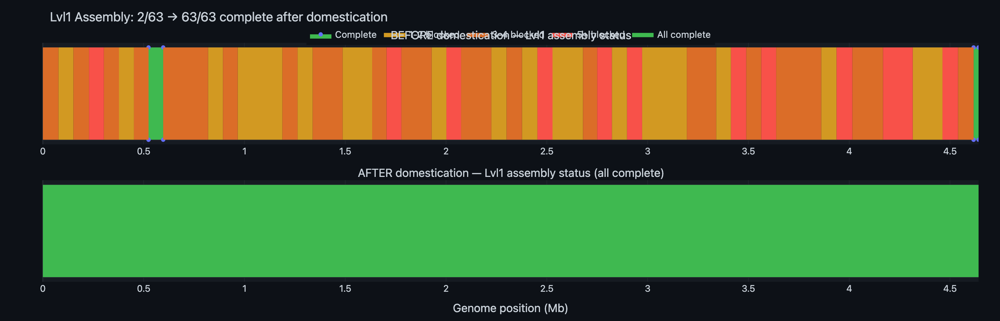
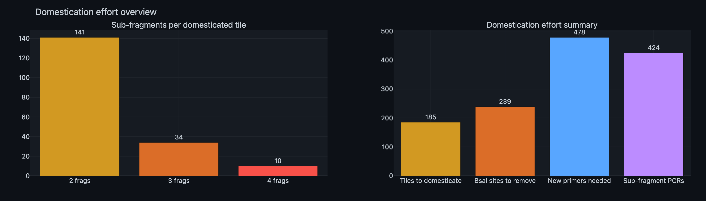
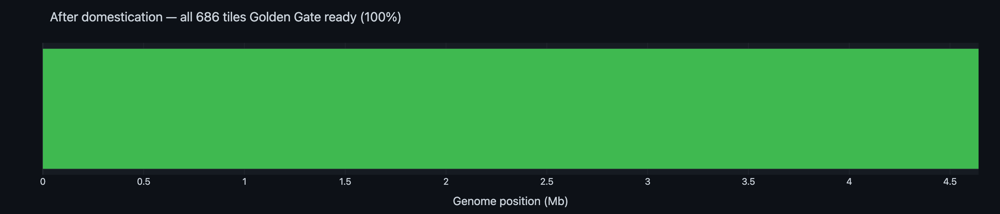

# Domestication Primer Design Report

**Experiment:** EXP_001  
**Date:** 2026-02-20  
**Author:** Michael Sedbon  
**Objective:** Design mutagenic primers for overlap extension PCR to domesticate all 199 blocked tiles, making the full genome Golden Gate-assemblable

---

## 1. Background

From the [PCR simulation](PCR_SIMULATION_REPORT.md), 199 of 686 tiles contain internal BsaI sites that would cause unwanted cleavage during Golden Gate assembly. These sites must be destroyed ("domesticated") by introducing silent mutations.

- **22 tiles** have sites near the tile boundaries — already domesticated by incorporating the mutation into the original amplification primers
- **185 tiles** have sites deep within the tile — require **overlap extension PCR**

---

## 2. Overlap Extension PCR Protocol

Internal BsaI sites can't be removed with external primers alone. Each site requires **mutagenic primer pairs** that overlap at the mutation point, splitting the tile into sub-fragments.

**Overlap Extension PCR** (OE-PCR), also called **SOEing PCR** (Splicing by Overlap Extension), was developed by Ho et al. (1989) and Horton et al. (1989). It is a standard molecular biology technique used routinely for site-directed mutagenesis, gene fusion, and restriction site removal in cloning workflows including MoClo/Golden Gate domestication (Weber et al., 2011).

### How it works

The principle is that two PCR products with **identical overlapping sequences** at their ends will self-assemble when mixed, denatured, and re-annealed:

```
1. Amplify sub-fragments with mutagenic primers that share ~40 bp of overlap:

   Fragment A:  5'════════════OVERLAP──3'
   Fragment B:           3'──OVERLAP════════════5'
                               ↑
                         (mutation is here, encoded in both fragments)

2. Mix fragments → denature at 95°C → anneal at 55°C:

   The complementary overlap regions hybridize:
       5'════════════OVERLAP
                     ||||||||||
                     OVERLAP════════════5'

3. DNA polymerase extends both 3' ends → full-length product:

       5'════════════OVERLAP════════════3'
       3'════════════OVERLAP════════════5'

4. Outer primers (F + R) amplify the full-length domesticated tile.
```

No ligase or restriction enzymes are needed — the overlapping ends act as mutual primers.

### Case 1: Tile with 1 internal BsaI site → 2 sub-fragments

```
Original tile (~7 kb):
  ═══════════════╋═══════════════
  F→             ▲             ←R
              BsaI site

Step 1: Two PCRs with mutagenic primers (mF, mR overlap at mutation site)
  PCR-A: F → mR     ═══════╗
  PCR-B: mF → R            ╚═══════

Step 2: Overlap extension PCR
  Mix PCR-A + PCR-B, amplify with F + R:
  ═══════════════╋═══════════════
                 ✓ (site destroyed by silent mutation)
```

**Total reactions:** 2 sub-fragment PCRs + 1 overlap assembly = **3 PCRs per tile**

### Case 2: Tile with 2 internal BsaI sites → 3 sub-fragments

```
  ═══════╋═══════╋═══════
  F→     ▲       ▲     ←R
       site 1  site 2

Step 1: Three PCRs
  PCR-A: F → mR₁     ════╗
  PCR-B: mF₁ → mR₂       ╠════╗
  PCR-C: mF₂ → R               ╚════

Step 2: Overlap extension PCR
  Mix A + B + C, amplify with F + R
```

**Total reactions:** 3 sub-fragment PCRs + 1 overlap assembly = **4 PCRs per tile**

### Case 3: Tile with 3 internal BsaI sites → 4 sub-fragments

```
  ══════╋══════╋══════╋══════
  F→    ▲      ▲      ▲    ←R
      site 1  site 2  site 3

Step 1: Four PCRs
  PCR-A: F → mR₁      ═══╗
  PCR-B: mF₁ → mR₂       ╠═══╗
  PCR-C: mF₂ → mR₃           ╠═══╗
  PCR-D: mF₃ → R                  ╚═══

Step 2: Overlap extension PCR
  Mix A + B + C + D, amplify with F + R
```

**Total reactions:** 4 sub-fragment PCRs + 1 overlap assembly = **5 PCRs per tile**

> **Key point:** A tile with N internal BsaI sites requires **N+1 individual PCRs** to generate overlapping sub-fragments, followed by **1 overlap extension PCR** to assemble the full domesticated tile. Each mutation is a single silent nucleotide change that destroys the GGTCTC/GAGACC recognition sequence without changing the encoded amino acid.

---

## 3. Domestication Summary

### Tiles by domestication strategy

| Strategy | Tiles | Internal sites | New primers | PCR reactions |
|----------|-------|----------------|-------------|---------------|
| Already ready (no sites) | 487 | 0 | 0 | 487 (1 per tile) |
| Primer overlap (near boundary) | 22 | 22 | 0 | 22 (1 per tile) |
| OE-PCR: 1 site → 2 frags | 141 | 141 | 282 | 423 (3 per tile) |
| OE-PCR: 2 sites → 3 frags | 34 | 68 | 136 | 136 (4 per tile) |
| OE-PCR: 3 sites → 4 frags | 10 | 30 | 60 | 50 (5 per tile) |
| **Total** | **686** | **261** | **478** | **1,118** |

### Grand totals

| Metric | Value |
|--------|-------|
| Tiles needing overlap extension PCR | **185** |
| BsaI sites to destroy | **239** |
| New mutagenic primers to order | **478** |
| Sub-fragment PCRs | **424** |
| Overlap extension assemblies | **185** |
| **Total PCR reactions (entire project)** | **1,118** |

---

## 4. Mutation Types

All mutations are **synonymous** (silent) — they change the DNA sequence but preserve the encoded amino acid. For sites in intergenic regions, the most conservative single nucleotide change is used.

| Mutation type | Count | Examples |
|---------------|-------|---------|
| GGT→GGC (Gly) | many | Destroys **GG**T**CTC** by changing T→C at position 3 |
| GAC→GAT (Asp) | many | Destroys **G**A**GACC** (rev) by changing C→T |
| GTC→GTT (Val) | many | Destroys G**GTC**TC by changing C→T at position 4 |
| GAG→GAA (Glu) | many | Destroys **GAGACC** (rev) by changing G→A |
| Intergenic | few | Single nt change in non-coding region |

---

## 5. Result: Assembly After Domestication

### Before vs After

| Metric | Before | After |
|--------|--------|-------|
| Tiles GG-ready | 487/686 (71%) | **686/686 (100%)** |
| Complete Lvl1 groups | 2/63 (3%) | **63/63 (100%)** |
| Assemblable genome | 97,181 bp (2.1%) | **4,641,652 bp (100%)** |



[→ Interactive version](data/domestication_before_after.html)

### Effort overview



[→ Interactive version](data/domestication_effort.html)

### All tiles ready



[→ Interactive version](data/tiles_after_domestication.html)

---

## 6. Output Files

| File | Description |
|------|-------------|
| [domestication_primers.csv](data/domestication_primers.csv) | 239 mutagenic primer pairs: sequences, Tm, mutation details |
| [domestication_subfragments.csv](data/domestication_subfragments.csv) | 424 sub-fragment definitions: coordinates, primers, Tm |

### Script

[domestication_primers.py](domestication_primers.py) — run with `python3 domestication_primers.py`

---

## 7. References

1. **Ho, S.N., Hunt, H.D., Horton, R.M., Pullen, J.K., Pease, L.R.** (1989). Site-directed mutagenesis by overlap extension using the polymerase chain reaction. *Gene*, 77(1), 51–59. [doi:10.1016/0378-1119(89)90358-2](https://doi.org/10.1016/0378-1119(89)90358-2)  
   — *Original paper describing OE-PCR for introducing point mutations, the exact technique used here.*

2. **Horton, R.M., Hunt, H.D., Ho, S.N., Pullen, J.K., Pease, L.R.** (1989). Engineering hybrid genes without the use of restriction enzymes: gene splicing by overlap extension. *Gene*, 77(1), 61–68. [doi:10.1016/0378-1119(89)90359-4](https://doi.org/10.1016/0378-1119(89)90359-4)  
   — *Companion paper coining the term "gene SOEing" (Splicing by Overlap Extension).*

3. **Horton, R.M., Cai, Z.L., Ho, S.N., Pease, L.R.** (1990). Gene splicing by overlap extension: tailor-made genes using the polymerase chain reaction. *BioTechniques*, 8(5), 528–535. [PMID: 2357375](https://pubmed.ncbi.nlm.nih.gov/2357375/)  
   — *Detailed protocol and extended applications.*

4. **Weber, E., Engler, C., Gruetzner, R., Werner, S., Marillonnet, S.** (2011). A modular cloning system for standardized assembly of multigene constructs. *PLoS ONE*, 6(2), e16765. [doi:10.1371/journal.pone.0016765](https://doi.org/10.1371/journal.pone.0016765)  
   — *MoClo system for Golden Gate assembly; describes domestication of parts with internal Type IIS sites.*
