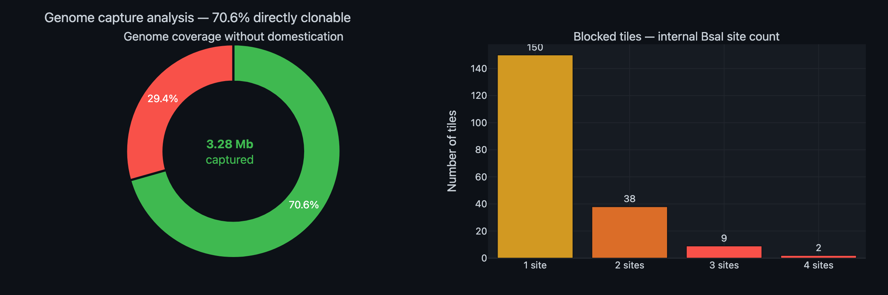
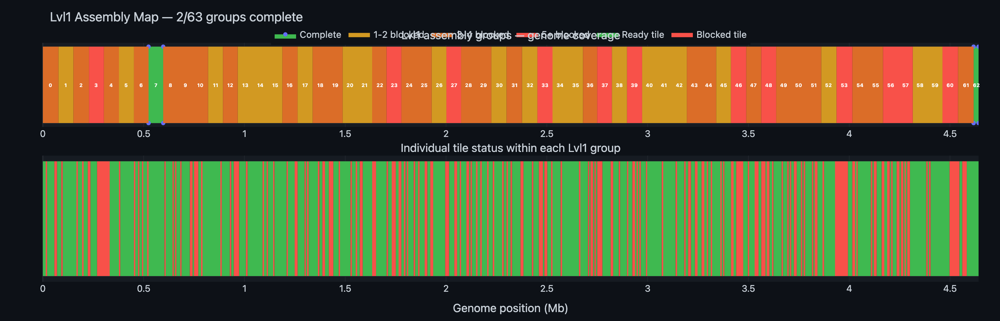
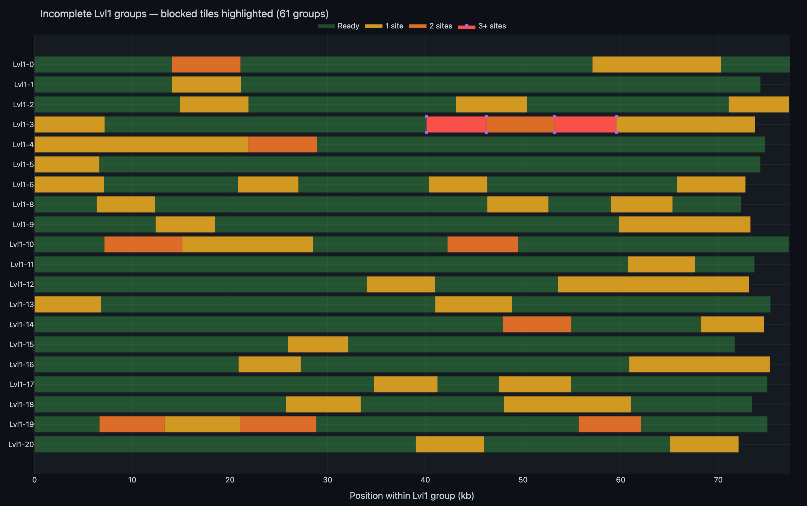

# PCR Simulation & Assembly Feasibility Report

**Experiment:** EXP_001  
**Date:** 2026-02-20  
**Author:** Michael Sedbon  
**Objective:** Simulate in-silico PCR for all 686 Lvl0 tiles, classify Golden Gate readiness, and map Lvl1 assembly completeness across the genome

---

## 1. In-silico PCR Simulation

All 686 primer pairs were used to extract amplicons from the MG1655 genome. Each amplicon was scanned for internal BsaI recognition sites (GGTCTC / GAGACC) — any internal site would cause unwanted cleavage during Golden Gate assembly.

| Metric | Value |
|--------|-------|
| PCR amplicons | **686** |
| Total amplified | **4.64 Mb** (100% of genome) |
| Amplicon GC content | 50.8% ± 3.1% (range 35.9–62.7%) |

### Golden Gate readiness

| Status | Tiles | % | Base pairs | % of genome |
|--------|-------|---|-----------|-------------|
| **Ready** (0 internal BsaI) | **487** | **71.0%** | **3,277,943** | **70.6%** |
| Needs domestication | 199 | 29.0% | 1,363,709 | 29.4% |

### Blocked tile breakdown

| Internal BsaI sites | Tiles | Base pairs |
|---------------------|-------|-----------|
| 1 site | 150 | 1,026,770 |
| 2 sites | 38 | 263,320 |
| 3 sites | 9 | 60,672 |
| 4 sites | 2 | 12,947 |

[→ Interactive version](data/pcr_simulation.html)

---

## 2. Lvl1 Assembly Analysis

The 686 tiles are grouped into **63 Lvl1 sets** of 11 tiles each. A Lvl1 group is "complete" only if **all** constituent tiles are Golden Gate ready (0 internal BsaI sites).

| Metric | Value | % |
|--------|-------|---|
| Complete Lvl1 groups | **2** | **3%** |
| Incomplete Lvl1 groups | **61** | **97%** |
| Genome in complete groups | 97,181 bp | 2.1% |
| Genome in incomplete groups | 4,544,471 bp | 97.9% |

This is a critical finding: although 71% of tiles are individually ready, only **3%** of Lvl1 groups can be fully assembled without domestication. Each incomplete group is blocked by 1–8 tiles that need silent mutations introduced.

### Genome coverage (without domestication)

[→ Interactive version](data/genome_coverage.html)

---

## 3. Lvl1 Assembly Map

Top row: Lvl1 groups coloured by completeness (green = complete, yellow = 1–2 blocked tiles, orange = 3–4, red = 5+). Bottom row: individual tiles (green = ready, red = blocked).

[→ Interactive version](data/lvl1_assembly_map.html)

### Complete Lvl1 groups

Only 2 groups are fully assemblable:

| Group | Start | End | Length |
|-------|-------|-----|--------|
| 7 | 524,379 | 596,973 | 72,594 bp |
| 62 | 4,617,065 | 4,641,652 | 24,587 bp |

---

## 4. Incomplete Lvl1 Groups — Detail

The chart below shows the internal structure of each incomplete Lvl1 group. Bright tiles are blocked; dimmed tiles are ready.

[→ Interactive version](data/incomplete_lvl1_detail.html)

### Most blocked groups

These Lvl1 groups have the highest domestication burden:

| Group | Ready | Blocked | Blocked tiles |
|-------|-------|---------|---------------|
| 53 | 3/11 | **8** | T583(1s), T584(3s), T585(2s), T586(2s), T587(1s), T588(1s), T589(2s), T590(2s) |
| 46 | 4/11 | **7** | T506(1s), T507(3s), T510(1s), T511(1s), T512(1s), T513(1s), T514(1s) |
| 3 | 5/11 | **6** | T33(1s), T39(3s), T40(2s), T41(3s), T42(1s), T43(1s) |
| 23 | 5/11 | **6** | T253(1s), T257(1s), T258(1s), T259(1s), T262(1s), T263(1s) |
| 48 | 5/11 | **6** | T528(1s), T529(2s), T530(1s), T532(2s), T533(2s), T536(1s) |
| 57 | 5/11 | **6** | T627(1s), T629(1s), T630(1s), T632(1s), T634(2s), T635(1s) |
| 60 | 5/11 | **6** | T665(2s), T666(1s), T667(3s), T668(2s), T669(3s), T670(1s) |

---

## 5. Practical Implications

### Without domestication
- **71% of tiles** can be PCR-amplified and cloned into Lvl0 plasmids directly
- But only **2 of 63 Lvl1 groups** can be fully assembled
- This means **97.9% of the genome** cannot be assembled into complete Lvl1 constructs

### Domestication strategy (priority order)
1. **Single-site tiles (150 tiles):** One synonymous mutation each — use overlap extension PCR or synthesize a short domestication oligo
2. **2-site tiles (38 tiles):** Two mutations. Consider gene synthesis for tiles with mutations close together
3. **3–4 site tiles (11 tiles):** Gene synthesis likely more practical than multi-step overlap extension

### Prioritization
Start domestication with Lvl1 groups that need only 1–2 tiles fixed:
- **13 groups** need domestication of just **1 tile** each
- **11 groups** need domestication of **2 tiles** each
- Together, these 24 groups cover ~1.78 Mb and would bring total assemblable Lvl1 coverage from 2.1% to ~40%

---

## 6. Output Files

| File | Description |
|------|-------------|
| [pcr_simulation.csv](data/pcr_simulation.csv) | Per-tile PCR results: GC%, internal sites, readiness |
| [lvl1_assembly_summary.csv](data/lvl1_assembly_summary.csv) | Per-group summary: completeness, blocked tile IDs |

### Interactive visualizations

| Plot | Link |
|------|------|
| PCR tile status | [pcr_simulation.html](data/pcr_simulation.html) |
| Lvl1 assembly map | [lvl1_assembly_map.html](data/lvl1_assembly_map.html) |
| Genome coverage donut | [genome_coverage.html](data/genome_coverage.html) |
| Incomplete Lvl1 detail | [incomplete_lvl1_detail.html](data/incomplete_lvl1_detail.html) |

### Script

[pcr_simulation.py](pcr_simulation.py) — run with `python3 pcr_simulation.py`
