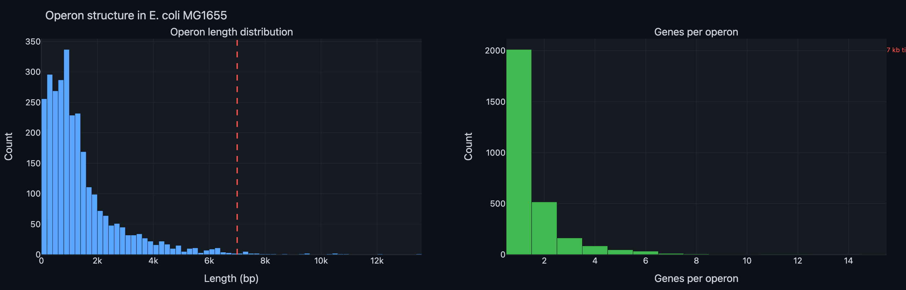
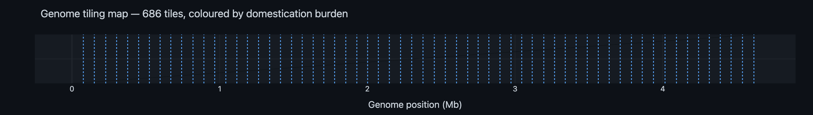

# Primer Design Report — Golden Gate Genome Tiling

**Experiment:** EXP_001  
**Date:** 2026-02-20  
**Author:** Michael Sedbon  
**Objective:** Design PCR primers to tile the *E. coli* MG1655 genome into ~7 kb BsaI Golden Gate fragments (Lvl0), grouped for 11-fragment Lvl1 assembly

---

## 1. Operon Analysis

### 1.1 Inference method

*E. coli* MG1655 (GenBank U00096.3) has no explicit operon annotations. We inferred operons by grouping consecutive same-strand genes with intergenic gaps ≤ 50 bp. Genes separated by a strand switch or a gap > 50 bp define an operon boundary.

Source: 4,534 gene features (4,318 CDS + 86 tRNA + 22 rRNA + 108 ncRNA).

### 1.2 Results

| Metric | Value |
|--------|-------|
| Total operons inferred | **2,882** |
| Singletons (1 gene) | 2,012 (70%) |
| Multi-gene operons | 870 (30%) |

**Operon length:**

| Statistic | Value |
|-----------|-------|
| Median | 999 bp |
| Mean | 1,419 bp |
| Max | 13,582 bp (*hyfA–hyfR*, 15 genes) |
| Min | 27 bp |

**Genes per operon:**

| Genes | Operons | % |
|-------|---------|---|
| 1 | 2,012 | 69.8% |
| 2 | 516 | 17.9% |
| 3 | 163 | 5.7% |
| 4 | 85 | 2.9% |
| 5 | 47 | 1.6% |
| 6 | 33 | 1.1% |
| 7+ | 26 | 0.9% |

The vast majority of operons (>99%) fit within a single 7 kb tile. Only 5 operons exceed 7 kb, and these can be accommodated by adjusting tile boundaries within the operon rather than across it.



[→ Interactive version](data/operon_length_distribution.html)

### 1.3 Genomic landscape

The genome was classified into three boundary-quality zones:

| Zone | Base pairs | % of genome | Tile boundary quality |
|------|-----------|-------------|----------------------|
| Inter-operon intergenic | 618,479 | 13.3% | **Best** — no operon disrupted |
| Intra-operon intergenic | 16,549 | 0.4% | Acceptable — within operon but between genes |
| Inside CDS | 4,006,624 | 86.3% | Worst — disrupts a coding sequence |

Despite 86% of the genome being CDS, the 13% of inter-operon intergenic space is distributed across 2,882 gaps — roughly one every 1.6 kb — giving the tiling algorithm ample opportunity to find a good boundary near every ~7 kb step.

---

## 2. Tiling Algorithm

### 2.1 Strategy

The genome was tiled in a single pass:

1. Walk from position 0 in ~7 kb steps
2. At each step, search a ±1 kb window around the ideal cut point
3. Score every position in the window:
   - **Score 0:** Inter-operon intergenic gap (best)
   - **Score 1:** Intra-operon intergenic region
   - **Score 2:** Inside a CDS (worst)
4. Pick the position with the lowest score
5. **Tie-break:** Prefer positions **near a BsaI site** (within 25 bp), so the primer binding region can overlap the site and introduce a silent mutation during PCR — domesticating it for free

### 2.2 Results

| Metric | Value |
|--------|-------|
| Total tiles | **686** |
| Tile size (median) | 6,859 bp |
| Tile size (mean) | 6,766 bp |
| Tile size (range) | 2,122 – 7,984 bp |

**Boundary quality:**

| Boundary type | Count | % |
|--------------|-------|---|
| Inter-operon gap | **557** | **81.2%** |
| Intra-operon gap | 75 | 10.9% |
| Inside CDS | 54 | 7.9% |

81% of all tile boundaries fall at inter-operon intergenic regions — no operon is disrupted at these junctions. The 54 CDS-internal boundaries occur in genome regions where no intergenic space exists within the ±1 kb search window (typically in dense gene clusters on a single strand).

---

## 3. Primer Design

### 3.1 Primer structure

Each primer follows the standard BsaI Golden Gate format:

```
5'- CGTCTC N [4-nt overhang] [binding region 18–25 bp] -3'
         ↑           ↑              ↑
    BsaI site    1-nt spacer    genomic sequence
```

- **BsaI recognition site** (CGTCTC / reverse: GAGACC) — cleaved by BsaI to expose the overhang
- **1-nt spacer** (N) — between recognition site and overhang (NEB/Thermo recommendation)
- **4-nt overhang** — the junction sequence that drives ordered assembly
- **Binding region** — 18–25 bp of genomic sequence, length tuned to hit Tm ≈ 60°C

### 3.2 Tm optimisation

Binding region length was adjusted (18–25 bp) to minimise |Tm − 60°C| using the SantaLucia (1998) nearest-neighbor model at 250 nM primer and 50 mM Na⁺.

| | Mean Tm | Std | Min | Max |
|---|---------|-----|-----|-----|
| Forward primers | 57.5°C | ±3.6°C | 44.8°C | 67.6°C |
| Reverse primers | 57.6°C | ±3.5°C | 41.6°C | 66.8°C |

Most primers cluster near 58–62°C. A small number of AT-rich or GC-rich regions produce outliers; these could be manually adjusted during ordering.

### 3.3 Primer-based domestication

When a BsaI recognition site falls within the primer binding region (≤ 25 bp from a tile boundary), the primer itself encodes a silent mutation that destroys the site. This eliminates the internal site during PCR without any extra steps.

**22 BsaI sites** were domesticated this way — the primer sequence already contains the synonymous substitution.

---

## 4. BsaI Domestication

### 4.1 Overall burden

| Internal BsaI sites | Tiles | % | Action required |
|---------------------|-------|---|-----------------|
| **0** | **487** | **71.0%** | None — clone directly |
| 1 | 150 | 21.9% | 1 overlap extension / synthesis |
| 2 | 38 | 5.5% | 2 mutations |
| 3 | 9 | 1.3% | 3 mutations |
| 4 | 2 | 0.3% | 4 mutations |

- **Primer-domesticated:** 22 sites (silent mutations encoded directly in the primer)
- **Extra domestication needed:** 239 sites (require overlap extension PCR or gene synthesis)

### 4.2 Mutation strategy

For each internal BsaI site, the script proposes a specific synonymous codon change:

- **Sites in CDS:** Identify the codon containing the critical base of the BsaI recognition site (GGTCTC). Find a synonymous codon where the substituted base destroys the recognition site. Example: `pos 14838: C→T (GAC→GAT, D, dnaJ)` — aspartate codon changed from GAC to GAT, both encode Asp, but the BsaI site is destroyed.
- **Sites in intergenic regions:** A single base change at position 3 of the recognition site (e.g., GGT**C**TC → GGT**A**TC).

All proposed mutations are recorded in `tiles.csv` under the `domestication_details` column.

---

## 5. Lvl1 Assembly & Overhang Design

### 5.1 Hierarchical assembly

The 686 Lvl0 tiles are grouped into **63 Lvl1 sets** of 11 tiles each (the last group may have fewer). Each Lvl1 set assembles into a single ~77 kb Lvl1 T7 replisome plasmid via 11-fragment Golden Gate.

### 5.2 Junction overhangs

The 4-nt overhang at each tile boundary is simply the **genomic sequence** at that junction:
- Forward primer overhang = first 4 nt of the tile
- Reverse primer overhang = reverse complement of the last 4 nt of the tile
- Adjacent tiles share the junction sequence, ensuring correct ligation order

### 5.3 Uniqueness verification

For each of the 63 Lvl1 groups, we verified that all junction overhangs (N+1 junctions for N tiles) are **unique** within the group. This is required for correct ordered Golden Gate assembly.

**Result: all 63 groups pass uniqueness verification ✓**

### 5.4 Mix-and-match compatibility

Because junction overhangs are derived from the genomic sequence (not arbitrary barcodes), tiles can be reassigned to different Lvl1 groups in future experiments. The only constraint is that junction overhangs must remain unique within the new group — which can be verified computationally before ordering.

---

## 6. Tiling Map

The genome map below shows all 686 tiles coloured by domestication burden. Blue dashed lines mark Lvl1 group boundaries (every 11 tiles).



[→ Interactive version](data/tiling_map.html)

---

## 7. Output Files

### Data files

| File | Description |
|------|-------------|
| [tiles.csv](data/tiles.csv) | Complete primer table: tile coordinates, primer sequences, Tm, overhangs, Lvl1 group, domestication details |
| [tiling_summary.csv](data/tiling_summary.csv) | High-level summary statistics |

### Key columns in `tiles.csv`

| Column | Description |
|--------|-------------|
| `tile` | Tile index (0–685) |
| `start`, `end`, `length` | Genomic coordinates (0-based) |
| `lvl1_group` | Which Lvl1 assembly group (0–62) |
| `overhang_left`, `overhang_right` | 4-nt junction sequences |
| `fwd_primer`, `rev_primer` | Full primer sequences (including BsaI site + overhang + binding) |
| `fwd_tm`, `rev_tm` | Melting temperatures (°C) |
| `boundary_type` | `inter-operon`, `intra-operon`, or `in-CDS` |
| `internal_bsai_total` | Total internal BsaI sites |
| `primer_domesticated` | Sites eliminated by primer overlap |
| `extra_domestication` | Sites needing overlap extension / synthesis |
| `domestication_details` | Specific mutations: position, base change, codon, gene |

### Scripts

| Script | Purpose |
|--------|---------|
| [primer_design.py](primer_design.py) | This analysis — run with `python3 primer_design.py` |
| [restriction_utils.py](restriction_utils.py) | Genome download and site mapping utilities |
