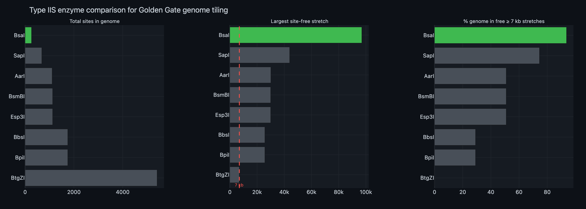
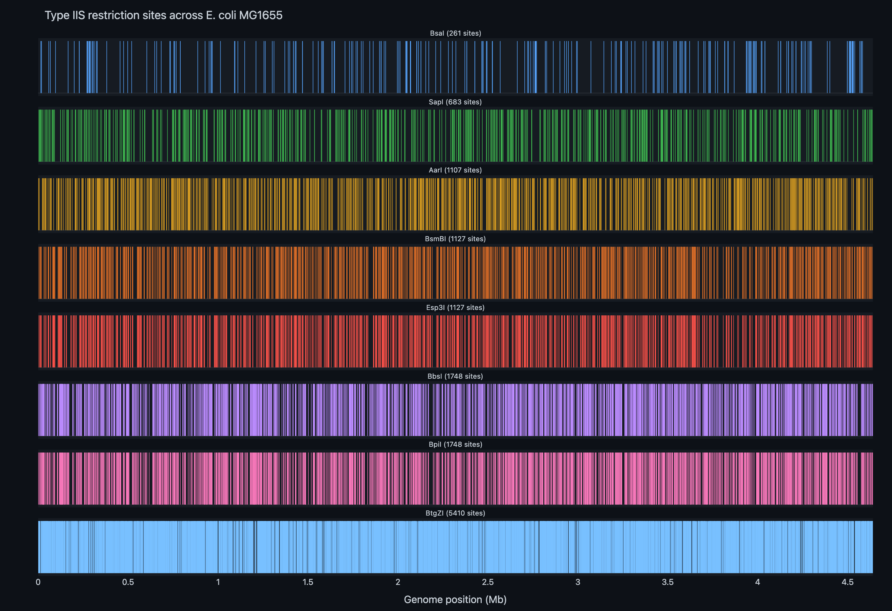
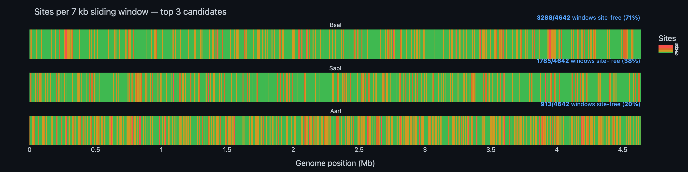
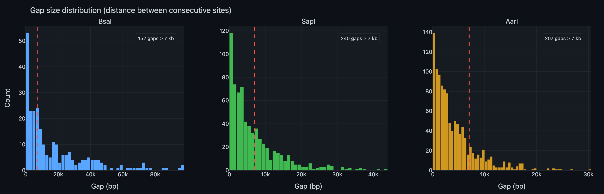
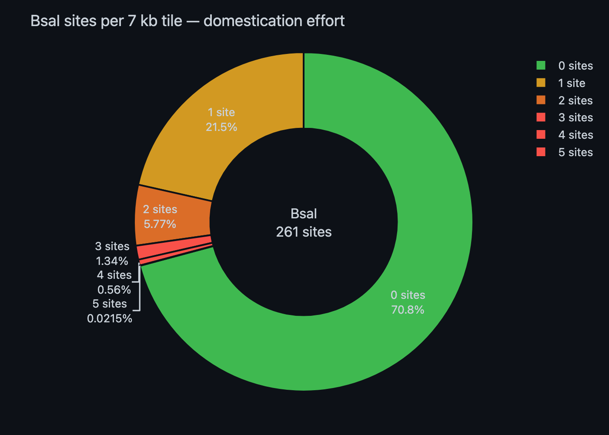

# Restriction Site Analysis — Comprehensive Report

**Experiment:** EXP_001  
**Date:** 2026-02-20  
**Author:** Michael Sedbon  
**Objective:** Identify the optimal Type IIS restriction enzyme for Golden Gate assembly of ~7 kb PCR-amplified tiles from the *E. coli* MG1655 genome

---

## 1. Background & Rationale

### 1.1 The Genome Tiling Strategy

Work Package 2 of the Sedbon_BF grant proposes a **polyploidy-inspired genome-scale hypermutation** system. The core idea is to create a "distributed diploid" in *E. coli*, where a T7 replisome plasmid carries tiled segments of the native genome. This second copy undergoes hypermutation (~100,000× higher than baseline) via an error-prone T7 DNA polymerase, enabling genome-wide exploration of evolvability under stress.

The tiling strategy requires:
1. **PCR amplification** of ~7 kb fragments spanning the entire *E. coli* genome
2. **Golden Gate assembly** into Level 0 (Lvl0) MoClo entry plasmids
3. **11-fragment Golden Gate assembly** from Lvl0 into Level 1 (Lvl1) T7 replisome plasmids

### 1.2 Why Enzyme Choice Matters

Golden Gate cloning relies on a **Type IIS restriction enzyme** that cuts outside its recognition sequence, generating custom 4-nt overhangs for scarless, directional assembly. However, if the enzyme's recognition site occurs **inside** a PCR fragment, the insert will be cut during assembly — destroying it.

For a whole-genome tiling project with ~660 tiles (4.64 Mb ÷ 7 kb), the ideal enzyme should have:
- **As few recognition sites as possible** in the target genome
- **Large site-free stretches** (≥ 7 kb), so most tiles need no modification
- For tiles with internal sites, only **1–2 sites** that can be eliminated by introducing silent mutations during PCR (called "domestication")

### 1.3 Candidate Enzymes

We screened **8 commonly used Type IIS enzymes** for Golden Gate assembly:

| Enzyme | Recognition site | Cut position | Commercial source |
|--------|-----------------|-------------|-------------------|
| BsaI | GGTCTC | 1/5 | NEB, Thermo |
| BbsI | GAAGAC | 2/6 | NEB, Thermo |
| BsmBI | CGTCTC | 1/5 | NEB |
| SapI | GCTCTTC | 1/4 | NEB |
| BtgZI | GCGATG | 10/14 | NEB |
| AarI | CACCTGC | 4/8 | Thermo |
| Esp3I | CGTCTC | 1/5 | Thermo (BsmBI isoschizomer) |
| BpiI | GAAGAC | 2/6 | Thermo (BbsI isoschizomer) |

> **Note:** Esp3I and BsmBI recognise the same sequence (CGTCTC) — they are isoschizomers and produce identical results. The same applies to BbsI and BpiI (GAAGAC).

---

## 2. Methods

### 2.1 Genome Sequence

- **Organism:** *Escherichia coli* str. K-12 substr. MG1655
- **Accession:** GenBank [U00096.3](https://www.ncbi.nlm.nih.gov/nuccore/U00096.3)
- **Genome length:** 4,641,652 bp (circular)
- **Annotation:** 4,651 genes, 4,318 CDS

The genome was downloaded from NCBI Entrez and cached locally.

### 2.2 Site Mapping

For each enzyme, we scanned **both strands** of the genome for exact matches to the recognition sequence using Biopython's `Restriction` module. Positions are reported as the first base of the recognition site on the sense strand.

### 2.3 Metrics Computed

For each enzyme, we calculated:

1. **Total site count** — number of recognition sites in the genome
2. **Site density** — sites per kilobase
3. **Inter-site gap statistics** — mean, median, min, and max distance between consecutive sites
4. **7 kb sliding window analysis** — a 7 kb window slid in 1 kb steps across the genome, counting sites in each window (4,642 windows total)
5. **Site-free stretches** — maximal contiguous regions ≥ 7 kb with zero recognition sites
6. **% genome coverage** — fraction of genome within site-free stretches ≥ 7 kb

---

## 3. Results

### 3.1 Summary Statistics

| Enzyme | Recognition | Total sites | Sites/kb | Mean gap (bp) | Min gap (bp) | Max gap (bp) | Site-free 7kb windows | % genome in free ≥7kb stretches |
|--------|------------|-------------|----------|---------------|-------------|-------------|----------------------|-------------------------------|
| **BsaI** | **GGTCTC** | **261** | **0.06** | **17,784** | **10** | **96,974** | **152** | **93.7%** |
| SapI | GCTCTTC | 683 | 0.15 | 6,796 | 3 | 43,956 | 240 | 74.5% |
| AarI | CACCTGC | 1,107 | 0.24 | 4,193 | 1 | 30,137 | 207 | 50.9% |
| BsmBI | CGTCTC | 1,127 | 0.24 | 4,119 | 6 | 30,000 | 211 | 50.9% |
| Esp3I | CGTCTC | 1,127 | 0.24 | 4,119 | 6 | 30,000 | 211 | 50.9% |
| BbsI | GAAGAC | 1,748 | 0.38 | 2,655 | 2 | 25,724 | 132 | 29.1% |
| BpiI | GAAGAC | 1,748 | 0.38 | 2,655 | 2 | 25,724 | 132 | 29.1% |
| BtgZI | GCGATG | 5,410 | 1.17 | 858 | 1 | 6,921 | 0 | 0.0% |

### 3.2 Key Observations

**BsaI dominates across all metrics.** With only 261 sites in 4.64 Mb, it has 2.6× fewer sites than the runner-up (SapI, 683 sites) and 4.2× fewer than AarI (1,107). More importantly, 93.7% of the genome falls within site-free stretches ≥ 7 kb — meaning the vast majority of tiles can be cloned without any domestication.

**BtgZI is completely unsuitable.** With 5,410 sites (1.17/kb) and a maximum inter-site gap of only 6,921 bp, there is **no** 7 kb window in the entire genome that is free of BtgZI sites. Every single tile would need domestication. This enzyme is eliminated.

**SapI is a distant second.** While SapI has 74.5% genome coverage by free stretches and the highest number of individual site-free 7 kb windows (240), its total site count of 683 is still 2.6× higher than BsaI, meaning significantly more tiles would require domestication.

**Isoschizomer pairs confirm consistency.** BsmBI and Esp3I (both CGTCTC) produce identical results (1,127 sites each), as do BbsI and BpiI (both GAAGAC, 1,748 sites). This serves as an internal control.

---

### 3.3 Genome-Wide Site Distribution

The linear map below shows the position of every recognition site for all 8 enzymes along the *E. coli* genome. Enzymes are sorted from fewest (top) to most (bottom) sites.

**Interpretation:** BsaI sites (top row) are sparse and well-separated, with large visible gaps corresponding to multi-kilobase site-free regions. BtgZI sites (bottom row) appear as a near-continuous band — sites are everywhere.

---

### 3.4 Sliding Window Analysis

For the top 3 candidates (BsaI, SapI, AarI), we counted the number of sites within every 7 kb window (slid in 1 kb steps). Windows are colour-coded:

- 🟢 **Green** = 0 sites (tile needs no domestication)
- 🟡 **Yellow** = 1 site (one silent mutation needed)
- 🟠 **Orange** = 2 sites
- 🔴 **Red** = 3+ sites

**BsaI:** 70.8% of all 7 kb windows contain zero sites. The genome appears overwhelmingly green with sparse yellow/orange clusters. An experimentalist could place tile boundaries to coincide with the green regions, minimising domestication.

**SapI:** More fragmented. While many site-free windows exist, yellow and orange windows are more frequent, and there are regions dense enough to form red patches.

**AarI:** Substantially worse. The majority of the genome shows yellow-to-orange windows, with few contiguous green stretches.

---

### 3.5 Gap-Size Distribution

The histograms below show the distribution of inter-site distances (gaps between consecutive recognition sites on the same strand) for the top 3 enzymes. The red dashed line marks the 7 kb threshold — gaps larger than this correspond to site-free regions that can accommodate a full tile.

**BsaI:**
- **152 gaps ≥ 7 kb** (out of 261 total gaps)
- Median gap: **9,237 bp** — the typical inter-site distance already exceeds tile size
- Mean gap: **17,784 bp**
- **Top 10 largest gaps:** 96,974 / 96,934 / 94,814 / 87,258 / 84,093 / 77,950 / 75,335 / 73,750 / 73,555 / 73,188 bp
- The 10 largest gaps alone span ~833 kb (~18% of the genome)
- Only 109 gaps are < 7 kb

**SapI:**
- 240 gaps ≥ 7 kb out of 683 total
- Median gap: ~4 kb — below tile size, indicating more frequent site encounters

**AarI:**
- 207 gaps ≥ 7 kb out of 1,107 total
- The distribution is heavily left-skewed, with most gaps well below 7 kb

---

### 3.6 BsaI Domestication Effort

For **BsaI**, we performed a detailed breakdown of how many 7 kb windows require domestication and at what cost:

| Sites in 7 kb window | Windows | % of total | Domestication effort |
|----------------------|---------|-----------|---------------------|
| **0 sites** | **3,288** | **70.8%** | None |
| 1 site | 997 | 21.5% | 1 silent mutation |
| 2 sites | 268 | 5.8% | 2 silent mutations |
| 3 sites | 62 | 1.3% | 3 silent mutations |
| 4 sites | 26 | 0.6% | 4 silent mutations |
| 5 sites | 1 | 0.02% | 5 silent mutations |

**Key takeaway:** 92.3% of all 7 kb windows have ≤ 1 BsaI site. The domestication burden is minimal:
- **70.8%** of tiles need no modification at all
- **21.5%** need a single silent mutation — typically introduced via the PCR primer or a short overlapping extension
- Only **7.7%** of tiles need 2+ mutations, which may require overlap extension PCR or synthetic gene fragments

---

## 4. Practical Implications for Tiling Design

### 4.1 Tile Placement Strategy

Since only 70.8% of randomly placed 7 kb windows are site-free, but **93.7%** of the genome lies in site-free **contiguous stretches** ≥ 7 kb, the tile placement coordinates matter. By positioning tile boundaries within site-free stretches, the fraction of "clean" tiles rises significantly above 70.8%.

In practice:
- **152 site-free stretches ≥ 7 kb** exist, covering 4,349,606 bp (93.7% of genome)
- These stretches can accommodate ~620 non-overlapping 7 kb tiles without any domestication
- The remaining ~40 tiles (~6.3% of genome) fall in enzyme-dense regions and require 1–5 silent mutations each

### 4.2 Domestication of Internal Sites

For tiles that contain internal BsaI sites (GGTCTC), domestication involves:
1. **Identify the codon context** — determine if the recognition site falls within a coding region
2. **Design a synonymous substitution** — change one nucleotide within the 6-mer to destroy the recognition site without altering the amino acid sequence
3. **Introduce via PCR** — either through a primer that spans the site (for sites near tile edges) or via overlap extension PCR (for sites in the middle of a tile)

Since BsaI's recognition site (GGTCTC) is only 6 bp, a single point mutation is sufficient to abolish recognition while maintaining the amino acid sequence.

### 4.3 Why Not SapI?

SapI has the second-lowest site count (683), but it is 2.6× worse than BsaI in terms of total sites, and only 74.5% of the genome (vs 93.7%) lies in site-free ≥ 7 kb stretches. This means:
- ~168 additional tiles would require domestication compared to BsaI
- The design and screening effort would approximately triple
- SapI has a 7-bp recognition site (GCTCTTC), which is actually *less* likely to occur by chance than BsaI's 6-bp site — yet it appears 2.6× more frequently, suggesting sequence composition bias in *E. coli* favours the SapI motif

---

## 5. Conclusion & Recommendation

**BsaI (GGTCTC) is the unambiguous best choice** for Golden Gate genome tiling of *E. coli* MG1655.

| Criterion | BsaI | Runner-up (SapI) | Advantage |
|-----------|------|-------------------|-----------|
| Total sites | 261 | 683 | **2.6× fewer** |
| Sites/kb | 0.06 | 0.15 | **2.5× lower** |
| Max gap | 96,974 bp | 43,956 bp | **2.2× larger** |
| Median gap | 9,237 bp | ~4,000 bp | **2.3× larger** |
| % genome in free ≥7kb | 93.7% | 74.5% | **+19.2 pp** |
| Tiles needing no domestication | ~620 | ~480 | **+140 tiles** |

With BsaI, the genome tiling strategy becomes highly practical: ~94% of the genome can be tiled directly, and the remaining ~6% requires only 1–2 silent mutations per tile. The enzyme is commercially available from NEB (BsaI-HFv2) and Thermo Fisher, with well-established Golden Gate protocols.

---

## 6. Scripts & Data Files

| File | Description |
|------|-------------|
| `restriction_utils.py` | Python utility module — genome download, site mapping, statistics |
| `restriction_site_analysis.ipynb` | Jupyter notebook — full analysis with interactive Plotly visualisations |
| `data/restriction_site_summary.csv` | Summary statistics for all 8 enzymes |
| `data/site_positions_linear.html` | Interactive — site positions across genome |
| `data/site_density_7kb_window.html` | Interactive — sliding window site count |
| `data/gap_distribution.html` | Interactive — inter-site gap distributions |
| `data/enzyme_ranking.html` | Interactive — enzyme comparison charts |
| `data/domestication_donut.html` | Interactive — BsaI domestication breakdown |

All `.html` files contain self-contained interactive Plotly charts (CDN-linked). Static `.png` versions are also available for embedding in documents.

