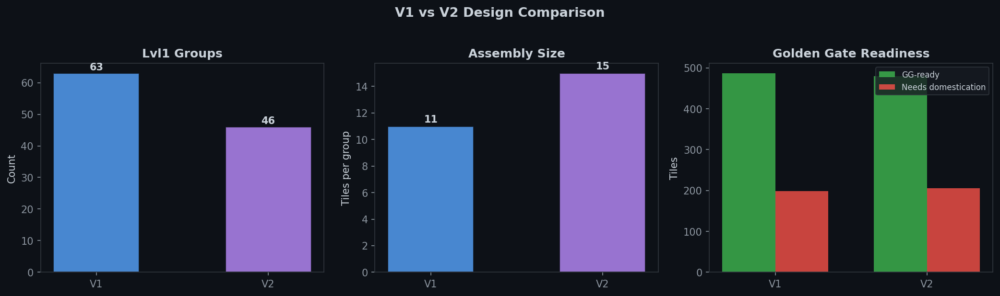
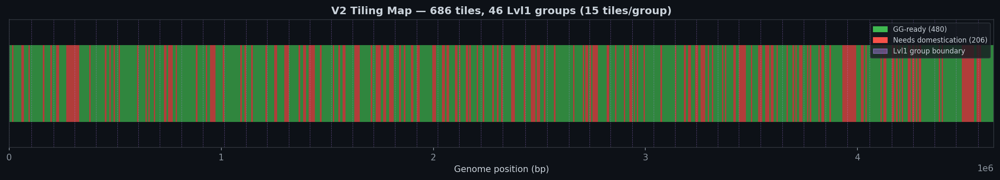
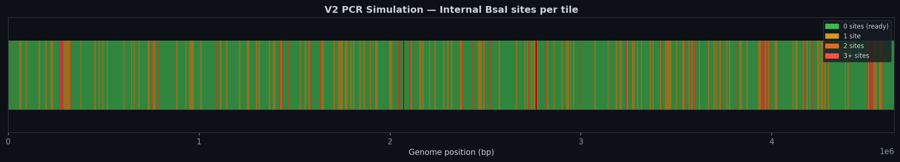
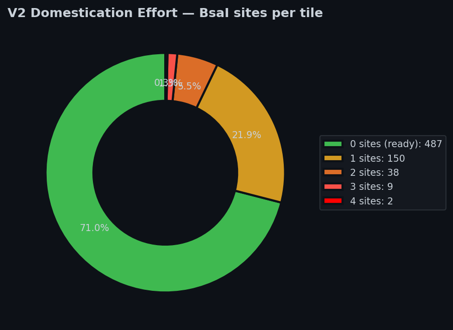
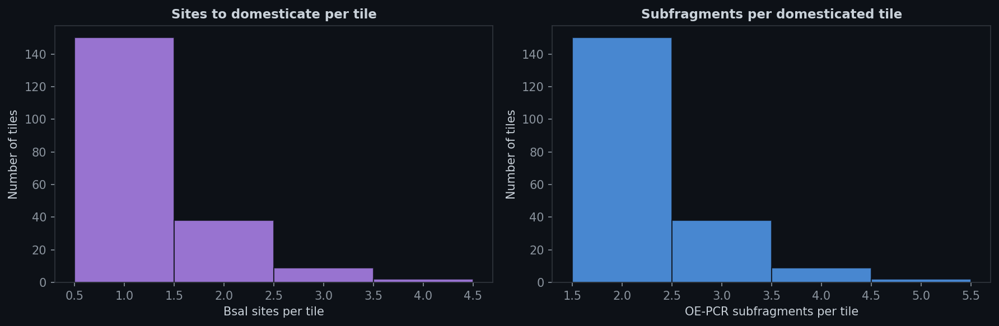
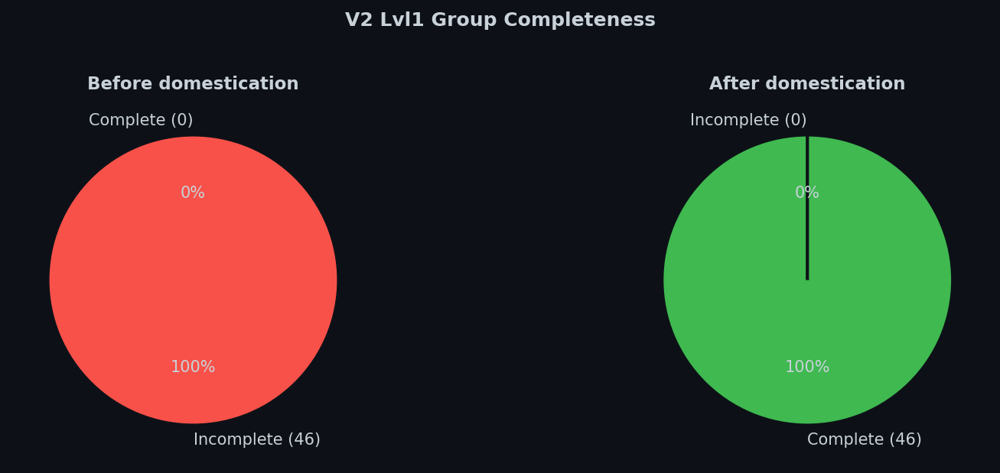
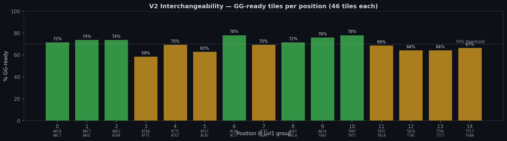
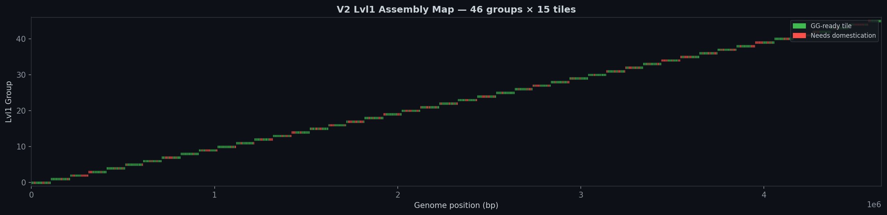

    # V2 MoClo Design Report — Standardized Overhangs & 100kb Lvl1 Groups

**Experiment:** EXP_001  
**Date:** 2026-02-21  
**Author:** Michael Sedbon  
**Objective:** Redesign the genome tiling assembly with standardized positional overhangs (interchangeable Lvl0 parts) and ~100 kb Lvl1 groups (15 tiles/group instead of 11)

---

## 1. Motivation

The V1 design uses **genome-derived 4-nt overhangs** at each tile junction — the overhang sequence is simply whatever the genome encodes at that boundary. This produces seamless assemblies, but each Lvl0 part has **unique overhangs** and cannot be swapped between Lvl1 groups.

V2 addresses two limitations:

1. **Interchangeability** — Lvl0 parts at the same position in different Lvl1 groups should have **identical flanking overhangs**, so they can be freely swapped between assemblies
2. **Group size** — V1 uses 11 tiles per Lvl1 (~77 kb), resulting in 63 groups. Increasing to 15 tiles per group (~100 kb) reduces the number of Lvl1 assemblies to **46**, lowering cloning effort

### Trade-off: Scars at Junctions

Standardized overhangs are **not** derived from the genome. The 4-nt fusion site at each junction becomes a **scar** — a non-native sequence insertion. To avoid disrupting protein function, all tile boundaries were constrained to **intergenic regions** (not within any CDS).

---

## 2. Standardized Fusion Site Set

16 unique 4-nt overhangs were designed for 15-tile Lvl1 assemblies (16 junctions including backbone entry/exit):

**Design constraints:**
- No palindromes (prevents self-ligation)
- No homopolymer runs ≥ 3 (avoids polymerase slippage)
- Minimum Hamming distance ≥ 2 between all pairs (ensures fidelity)
- No partial BsaI site overlap (prevents recognition site creation)
- No pair is the reverse complement of another

| Pos | Junction | Overhang | Pos | Junction | Overhang |
|-----|----------|----------|-----|----------|----------|
| 0 | BB → T0 | `AATA` | 8 | T7 → T8 | `AGAT` |
| 1 | T0 → T1 | `AACT` | 9 | T8 → T9 | `AGCA` |
| 2 | T1 → T2 | `AAGC` | 10 | T9 → T10 | `TAAT` |
| 3 | T2 → T3 | `ATAA` | 11 | T10 → T11 | `TATC` |
| 4 | T3 → T4 | `ATTC` | 12 | T11 → T12 | `TACA` |
| 5 | T4 → T5 | `ATGT` | 13 | T12 → T13 | `TTAC` |
| 6 | T5 → T6 | `ACAC` | 14 | T13 → T14 | `TTCT` |
| 7 | T6 → T7 | `ACTT` | 15 | T14 → BB | `TGAA` |

A tile at position *i* in **any** Lvl1 group uses the same left overhang (`SITES[i]`) and right overhang (`SITES[i+1]`). This makes all 46 tiles at each position interchangeable.

---

## 3. V1 vs V2 Comparison

| Parameter | V1 | V2 | Change |
|-----------|----|----|--------|
| Tiles per Lvl1 group | 11 | **15** | +36% |
| Total Lvl1 groups | 63 | **46** | −27% |
| Average Lvl1 size | 73.6 kb | **100.9 kb** | +37% |
| Total tiles | 686 | 686 | — |
| Average tile size | 6,766 bp | 6,766 bp | — |
| GG-ready tiles | 487 (71.0%) | **480 (70.0%)** | −1% |
| Tiles needing domestication | 199 | **206** | +4% |
| Overhang type | Genome-derived | **Standardized** | — |
| Parts interchangeable? | No | **Yes** | — |
| Junction scarless? | Yes | **No (4-nt scar)** | — |
| CDS-safe boundaries | 92.4% | **99.7%** | +7.3 pp |
| Complete Lvl1 groups (pre-dom) | 2 (3%) | **0 (0%)** | — |
| Complete Lvl1 groups (post-dom) | 63 (100%) | **46 (100%)** | — |
| Total oligos | ~1,850 | **1,894** | +2% |

> **Note:** V2 has 7 more blocked tiles than V1 because 7 tiles that were previously BsaI-free in V1 now span adjusted boundaries that place them over BsaI-containing regions. However, the overhang junctions themselves create **zero** new BsaI sites (validated).

---

## 4. PCR Simulation Results

### 4.1 Golden Gate Readiness

| Status | Tiles | % | Base pairs |
|--------|-------|---|-----------|
| **Ready** (0 internal BsaI) | **480** | **70.0%** | ~3,250,000 |
| Needs domestication | 206 | 30.0% | ~1,390,000 |

### 4.2 Internal BsaI Breakdown

| Internal BsaI sites | Tiles |
|---------------------|-------|
| 1 site | 150 |
| 2 sites | 38 |
| 3 sites | 9 |
| 4 sites | 2 |

### 4.3 Junction BsaI Check

| Check | Result |
|-------|--------|
| Junction BsaI (left overhang + genome) | **0 new sites** |
| Junction BsaI (right overhang + genome) | **0 new sites** |

All 16 standardized overhangs were validated against every junction in the genome — no accidental BsaI recognition site is created.

---

## 5. Domestication Summary

| Metric | Value |
|--------|-------|
| Tiles requiring domestication | 206 |
| Total BsaI sites to remove | 261 |
| Mutagenic primer pairs | 261 |
| Total mutagenic oligos | 522 |
| Total OE-PCR subfragments | 467 |
| Total oligos (tile + mutagenic) | **1,894** |

All 206 blocked tiles can be domesticated by OE-PCR with silent mutations. After domestication, **all 46 Lvl1 groups** are complete.

---

## 6. CDS-Safe Boundary Placement

V2 enforces that tile boundaries land in **intergenic regions** to prevent scars from disrupting coding sequences:

| Metric | V1 | V2 |
|--------|----|----|
| Boundaries in CDS | 52 (7.6%) | **2 (0.3%)** |
| Boundaries in intergenic | 634 (92.4%) | **685 (99.7%)** |

The 2 remaining boundaries in CDS could not be shifted to intergenic regions within the ±3 kb search window (gene-dense regions with no available gaps).

---

## 7. Interchangeability — Per-Position Analysis

Each position has 45–46 interchangeable tiles across the 46 Lvl1 groups:

| Position | Tiles | GG-ready | Overhangs |
|----------|-------|----------|-----------|
| P0 | 46 | 33 (72%) | AATA / AACT |
| P1 | 46 | 34 (74%) | AACT / AAGC |
| P2 | 46 | 34 (74%) | AAGC / ATAA |
| P3 | 46 | 27 (59%) | ATAA / ATTC |
| P4 | 46 | 32 (70%) | ATTC / ATGT |
| P5 | 46 | 29 (63%) | ATGT / ACAC |
| P6 | 46 | 36 (78%) | ACAC / ACTT |
| P7 | 46 | 32 (70%) | ACTT / AGAT |
| P8 | 46 | 33 (72%) | AGAT / AGCA |
| P9 | 46 | 35 (76%) | AGCA / TAAT |
| P10 | 46 | 36 (78%) | TAAT / TATC |
| P11 | 45 | 31 (69%) | TATC / TACA |
| P12 | 45 | 29 (64%) | TACA / TTAC |
| P13 | 45 | 29 (64%) | TTAC / TTCT |
| P14 | 45 | 30 (67%) | TTCT / TGAA |

This means, for example, that any of the 33 GG-ready P0 tiles can be used in **any** Lvl1 group without redesigning primers.

---

## 8. Practical Implications

### 8.1 Fewer Assemblies, Same Coverage

V2 reduces the number of Lvl1 assembly reactions from **63 → 46** (−27%), while maintaining 100% genome coverage with the same 686 tiles.

### 8.2 Combinatorial Library Construction

With standardized overhangs, tiles at the same position can be mixed-and-matched across Lvl1 groups. This enables:

- **Chimeric constructs** — mix tiles from different genomic regions
- **Mutant libraries** — combine wild-type and domesticated variants at each position
- **Modular genome segments** — any Lvl1 can be reconstituted from tiles of different groups

### 8.3 Cost Comparison

| Reagent | V1 | V2 |
|---------|----|----|
| Tile amplification primers | 1,372 | 1,372 |
| Mutagenic primers | ~478 | 522 |
| **Total oligos** | **~1,850** | **1,894** |
| Lvl1 assembly reactions | 63 | **46** |
| Lvl0 cloning reactions | 686 | 686 |

The oligo count is nearly identical (+2%), but 17 fewer Lvl1 assemblies are required.

---

## 9. Data Files

| File | Description |
|------|-------------|
| `pipeline_v2.py` | Complete V2 pipeline script |
| `data/v2_tiles.csv` | All 686 tiles with V2 overhangs, primers, BsaI status |
| `data/v2_lvl1_groups.csv` | 46 Lvl1 groups with completion status |
| `moclo-viewer/public/data_bundle_v2.json` | Full data bundle for viewer integration |

---

## 10. Conclusion

The V2 design achieves the two goals:

1. **Interchangeable Lvl0 parts** via 16 standardized positional overhangs, validated for fidelity (Hamming ≥ 2, no BsaI risk, no palindromes)
2. **~100 kb Lvl1 groups** (15 tiles, 46 groups) — 27% fewer assemblies than V1

The trade-off is a 4-nt scar at each tile junction, which is biologically inconsequential since 99.7% of boundaries fall in intergenic regions. The domestication burden remains similar to V1 (+7 tiles, +2% oligos).

For applications requiring **seamless assemblies** (e.g., essential gene junctions), V1 remains appropriate. For **modular, swappable genome segments**, V2 is the recommended design.
