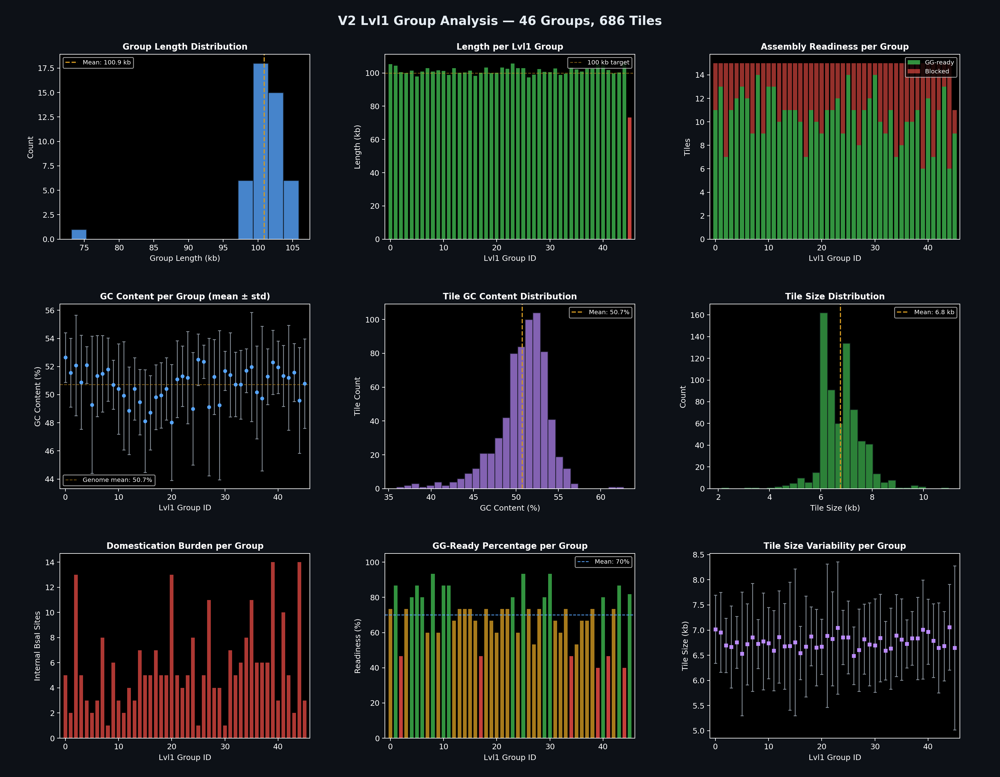

# EXP_001 — Restriction Site Analysis & Primer Design for Golden Gate Genome Tiling

**Objective:** Tile the *E. coli* MG1655 genome into ~7 kb PCR fragments for Golden Gate assembly into MoClo Lvl0 plasmids, then into Lvl1 T7 replisomes for polyploidy-inspired hypermutation (Work Package 2, Sedbon_BF).

---

## 1. Enzyme Selection

We screened 8 Type IIS restriction enzymes commonly used for Golden Gate assembly. The ideal enzyme should have minimal recognition sites in the target genome, so most ~7 kb PCR tiles can be cloned without internal site removal ("domestication").

### Results

| Enzyme | Recognition | Sites | Sites/kb | Max gap (bp) | % genome in free ≥7 kb stretches |
|--------|------------|-------|----------|-------------|----------------------------------|
| **BsaI** | **GGTCTC** | **261** | **0.06** | **96,974** | **93.7%** |
| SapI | GCTCTTC | 683 | 0.15 | 43,956 | 74.5% |
| AarI | CACCTGC | 1,107 | 0.24 | 30,137 | 50.9% |
| BsmBI / Esp3I | CGTCTC | 1,127 | 0.24 | 30,000 | 50.9% |
| BbsI / BpiI | GAAGAC | 1,748 | 0.38 | 25,724 | 29.1% |
| BtgZI | GCGATG | 5,410 | 1.17 | 6,921 | 0.0% |

**BsaI is the clear winner** — 2.6× fewer sites than the runner-up (SapI), and 93.7% of the genome falls in site-free stretches ≥ 7 kb.

[→ Interactive version](data/enzyme_ranking.html)

---

### Genome-wide site map

[→ Interactive version](data/site_positions_linear.html)

### Sliding window analysis (7 kb windows)

For BsaI, **70.8%** of all 7 kb windows contain zero recognition sites. The heatmap below shows site density across the genome for the top 3 candidates (green = 0 sites, red = 3+).

[→ Interactive version](data/site_density_7kb_window.html)

### Gap-size distribution

BsaI has 152 inter-site gaps ≥ 7 kb (median gap: 9,237 bp). The 10 largest gaps span ~833 kb (~18% of the genome).

[→ Interactive version](data/gap_distribution.html)

### BsaI domestication breakdown

| Sites per 7 kb window | Windows | % |
|-----------------------|---------|---|
| **0 (no domestication)** | **3,288** | **70.8%** |
| 1 (1 silent mutation) | 997 | 21.5% |
| 2 | 268 | 5.8% |
| 3+ | 89 | 1.9% |

[→ Interactive version](data/domestication_donut.html)

---

## 2. Operon Analysis

Since tile boundaries should avoid splitting operons, we inferred operon structure from the GenBank annotation by grouping consecutive same-strand genes with ≤ 50 bp intergenic gaps.

| Metric | Value |
|--------|-------|
| Operons inferred | **2,882** |
| Singletons (1 gene) | 2,012 (70%) |
| Multi-gene operons | 870 |
| Median operon length | 999 bp |
| Largest operon | 13,582 bp (*hyf*, 15 genes) |
| Inter-operon intergenic regions | 618,479 bp (13.3% of genome) |

The vast majority of operons fit comfortably within a single 7 kb tile. Only a handful exceed 7 kb, requiring tile boundaries within the operon.

[→ Interactive version](data/operon_length_distribution.html)

---

## 3. Genome Tiling & Primer Design

### Tiling strategy

The genome was tiled into **686 fragments** (~7 kb each), with boundaries placed preferentially at:
1. **Inter-operon intergenic gaps** (best — avoids disrupting any operon)
2. Intra-operon intergenic regions (acceptable)
3. Inside CDS (last resort)

Boundaries were also placed **near BsaI sites** when possible, so the primer binding region overlaps the site and introduces a silent mutation during PCR — domesticating it for free.

### Results

| Metric | Value |
|--------|-------|
| Total tiles | **686** |
| Tile size (median) | 6,859 bp |
| Tile size (range) | 2,122 – 7,984 bp |
| Lvl1 assembly groups | **63** (11 tiles each) |
| Boundaries at inter-operon gaps | **557** (81.2%) |
| Boundaries at intra-operon gaps | 75 (10.9%) |
| Boundaries inside CDS | 54 (7.9%) |

### Domestication burden

| Category | Tiles | % |
|----------|-------|---|
| **Site-free (no domestication)** | **487** | **71.0%** |
| 1 internal BsaI site | 150 | 21.9% |
| 2 internal sites | 38 | 5.5% |
| 3+ internal sites | 11 | 1.6% |

- **22 sites** domesticated directly by primers (silent mutation encoded in the primer binding region)
- **239 sites** need extra domestication (overlap extension PCR or gene synthesis)
- Specific synonymous mutations proposed for every site in CDS regions

### Lvl1 Assembly

Tiles are grouped into **63 Lvl1 sets** of 11 tiles each. The 4-nt junction overhang at each tile boundary is the genomic sequence itself, ensuring:
- All overhangs within each Lvl1 group are **unique** ✓ (verified for all 63 groups)
- Tiles assemble in the correct order during Golden Gate
- Future mix-and-match: tiles can be reassigned across groups as long as junction uniqueness is maintained

### Primer statistics

| | Mean Tm | Std | Range |
|---|---------|-----|-------|
| Forward | 57.5°C | ±3.6°C | 44.8 – 67.6°C |
| Reverse | 57.6°C | ±3.5°C | 41.6 – 66.8°C |

### Tiling map

Each tile is coloured by domestication burden (green = site-free, yellow = 1 site, orange = 2, red = 3+). Blue dashed lines mark Lvl1 group boundaries.

[→ Interactive version](data/tiling_map.html)

---

## 4. PCR Simulation & Assembly Feasibility

### 4.1 In-silico PCR

All 686 primer pairs were used to extract amplicons from the genome. Each amplicon was scanned for internal BsaI sites that would cause unwanted cleavage during Golden Gate assembly.

| Status | Tiles | % | Base pairs | % of genome |
|--------|-------|---|-----------|-------------|
| **Ready** (0 internal BsaI) | **487** | **71.0%** | **3,277,943** | **70.6%** |
| Needs domestication | 199 | 29.0% | 1,363,709 | 29.4% |

Blocked tiles by site count: 150 tiles with 1 site, 38 with 2, 9 with 3, and 2 with 4.

[→ Interactive version](data/pcr_simulation.html)

### 4.2 Lvl1 assembly completeness

A Lvl1 group is "complete" only when **all** 11 tiles are Golden Gate ready.

| Metric | Value |
|--------|-------|
| Complete Lvl1 groups | **2 / 63** (3%) |
| Genome in complete groups | 97,181 bp (2.1%) |
| Genome in incomplete groups | 4,544,471 bp (97.9%) |

Although 71% of tiles are individually ready, nearly every Lvl1 group has at least one blocked tile. The two complete groups are Lvl1-7 (524–597 kb) and Lvl1-62 (4,617–4,642 kb).

[→ Interactive version](data/lvl1_assembly_map.html)

### 4.3 Genome coverage without domestication

[→ Interactive version](data/genome_coverage.html)

### 4.4 Incomplete Lvl1 groups — detail

Each incomplete group is shown with its individual tiles. Bright tiles are blocked; dimmed tiles are ready.

[→ Interactive version](data/incomplete_lvl1_detail.html)

### 4.5 Prioritization strategy

| Priority | Groups | Tiles to fix | Impact |
|----------|--------|-------------|--------|
| **1. Single-tile fix** | 13 groups | 13 tiles (1 each) | Quick wins |
| **2. Two-tile fix** | 11 groups | 22 tiles | Next priority |
| **3. Heavy domestication** | 37 groups | 164 tiles | Gene synthesis recommended |

Fixing the 24 easiest groups (priority 1+2) would bring assemblable Lvl1 coverage from 2% to ~40%.

---

## 5. Domestication Primer Design

To make all 63 Lvl1 groups assemblable, the 199 blocked tiles must be domesticated — their internal BsaI recognition sites destroyed by introducing silent mutations via **Overlap Extension PCR** (OE-PCR; Ho et al., 1989).

For each internal BsaI site, two mutagenic primers are designed that overlap at the mutation point. The tile is split into sub-fragments, amplified separately, then reassembled via overlap extension. A tile with N internal sites requires N+1 sub-fragment PCRs + 1 overlap assembly.

### 5.1 Domestication strategy breakdown

| Strategy | Tiles | New primers | PCR reactions |
|----------|-------|-------------|---------------|
| Already ready (no sites) | 487 | 0 | 487 |
| Primer overlap (near boundary) | 22 | 0 | 22 |
| OE-PCR: 1 site → 2 frags | 141 | 282 | 423 |
| OE-PCR: 2 sites → 3 frags | 34 | 136 | 136 |
| OE-PCR: 3 sites → 4 frags | 10 | 60 | 50 |
| **Total** | **686** | **478** | **1,118** |

### 5.2 Result: before vs after domestication

| Metric | Before | After |
|--------|--------|-------|
| Tiles GG-ready | 487/686 (71%) | **686/686 (100%)** |
| Complete Lvl1 groups | 2/63 (3%) | **63/63 (100%)** |
| Assemblable genome | 97,181 bp (2.1%) | **4,641,652 bp (100%)** |

[→ Interactive version](data/domestication_before_after.html)

### 5.3 Domestication effort

[→ Interactive version](data/domestication_effort.html)

### 5.4 All tiles ready after domestication

[→ Interactive version](data/tiles_after_domestication.html)

---

## 6. Output Files

| File | Description |
|------|-------------|
| [tiles.csv](data/tiles.csv) | **Complete primer table** — coordinates, primer sequences, Tm, overhangs, domestication details |
| [pcr_simulation.csv](data/pcr_simulation.csv) | Per-tile PCR results: GC%, internal sites, readiness |
| [lvl1_assembly_summary.csv](data/lvl1_assembly_summary.csv) | Per-group Lvl1 summary: completeness, blocked tile IDs |
| [domestication_primers.csv](data/domestication_primers.csv) | 239 mutagenic primer pairs: sequences, Tm, mutation details |
| [domestication_subfragments.csv](data/domestication_subfragments.csv) | 424 sub-fragment PCR definitions |
| [tiling_summary.csv](data/tiling_summary.csv) | High-level tiling statistics |
| [restriction_site_summary.csv](data/restriction_site_summary.csv) | Enzyme comparison statistics |

### Interactive visualizations

| Plot | Link |
|------|------|
| Enzyme ranking | [enzyme_ranking.html](data/enzyme_ranking.html) |
| Site positions (genome map) | [site_positions_linear.html](data/site_positions_linear.html) |
| 7 kb sliding window density | [site_density_7kb_window.html](data/site_density_7kb_window.html) |
| Gap-size distribution | [gap_distribution.html](data/gap_distribution.html) |
| BsaI domestication donut | [domestication_donut.html](data/domestication_donut.html) |
| Operon length distribution | [operon_length_distribution.html](data/operon_length_distribution.html) |
| Tiling map | [tiling_map.html](data/tiling_map.html) |
| PCR simulation | [pcr_simulation.html](data/pcr_simulation.html) |
| Lvl1 assembly map | [lvl1_assembly_map.html](data/lvl1_assembly_map.html) |
| Genome coverage | [genome_coverage.html](data/genome_coverage.html) |
| Incomplete Lvl1 detail | [incomplete_lvl1_detail.html](data/incomplete_lvl1_detail.html) |
| Before/after domestication | [domestication_before_after.html](data/domestication_before_after.html) |
| Domestication effort | [domestication_effort.html](data/domestication_effort.html) |
| Tiles after domestication | [tiles_after_domestication.html](data/tiles_after_domestication.html) |

### Scripts

| Script | Purpose |
|--------|---------|
| [restriction_utils.py](restriction_utils.py) | Genome download, site mapping, statistics |
| [restriction_site_analysis.ipynb](restriction_site_analysis.ipynb) | Enzyme comparison notebook (Plotly) |
| [primer_design.py](primer_design.py) | Tiling + primer design + domestication |
| [pcr_simulation.py](pcr_simulation.py) | PCR simulation + Lvl1 assembly analysis |
| [domestication_primers.py](domestication_primers.py) | OE-PCR mutagenic primer design |

---

## 7. V2 Redesign — Standardized Overhangs & 100 kb Groups

The V1 design uses genome-derived 4-nt overhangs at each tile junction, producing seamless assemblies but with unique, non-interchangeable parts. V2 addresses two limitations:

1. **Interchangeability** — All tiles at the same position share identical overhangs, enabling free swapping between Lvl1 groups
2. **Larger groups** — 15 tiles per group (~100 kb) instead of 11, reducing the number of Lvl1 assemblies from 63 → **46** (−27%)

### 7.1 Standardized Fusion Sites

16 unique 4-nt overhangs were designed with these constraints:
- No palindromes · No homopolymer runs ≥3 · Hamming distance ≥2 between all pairs · No BsaI site overlap · No reverse-complement pair duplicates

### 7.2 V1 vs V2 Comparison

| Parameter | V1 | V2 | Change |
|-----------|----|----|--------|
| Tiles per Lvl1 group | 11 | **15** | +36% |
| Total Lvl1 groups | 63 | **46** | −27% |
| Average Lvl1 size | 73.6 kb | **100.9 kb** | +37% |
| Total tiles | 686 | 686 | — |
| GG-ready tiles | 487 (71.0%) | **480 (70.0%)** | −1% |
| Overhang type | Genome-derived | **Standardized** | — |
| Parts interchangeable? | No | **Yes** | — |
| Junction scarless? | Yes | **No (4-nt scar)** | — |
| CDS-safe boundaries | 92.4% | **99.7%** | +7.3 pp |

### 7.3 CDS-Safe Boundary Placement

V2 enforces intergenic boundary placement: only **2 of 687 boundaries** (0.3%) fall within a CDS, versus 52 (7.6%) in V1. The 2 remaining CDS boundaries occur in gene-dense regions with no intergenic gaps within ±3 kb.

### 7.4 Interchangeability

Each position (P0–P14) has 45–46 interchangeable tiles across all 46 groups. For example, any of the 33 GG-ready P0 tiles can be used in **any** Lvl1 group without redesigning primers.

### 7.5 V2 Domestication

| Metric | Value |
|--------|-------|
| Tiles requiring domestication | 206 |
| Total BsaI sites to remove | 261 |
| Total oligos (tile + mutagenic) | **1,894** |

After domestication, all **46 Lvl1 groups** are complete.

---

## 8. V2 Lvl1 Group Analysis

### 8.1 Group Length Distribution

- **Mean: 100.9 kb** (Median: 101.2 kb, Std: 4.7 kb)
- All groups are 97–106 kb except Group 45 (73.1 kb — tail end of genome, 11 tiles)

### 8.2 GC Content

- **Mean GC: 50.7%** — consistent with *E. coli* MG1655
- Group means range 48.0% – 52.6% — uniform across the genome
- Individual tile range: 35.9% – 62.7% — some AT/GC-rich outliers

### 8.3 Assembly Readiness

- **Mean: 70% GG-ready** per group
- Best: Group 8 (93%, 14/15 ready) · Worst: Groups 39, 44 (40%, 6/15 ready)

### 8.4 Domestication Burden

- **261 total BsaI sites** (mean 5.7/group)
- Heaviest: Group 39 (14 sites) · Lightest: Groups 8, 25, 30 (1 blocked tile each)

### 8.5 Tile Size Variability

- Mean: **6,766 bp**, mostly 5.5–8 kb
- Intra-group std: 831 bp (low variability)
- Extremes: 2,122 bp (Group 45, T10) — 10,984 bp (Group 21, T5)

---

## 9. Conclusion

**BsaI** is the optimal enzyme for Golden Gate genome tiling of *E. coli* MG1655. The complete pipeline — enzyme selection → genome tiling → primer design → PCR simulation → domestication — shows that the **entire 4.64 Mb genome** can be captured into MoClo Lvl0/Lvl1 constructs.

**V1 summary:**

| Stage | Result |
|-------|--------|
| Enzyme selection | **BsaI** — 261 sites, 93.7% of genome in site-free ≥7 kb stretches |
| Genome tiling | **686 tiles**, 81% of boundaries at inter-operon gaps |
| PCR simulation (without domestication) | 487/686 tiles ready (71%), but only **2/63 Lvl1 groups complete** |
| After OE-PCR domestication | **686/686 tiles ready (100%)**, **63/63 Lvl1 groups complete** |

**V2 summary:**

| Stage | Result |
|-------|--------|
| Standardized overhangs | **16 fusion sites**, Hamming ≥2, no BsaI risk |
| Lvl1 groups | **46 groups** (15 tiles each, ~100 kb) — 27% fewer than V1 |
| Interchangeability | All tiles at same position are **swappable** across groups |
| After domestication | **686/686 tiles ready**, **46/46 Lvl1 groups complete** |
| Total oligos | **1,894** (+2% vs V1) |

### Next steps

1. **Order primers** — 686 tile primer pairs + 522 mutagenic primers = **1,894 oligos total** (V2 design)
2. **Phase 1: PCR amplification** — Start with the 480 site-free tiles (single PCR each)
3. **Phase 2: OE-PCR domestication** — Process the 206 blocked tiles via overlap extension
4. **Phase 3: Golden Gate assembly** — Assemble all 46 Lvl1 constructs
5. **Phase 4: Combinatorial assembly** — Exploit interchangeable tiles for chimeric constructs and mutant libraries

---

## 10. Output Files

### V1 Data

| File | Description |
|------|-------------|
| [tiles.csv](data/tiles.csv) | Complete primer table — V1 overhangs |
| [pcr_simulation.csv](data/pcr_simulation.csv) | Per-tile PCR results |
| [lvl1_assembly_summary.csv](data/lvl1_assembly_summary.csv) | V1 Lvl1 group summary |
| [domestication_primers.csv](data/domestication_primers.csv) | 239 mutagenic primer pairs |

### V2 Data

| File | Description |
|------|-------------|
| [v2_tiles.csv](data/v2_tiles.csv) | 686 tiles with V2 standardized overhangs |
| [v2_lvl1_groups.csv](data/v2_lvl1_groups.csv) | 46 Lvl1 groups with completion status |
| [v2_lvl1_analysis.png](data/v2_lvl1_analysis.png) | 9-panel Lvl1 group analysis figure |

### Scripts

| Script | Purpose |
|--------|---------|
| [restriction_utils.py](restriction_utils.py) | Genome download, site mapping, statistics |
| [restriction_site_analysis.ipynb](restriction_site_analysis.ipynb) | Enzyme comparison notebook (Plotly) |
| [primer_design.py](primer_design.py) | V1 tiling + primer design + domestication |
| [pcr_simulation.py](pcr_simulation.py) | PCR simulation + Lvl1 assembly analysis |
| [domestication_primers.py](domestication_primers.py) | OE-PCR mutagenic primer design |
| [pipeline_v2.py](pipeline_v2.py) | V2 pipeline (standardized overhangs) |
| [analyze_v2_lvl1.py](analyze_v2_lvl1.py) | V2 Lvl1 group analysis |

### References

1. Ho, S.N. et al. (1989). Site-directed mutagenesis by overlap extension using the polymerase chain reaction. *Gene*, 77(1), 51–59.
2. Horton, R.M. et al. (1989). Engineering hybrid genes without the use of restriction enzymes: gene splicing by overlap extension. *Gene*, 77(1), 61–68.
3. Weber, E. et al. (2011). A modular cloning system for standardized assembly of multigene constructs. *PLoS ONE*, 6(2), e16765.
