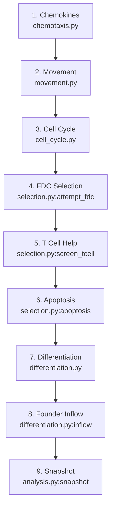

# EXP_002 — Code Review: Natural GC Simulation

**Experiment:** EXP_002
**Date:** 2026-03-16
**Purpose:** Block-by-block code reference for the natural germinal center simulation, with clickable links to every function.

> [!TIP]
> **How to use this document:** Every function name is a clickable link that opens the code at the right line. Read a section, click the link to inspect the implementation, then come back.

---

## Table of Contents

1. [Shape Space & Affinity](#1-shape-space--affinity)
2. [State Representation](#2-state-representation)
3. [Chemotaxis & Diffusion](#3-chemotaxis--diffusion)
4. [Cell Movement](#4-cell-movement)
5. [Cell Cycle & Division](#5-cell-cycle--division)
6. [Selection (FDC + T cell)](#6-selection-fdc--t-cell)
7. [Differentiation & Recycling](#7-differentiation--recycling)
8. [Initialization](#8-initialization)
9. [Simulation Loop](#9-simulation-loop)
10. [Analysis & Plotting](#10-analysis--plotting)

---

## 1. Shape Space & Affinity

**Script:** [affinity.py](file:///Users/michaelsedbon/Documents/PhD/experiments/EXP_002/simulation/src/germinal_center/affinity.py)

The affinity module defines the fitness landscape. Sequences are integer vectors in L-dimensional shape space. Affinity to antigen is a Gaussian function of Hamming distance.

| Function | What it does | Link |
|---|---|---|
| `hamming_distance` | Computes Hamming distance between two sequences | [L20–L29](file:///Users/michaelsedbon/Documents/PhD/experiments/EXP_002/simulation/src/germinal_center/affinity.py#L20-L29) |
| `compute_affinity` | Gaussian affinity: `exp(-(d/Γ)^η)` | [L32–L56](file:///Users/michaelsedbon/Documents/PhD/experiments/EXP_002/simulation/src/germinal_center/affinity.py#L32-L56) |
| `mutate_sequence` | Somatic hypermutation: ±1 on one random position | [L59–L93](file:///Users/michaelsedbon/Documents/PhD/experiments/EXP_002/simulation/src/germinal_center/affinity.py#L59-L93) |
| `batch_hamming` | Vectorized Hamming for N sequences | [L95–L106](file:///Users/michaelsedbon/Documents/PhD/experiments/EXP_002/simulation/src/germinal_center/affinity.py#L95-L106) |
| `batch_affinity` | Vectorized affinity for N sequences | [L108–L126](file:///Users/michaelsedbon/Documents/PhD/experiments/EXP_002/simulation/src/germinal_center/affinity.py#L108-L126) |
| `batch_mutate` | Vectorized mutation for N sequences | [L128–L157](file:///Users/michaelsedbon/Documents/PhD/experiments/EXP_002/simulation/src/germinal_center/affinity.py#L128-L157) |
| `create_antigen` | Create target antigen (zeros vector) | [L159–L172](file:///Users/michaelsedbon/Documents/PhD/experiments/EXP_002/simulation/src/germinal_center/affinity.py#L159-L172) |
| `create_founders_at_distance` | Create N founders at specified Hamming distance | [L174–L210](file:///Users/michaelsedbon/Documents/PhD/experiments/EXP_002/simulation/src/germinal_center/affinity.py#L174-L210) |

> [!WARNING]
> `mutate_sequence` uses `jax.random.choice` to pick dimension and direction. At L=4, there are only 8 possible mutations per step — very constrained. At L=400, the landscape becomes vastly richer.

---

## 2. State Representation

**Script:** [state.py](file:///Users/michaelsedbon/Documents/PhD/experiments/EXP_002/simulation/src/germinal_center/state.py)

All agents stored as padded fixed-size arrays (Structure of Arrays). Slot allocator manages free positions.

| Function / Class | What it does | Link |
|---|---|---|
| `CentroblastState` | CB NamedTuple: seq, aff, pos, clone_id, phase, etc. | [L58–L72](file:///Users/michaelsedbon/Documents/PhD/experiments/EXP_002/simulation/src/germinal_center/state.py#L58-L72) |
| `CentrocyteState` | CC NamedTuple: seq, aff, pos, antigen collected, tc signal | [L73–L90](file:///Users/michaelsedbon/Documents/PhD/experiments/EXP_002/simulation/src/germinal_center/state.py#L73-L90) |
| `TCellState` | T cell: position only | [L91–L97](file:///Users/michaelsedbon/Documents/PhD/experiments/EXP_002/simulation/src/germinal_center/state.py#L91-L97) |
| `FDCState` | FDC: position, antigen levels per arm | [L98–L104](file:///Users/michaelsedbon/Documents/PhD/experiments/EXP_002/simulation/src/germinal_center/state.py#L98-L104) |
| `GCState` | Top-level state: all sub-states + grid + chemokines | [L121–L140](file:///Users/michaelsedbon/Documents/PhD/experiments/EXP_002/simulation/src/germinal_center/state.py#L121-L140) |
| `allocate_slots` | Find N free slots via argsort on alive mask | [L141–L180](file:///Users/michaelsedbon/Documents/PhD/experiments/EXP_002/simulation/src/germinal_center/state.py#L141-L180) |
| `count_alive` | Count living cells in padded array | [L181–L188](file:///Users/michaelsedbon/Documents/PhD/experiments/EXP_002/simulation/src/germinal_center/state.py#L181-L188) |
| `count_cells` | Summary dict: n_cb, n_cc, n_tc, n_out, n_total | [L267–L280](file:///Users/michaelsedbon/Documents/PhD/experiments/EXP_002/simulation/src/germinal_center/state.py#L267-L280) |

---

## 3. Chemotaxis & Diffusion

**Script:** [chemotaxis.py](file:///Users/michaelsedbon/Documents/PhD/experiments/EXP_002/simulation/src/germinal_center/chemotaxis.py)

3D diffusion on the lattice. CXCL12 attracts to DZ, CXCL13 attracts to LZ.

| Function | What it does | Link |
|---|---|---|
| `produce_chemokine` | Source terms: stromal→CXCL12, FDC→CXCL13 | [L21–L50](file:///Users/michaelsedbon/Documents/PhD/experiments/EXP_002/simulation/src/germinal_center/chemotaxis.py#L21-L50) |
| `_diffuse_3d_single` | One diffusion sub-step (3D finite difference) | [L52–L67](file:///Users/michaelsedbon/Documents/PhD/experiments/EXP_002/simulation/src/germinal_center/chemotaxis.py#L52-L67) |
| `diffuse_3d` | Auto-substep diffusion (stability: α ≤ 1/6) | [L69–L106](file:///Users/michaelsedbon/Documents/PhD/experiments/EXP_002/simulation/src/germinal_center/chemotaxis.py#L69-L106) |
| `update_receptor_sensitivity` | Receptor up/down-regulation | [L108–L145](file:///Users/michaelsedbon/Documents/PhD/experiments/EXP_002/simulation/src/germinal_center/chemotaxis.py#L108-L145) |
| `compute_gradient_at` | Evaluate chemokine gradient at a cell position | [L147–L180](file:///Users/michaelsedbon/Documents/PhD/experiments/EXP_002/simulation/src/germinal_center/chemotaxis.py#L147-L180) |

---

## 4. Cell Movement

**Script:** [movement.py](file:///Users/michaelsedbon/Documents/PhD/experiments/EXP_002/simulation/src/germinal_center/movement.py)

Persistent random walk + chemotaxis gradient. GPU-optimized via vmap.

| Function | What it does | Link |
|---|---|---|
| `update_polarity` | Blend persistence + chemotaxis gradient | [L37–L78](file:///Users/michaelsedbon/Documents/PhD/experiments/EXP_002/simulation/src/germinal_center/movement.py#L37-L78) |
| `_find_target_single` | Target position for one cell (26-neighborhood) | [L80–L113](file:///Users/michaelsedbon/Documents/PhD/experiments/EXP_002/simulation/src/germinal_center/movement.py#L80-L113) |
| `move_cells_parallel` | vmap movement + scatter conflict resolution | [L127–L200](file:///Users/michaelsedbon/Documents/PhD/experiments/EXP_002/simulation/src/germinal_center/movement.py#L127-L200) |

> [!IMPORTANT]
> **GPU architecture decision:** Movement uses `jax.vmap` over `_find_target_single` to compute all targets in parallel, then scatter-resolves conflicts (last writer wins). This is the key GPU optimization — replaced the original Python for-loop.

---

## 5. Cell Cycle & Division

**Script:** [cell_cycle.py](file:///Users/michaelsedbon/Documents/PhD/experiments/EXP_002/simulation/src/germinal_center/cell_cycle.py)

| Function | What it does | Link |
|---|---|---|
| `progress_phases` | Advance G1→S→G2→M timers | [L24–L43](file:///Users/michaelsedbon/Documents/PhD/experiments/EXP_002/simulation/src/germinal_center/cell_cycle.py#L24-L43) |
| `find_dividing_cells` | Identify CBs at M phase end | [L45–L56](file:///Users/michaelsedbon/Documents/PhD/experiments/EXP_002/simulation/src/germinal_center/cell_cycle.py#L45-L56) |
| `divide_and_mutate` | Division: allocate daughter slot, mutate, update counters | [L58–L157](file:///Users/michaelsedbon/Documents/PhD/experiments/EXP_002/simulation/src/germinal_center/cell_cycle.py#L58-L157) |
| `find_transition_to_cc` | Identify CBs that completed all divisions | [L159–L162](file:///Users/michaelsedbon/Documents/PhD/experiments/EXP_002/simulation/src/germinal_center/cell_cycle.py#L159-L162) |
| `transition_cb_to_cc` | Move CB → CC: deactivate CB slot, activate CC slot | [L164–L220](file:///Users/michaelsedbon/Documents/PhD/experiments/EXP_002/simulation/src/germinal_center/cell_cycle.py#L164-L220) |

---

## 6. Selection (FDC + T cell)

**Script:** [selection.py](file:///Users/michaelsedbon/Documents/PhD/experiments/EXP_002/simulation/src/germinal_center/selection.py)

The selection pipeline: CCs first try to collect antigen from FDCs, then compete for T cell help.

| Function | What it does | Link |
|---|---|---|
| `attempt_fdc_contacts` | CC walks near FDC → probabilistic antigen capture (affinity-dependent) | [L37–L107](file:///Users/michaelsedbon/Documents/PhD/experiments/EXP_002/simulation/src/germinal_center/selection.py#L37-L107) |
| `screen_tcell_help` | Accumulated TC signal → rescue or apoptosis | [L109–L202](file:///Users/michaelsedbon/Documents/PhD/experiments/EXP_002/simulation/src/germinal_center/selection.py#L109-L202) |
| `apply_apoptosis` | Remove failed CCs from grid + mark dead | [L204–L260](file:///Users/michaelsedbon/Documents/PhD/experiments/EXP_002/simulation/src/germinal_center/selection.py#L204-L260) |

> [!CAUTION]
> **TC rescue bug fix location:** The signal rate scaling is in [screen_tcell_help](file:///Users/michaelsedbon/Documents/PhD/experiments/EXP_002/simulation/src/germinal_center/selection.py#L109-L202). Look for `tc_rescue_time / (tc_time * 0.5)` scaling factor. Without this, all CCs die.

---

## 7. Differentiation & Recycling

**Script:** [differentiation.py](file:///Users/michaelsedbon/Documents/PhD/experiments/EXP_002/simulation/src/germinal_center/differentiation.py)

Rescued CCs either recycle to DZ (97%) or become output cells (3%).

| Function | What it does | Link |
|---|---|---|
| `process_differentiation` | CC → output (prob_output) or CB (recycle). Hill function on division count for recycled cells. | [L21–L161](file:///Users/michaelsedbon/Documents/PhD/experiments/EXP_002/simulation/src/germinal_center/differentiation.py#L21-L161) |
| `apply_inflow` | Founder cell inflow during first 72h. Places new CBs at valid DZ positions. | [L163–L250](file:///Users/michaelsedbon/Documents/PhD/experiments/EXP_002/simulation/src/germinal_center/differentiation.py#L163-L250) |

---

## 8. Initialization

**Script:** [initialization.py](file:///Users/michaelsedbon/Documents/PhD/experiments/EXP_002/simulation/src/germinal_center/initialization.py)

| Function | What it does | Link |
|---|---|---|
| `_random_positions_in_zone` | Generate random positions in DZ or LZ hemisphere | [L27–L71](file:///Users/michaelsedbon/Documents/PhD/experiments/EXP_002/simulation/src/germinal_center/initialization.py#L27-L71) |
| `initialize_gc` | Full GC setup: grid, sphere, FDCs, TCs, stromal, founders | [L73–L200](file:///Users/michaelsedbon/Documents/PhD/experiments/EXP_002/simulation/src/germinal_center/initialization.py#L73-L200) |

---

## 9. Simulation Loop

**Script:** [simulation.py](file:///Users/michaelsedbon/Documents/PhD/experiments/EXP_002/simulation/src/germinal_center/simulation.py)

Orchestrates all 11 blocks per timestep.

| Function | What it does | Link |
|---|---|---|
| `step` | One timestep: chemokines → movement → division → selection → differentiation → inflow | [L26–L172](file:///Users/michaelsedbon/Documents/PhD/experiments/EXP_002/simulation/src/germinal_center/simulation.py#L26-L172) |
| `run_simulation` | Full experiment: init → loop → snapshots → return history | [L174–L220](file:///Users/michaelsedbon/Documents/PhD/experiments/EXP_002/simulation/src/germinal_center/simulation.py#L174-L220) |

---

## 10. Analysis & Plotting

**Script:** [analysis.py](file:///Users/michaelsedbon/Documents/PhD/experiments/EXP_002/simulation/src/germinal_center/analysis.py)

| Function / Class | What it does | Link |
|---|---|---|
| `Snapshot` | Dataclass: population counts, affinities, diversity per timestep | [L21–L36](file:///Users/michaelsedbon/Documents/PhD/experiments/EXP_002/simulation/src/germinal_center/analysis.py#L21-L36) |
| `snapshot` | Capture current GC state into Snapshot | [L38–L117](file:///Users/michaelsedbon/Documents/PhD/experiments/EXP_002/simulation/src/germinal_center/analysis.py#L38-L117) |
| `plot_population_dynamics` | CB, CC, output, total over time | [L119–L149](file:///Users/michaelsedbon/Documents/PhD/experiments/EXP_002/simulation/src/germinal_center/analysis.py#L119-L149) |
| `plot_affinity_maturation` | Mean/max affinity for CB, CC, output | [L151–L182](file:///Users/michaelsedbon/Documents/PhD/experiments/EXP_002/simulation/src/germinal_center/analysis.py#L151-L182) |
| `plot_dz_lz_ratio` | DZ/LZ cell ratio over time | [L184–L208](file:///Users/michaelsedbon/Documents/PhD/experiments/EXP_002/simulation/src/germinal_center/analysis.py#L184-L208) |
| `plot_diversity` | Shannon entropy and unique clone count | [L210–L260](file:///Users/michaelsedbon/Documents/PhD/experiments/EXP_002/simulation/src/germinal_center/analysis.py#L210-L260) |

---

## Block Pipeline Diagram

