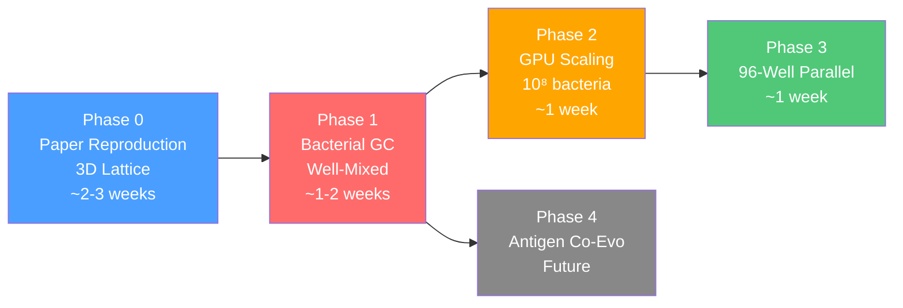

# Master Handoff Checklist — Synthetic GC Simulation

> Every phase below has **entry criteria** (what must be true before starting), **deliverables** (what gets built), **exit criteria** (definition of done), and a **handoff** section (what the next phase needs from this one).

---

## Phase 0: Reproduce Paper (3D Lattice GC)

**Goal**: Faithful reproduction of Robert et al. hyphasma model. Validate against paper figures.

**Flow diagram**: [Diagram A — Natural GC](flow_diagram_A_natural_GC.md)

### Entry Criteria
- [x] Paper read and algorithms 1-9 understood
- [x] Flow Diagram A approved
- [x] Implementation plan approved
- [x] GPU confirmed (RTX 2080 Ti, 11 GB — more than enough for ~10⁴ cells)

### Deliverables

| # | Deliverable | File | Status |
|---|---|---|---|
| 0.1 | `affinity.py` — shape space, Hamming, Gaussian affinity, mutation | `src/germinal_center/affinity.py` | [ ] |
| 0.2 | `config.py` — all paper parameters (Tables 1-2) as dataclass | `src/germinal_center/config.py` | [ ] |
| 0.3 | `state.py` — GC state: grid, chemokines, agent SoA arrays | `src/germinal_center/state.py` | [ ] |
| 0.4 | `chemotaxis.py` — diffusion solver, receptor sensitivity | `src/germinal_center/chemotaxis.py` | [ ] |
| 0.5 | `movement.py` — persistent random walk + gradient bias, exclusion | `src/germinal_center/movement.py` | [ ] |
| 0.6 | `cell_cycle.py` — G1→S→G2→M, division, daughter placement | `src/germinal_center/cell_cycle.py` | [ ] |
| 0.7 | `mutation.py` — ±1 shape space mutation at division | `src/germinal_center/mutation.py` | [ ] |
| 0.8 | `selection.py` — FDC antigen capture + T cell help (Algos 5-7) | `src/germinal_center/selection.py` | [ ] |
| 0.9 | `differentiation.py` — recycle/output + inflow (Algos 8-9) | `src/germinal_center/differentiation.py` | [ ] |
| 0.10 | `initialization.py` — spherical grid, FDCs, T cells, founders | `src/germinal_center/initialization.py` | [ ] |
| 0.11 | `simulation.py` — main loop orchestrating all blocks | `src/germinal_center/simulation.py` | [ ] |
| 0.12 | `analysis.py` — population, affinity, DZ/LZ plots | `src/germinal_center/analysis.py` | [ ] |
| 0.13 | Jupyter notebook with block-by-block checkpoints | `notebooks/01_reproduce_paper.ipynb` | [ ] |
| 0.14 | Unit tests for affinity module | `tests/test_affinity.py` | [ ] |
| 0.15 | `run.py` — CLI entry point for batch runs | `run.py` | [ ] |

### Exit Criteria (Definition of Done)
- [ ] All 11 blocks run end-to-end for 21 simulated days
- [ ] Population dynamics qualitatively match paper (peak ~1000-3000 cells at day 7-10)
- [ ] Mean affinity increases ~10-fold over simulation
- [ ] DZ/LZ ratio ≈ 2:1
- [ ] Notebook has all checkpoints passing with explanations
- [ ] Code reviewed against flow diagram A — every block maps to a function

### Handoff to Phase 1
Phase 1 reuses from Phase 0:
- `affinity.py` (shape space, Hamming, Gaussian — **shared**)
- `mutation.py` (±1 mutation — **shared**)
- `config.py` (extended with bacterial parameters)
- `analysis.py` (adapted for bacterial metrics)
- `state.py` (restructured: drop grid, add compartments)

Phase 1 **replaces**:
- `chemotaxis.py` → not needed (no spatial gradients)
- `movement.py` → `migration.py` (robotic pipetting transfers)
- `selection.py` → rewritten with 4 bacterial selection models
- `initialization.py` → simplified (no grid, no FDCs, no T cells)
- `cell_cycle.py` → `growth.py` (logistic bacterial growth)

---

## Phase 1: Bacterial Synthetic GC

**Goal**: Adapt the simulation to model the bacterial *E. coli* system from the Maimonide proposal. Well-mixed compartments, bead-based selection, robotic transfers.

**Flow diagram**: [Diagram B — Bacterial GC](flow_diagram_B_bacterial_GC.md)

### Entry Criteria
- [ ] Phase 0 complete and validated
- [ ] Flow Diagram B approved
- [ ] Selection model decided (which of A/B/C/D is default for exploration?)
- [ ] User confirms key parameters: library size, mutation rate, transfer protocol

### Deliverables

| # | Deliverable | File | Status |
|---|---|---|---|
| 1.1 | `bacterial_config.py` — all bacterial parameters | `src/bacterial_gc/config.py` | [ ] |
| 1.2 | `bacterial_state.py` — SoA arrays (no grid), compartment tags | `src/bacterial_gc/state.py` | [ ] |
| 1.3 | `growth.py` — logistic growth with carrying capacity | `src/bacterial_gc/growth.py` | [ ] |
| 1.4 | `migration.py` — DZ↔LZ robotic transfers, bottleneck sampling | `src/bacterial_gc/migration.py` | [ ] |
| 1.5 | `bacterial_selection.py` — 4 selection models (Hill, threshold, top-K, bead-binding) | `src/bacterial_gc/selection.py` | [ ] |
| 1.6 | `differentiation.py` — output extraction, DZ reset | `src/bacterial_gc/differentiation.py` | [ ] |
| 1.7 | `bacterial_sim.py` — main cycle loop | `src/bacterial_gc/simulation.py` | [ ] |
| 1.8 | `bacterial_analysis.py` — affinity curves, diversity, clone phylogeny | `src/bacterial_gc/analysis.py` | [ ] |
| 1.9 | `antigen.py` — stub for antigen evolution (returns static antigen) | `src/bacterial_gc/antigen.py` | [ ] |
| 1.10 | Jupyter notebook for bacterial GC with checkpoints | `notebooks/02_bacterial_gc.ipynb` | [ ] |
| 1.11 | Parameter sweep notebook | `notebooks/03_parameter_sweep.ipynb` | [ ] |
| 1.12 | `parameter_sweep.py` — grid sweep + genetic algorithm | `src/bacterial_gc/parameter_sweep.py` | [ ] |

### Exit Criteria
- [ ] Full cycle (grow → transfer → select → recycle) runs end-to-end
- [ ] Affinity increases over 10+ cycles for all 4 selection models
- [ ] Parameter sweep generates heatmap (mutation_rate × selection_stringency)
- [ ] Diversity metrics (Shannon entropy, clone count) tracked
- [ ] Notebook checkpoints 1-9 from Diagram B all pass
- [ ] Runs at 10⁶ on CPU in < 1 minute (smoke test before GPU)

### Handoff to Phase 2
Phase 2 needs from Phase 1:
- Working `bacterial_sim.run_experiment()` → History
- `antigen.py` stub → to be filled with co-evolution logic
- `selection.py` (bead-binding model D) → most relevant for antigen escape
- All analysis/plotting tools

---

## Phase 2: GPU Scaling to 10⁸

**Goal**: Scale the bacterial simulation to handle 10⁸ bacteria on the RTX 2080 Ti (11 GB). Benchmark, profile, optimize.

### Entry Criteria
- [ ] Phase 1 complete and validated at 10⁶
- [ ] JAX installed and tested on `172.16.1.80`
- [ ] Bacterial sim runs correctly on CPU

### Deliverables

| # | Deliverable | Status |
|---|---|---|
| 2.1 | JIT-compile all inner loops with `@jax.jit` | [ ] |
| 2.2 | Vectorize per-cell operations with `jax.vmap` | [ ] |
| 2.3 | Replace Python loops with `jax.lax.scan` / `jax.lax.fori_loop` | [ ] |
| 2.4 | Profile memory usage at 10⁶, 10⁷, 10⁸ | [ ] |
| 2.5 | Optimize memory: in-place updates, avoid large temporaries, `float16` where possible | [ ] |
| 2.6 | Dynamic array management: pre-allocate max arrays + alive mask (avoid dynamic resize) | [ ] |
| 2.7 | Benchmark wall-time per cycle at each scale | [ ] |
| 2.8 | Document memory-performance tradeoff table | [ ] |

### Exit Criteria
- [ ] 10⁸ bacteria simulation runs within 11 GB VRAM
- [ ] One full cycle completes in < 10 seconds (target)
- [ ] Results match CPU version at 10⁶ (numerical validation)
- [ ] Memory profile documented

### Handoff to Phase 3
Phase 3 needs:
- Confirmed performance envelope (max N, time per cycle)
- Memory optimization patterns established

---

## Phase 3: 96-Well Parallelization

**Goal**: Run 96 independent GC simulations in parallel (one per well), with optional inter-well migration. Maps to the robotic 96-well plate protocol.

### Entry Criteria
- [ ] Phase 2 complete (single well runs at target scale)
- [ ] User provides: well layout, transfer protocol between wells, per-well parameter variations

### Deliverables

| # | Deliverable | Status |
|---|---|---|
| 3.1 | `multiwell.py` — orchestrate 96 independent simulations | [ ] |
| 3.2 | Per-well parameter config (different selection stringency, mutation rates) | [ ] |
| 3.3 | Inter-well migration module (transfer bacteria between wells) | [ ] |
| 3.4 | Plate-level analysis (heatmap of affinity per well, best-well identification) | [ ] |
| 3.5 | `plate_config.yaml` — 96-well experiment definition | [ ] |
| 3.6 | Notebook: full plate experiment visualization | [ ] |

### Exit Criteria
- [ ] 96 wells run in parallel on GPU
- [ ] Results from single-well simulation match isolated run
- [ ] Inter-well transfers work (bacteria move between wells)
- [ ] Total runtime for 96 wells × 10 cycles is documented

### Handoff to Phase 4
- Working plate simulation framework
- Performance benchmarks for grant proposal

---

## Phase 4: Antigen Co-Evolution (Future)

**Goal**: Fill in the `antigen.py` stub. Phage-displayed antigen mutates under nanobody pressure, creating an arms race. This is the core of WP3 in the Maimonide proposal.

### Entry Criteria
- [ ] Phases 0-2 complete
- [ ] User decides antigen evolution model (phage fitness landscape, escape mutations)
- [ ] Additional literature review on phage display dynamics

### Deliverables

| # | Deliverable | Status |
|---|---|---|
| 4.1 | `antigen.py` — phage population with mutation + selection | [ ] |
| 4.2 | Co-evolution loop: bacteria select → antigen escapes → bacteria adapt → ... | [ ] |
| 4.3 | Red Queen dynamics analysis (affinity oscillations, escape rate) | [ ] |
| 4.4 | Notebook: co-evolution visualization | [ ] |

### Exit Criteria
- [ ] Arms race dynamics observable (antigen escapes, nanobody catches up)
- [ ] Escape rate depends on mutation rate and selection stringency
- [ ] Steady-state affinity vs drift rate characterized

---

## Shared Code Registry

Modules shared across phases to avoid duplication:

| Module | Used in | Location |
|---|---|---|
| `affinity.py` | Phase 0, 1, 2, 3, 4 | `src/shared/affinity.py` |
| `mutation.py` | Phase 0, 1, 2, 3, 4 | `src/shared/mutation.py` |
| Shape space config (L, Γ, η) | All phases | config dataclass |

---

## Implementation Order

> **Current position**: Starting Phase 0. All planning documents complete.
