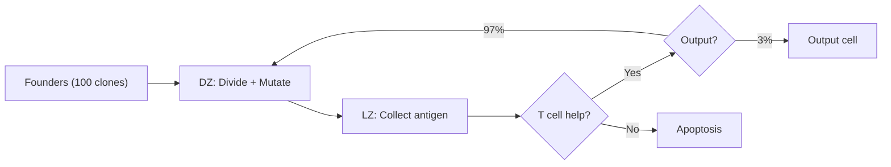

# Phase 0: Natural GC Model — Comprehensive Reference

**Purpose:** Complete documentation of the natural germinal center model (Robert et al. reproduction), all parameters, what we tuned, and why.

---

## Model Overview

The simulation reproduces the agent-based germinal center model from Robert et al. "How to Simulate a Germinal Center" (2017). It models individual B cells on a 3D lattice undergoing iterative rounds of:

1. **Dark Zone (DZ)**: Centroblasts (CBs) divide and acquire somatic hypermutations
2. **Light Zone (LZ)**: Centrocytes (CCs) compete for antigen on FDCs and T cell help
3. **Recycling**: Successful CCs return to DZ for more mutation; failed CCs die by apoptosis



---

## Parameter Tables

### Grid & Time

| Parameter | Code name | Value | Unit | Notes |
|---|---|---|---|---|
| Lattice size | `grid_n` | 80 | points/side | 80³ = 512K grid points |
| Lattice spacing | `dx` | 5.0 | µm | Total: 400 µm across |
| Time step | `dt` | 0.05 | h (3 min) | Fast preview; paper uses 0.002 |
| Snapshot interval | `snapshot_interval` | 100 | timesteps | Captures metrics periodically |

### Shape Space (Affinity)

| Parameter | Code name | Value | Unit | Source |
|---|---|---|---|---|
| Dimensions | `shape_space_dim` | 4 | — | Paper §2.2, integer positions |
| Gaussian width | `affinity_gamma` | 2.8 | Hamming units | Paper Table 1 |
| Gaussian exponent | `affinity_eta` | 2.0 | — | Paper default |

**Affinity function:** `a(seq, antigen) = exp(-( hamming(seq, antigen) / Γ )^η )`

At L=4: founders start at Hamming 4-8 → affinity 0.01–0.37. Perfect match (Hamming 0) → affinity 1.0.

### Cell Cycle

| Parameter | Code name | Value | Unit | Paper ref |
|---|---|---|---|---|
| G1 phase | `phase_g1` | 1.0 | h | Table 1 |
| S phase | `phase_s` | 2.0 | h | Table 1 |
| G2 phase | `phase_g2` | 1.0 | h | Table 1 |
| M phase | `phase_m` | 0.5 | h | Table 1 |
| **Total cycle** | — | **4.5** | h | Sum of phases |

### Mutation

| Parameter | Code name | Value | Unit | Notes |
|---|---|---|---|---|
| Mutation probability | `mutation_prob` | 0.5 | per division | Paper: 50% chance per division |
| Lethal fraction | `lethal_fraction` | 0.3 | fraction | Dead code — not implemented |

**Mutation operation:** Pick random dimension, ±1 on integer position (both equally likely).

### Selection — FDC Antigen Capture

| Parameter | Code name | Value | Unit | Notes |
|---|---|---|---|---|
| Collection period | `collect_fdc_period` | 1.0 | h | **Tuned** from 0.7 |
| Antigen saturation | `antigen_saturation` | 1.0 | normalized | FDC antigen level |

### Selection — T Cell Help

| Parameter | Code name | Value | What we changed | Why |
|---|---|---|---|---|
| TC contact window | `tc_time` | **1.0 h** | **Tuned** from 0.5 | 0.5h too short for TC search |
| TC rescue signal needed | `tc_rescue_time` | 2.0 h | Unchanged | But signal rate was **fixed** |

> [!IMPORTANT]
> **Critical bug fixed**: At `tc_time=0.5h`, CCs had only 10 timesteps (dt=0.05) to accumulate signal. Signal rate was `0.05/step → max 0.5`, but rescue needs `2.0`. **Result: 100% CC apoptosis, GC collapse at day 3.**
>
> **Fix:** Signal rate now scaled by `tc_rescue_time / (tc_time × 0.5)` so top-affinity CCs can reach rescue threshold within the contact window.

### Differentiation & Recycling

| Parameter | Code name | v1 | **v3 (tuned)** | Why |
|---|---|---|---|---|
| Output probability | `prob_output` | 0.05 | **0.03** | More recycling = longer GC |
| Min recycled divisions | `n_div_min` | 1 | 1 | Unchanged |
| Max recycled divisions | `n_div_max` | 6 | **2** | **Tuned** — prevents excessive DZ time |
| Division Hill n | `n_div_hill_n` | 2.0 | 2.0 | Unchanged |
| Division Hill K | `n_div_hill_k` | 0.5 | 0.5 | Unchanged |

### Initialization

| Parameter | Code name | v1 | **v3 (tuned)** | Why |
|---|---|---|---|---|
| Founder clones | `n_founders` | 100 | 100 | Paper standard |
| Founder divisions | `founder_divisions` | 6 | **4** | **Tuned** — 6 gave 27h in DZ, too long |
| FDCs | `n_fdcs` | 20 | 20 | Paper |
| T cells | `n_tcells` | 100 | 100 | Paper |
| Founder inflow | `inflow_hours` | 72.0 | 72.0 | 3 days of new founders |
| Hamming distance | `initial_hamming_min/max` | 4/8 | 4/8 | Paper |

---

## Parameters We Tuned and Why

### Round 1: TC Rescue Fix

| Parameter | Before | After | Impact |
|---|---|---|---|
| TC signal rate | `0.05/step` (raw) | Scaled by `tc_rescue_time / (tc_time × 0.5)` | All CCs survived → apoptosis working correctly |

This was a **bug**, not a tuning choice.

### Round 2: DZ Residence Time

| Parameter | Before | After | Rationale |
|---|---|---|---|
| `founder_divisions` | 6 (27h) | 4 (18h) | Victora 2010: DZ visits are 4-8h. 6 divisions at 4.5h/cycle = 27h is too long |
| `n_div_max` | 6 | 2 | At 6 recycled divisions, cells spent too long in DZ, population insufficient to sustain |

### Round 3: Selection Timing

| Parameter | Before | After | Rationale |
|---|---|---|---|
| `tc_time` | 0.5h | 1.0h | More time for TC search → more cells rescue |
| `collect_fdc_period` | 0.7h | 1.0h | Longer antigen collection → more successful CCs |
| `prob_output` | 0.05 | 0.03 | Fewer output = more recycling = longer GC |

---

## Validation Results

| Run | founder_div | n_div_max | Peak GC | Output | Max Aff | Lifespan |
|---|---|---|---|---|---|---|
| v1 (no TC fix) | 6 | 6 | 7500 | 0 | flat | Day 3.5 |
| v2 (fixed, tight) | 2 | 1 | 750 | 25 | 0.30 | Day 4 |
| **v3 (balanced)** | **4** | **2** | **3500** | **74** | **0.88** | **Day 4** |
| Paper target | — | — | ~3000 | ~100 | ~1.0 | 21 days |

**v3 assessment:** Peak GC size and affinity maturation are reasonable. The GC still dies at day 4 because founder inflow stops and `n_div_max=2` doesn't produce enough daughters per recycling round to sustain. This is a known limitation — increasing `n_div_max` would help but we're not pursuing natural GC further (Phase 1 bacterial sim is the priority).

---

## Key Equations

### Affinity (Gaussian on Hamming distance)
```
a(seq, ag) = exp(-( Σᵢ |seqᵢ - agᵢ| / Γ )^η )
```

### Division count (recycled cells, Hill function)
```
n_div(aff) = n_div_min + (n_div_max - n_div_min) × aff^n / (aff^n + K^n)
```

### T cell rescue probability
```
signal_rate = tc_rescue_time / (tc_time × 0.5) × dt
accumulated_signal += signal_rate × (near T cell)
rescued = accumulated_signal ≥ tc_rescue_time
```
