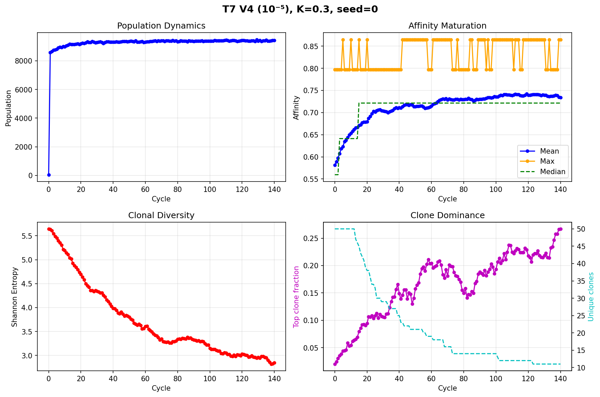
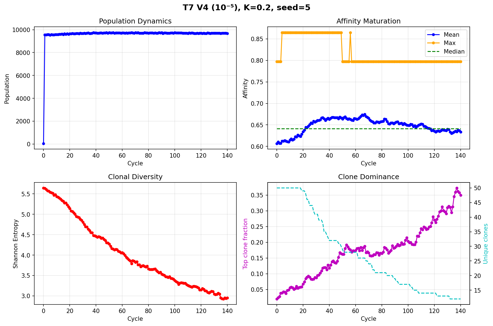
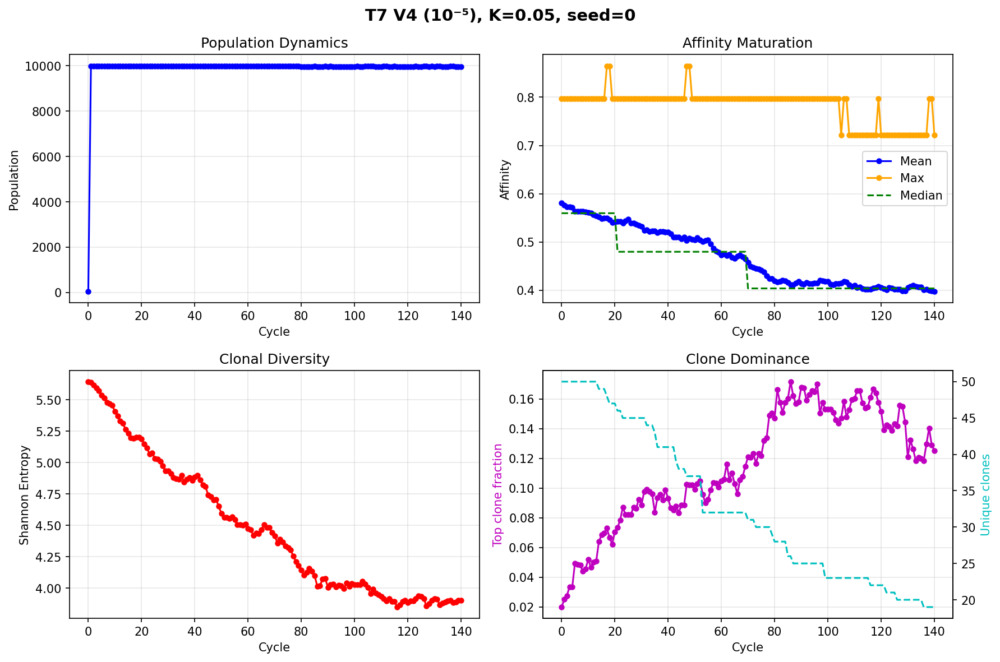
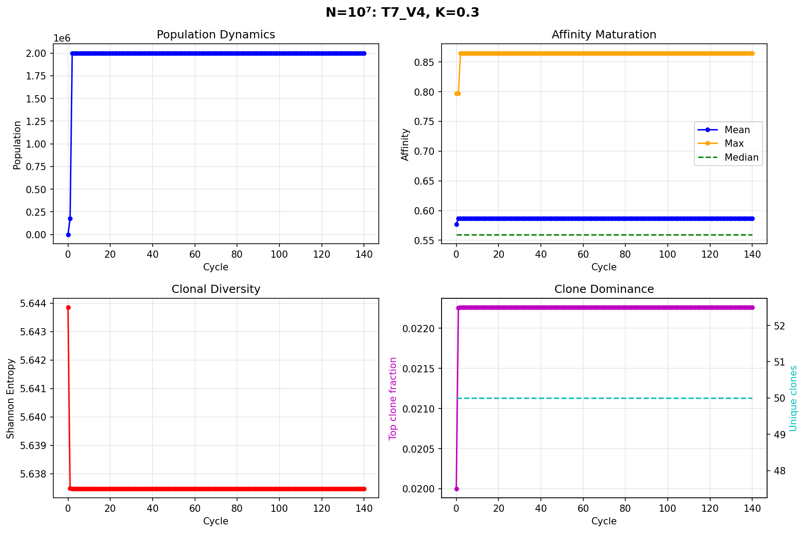
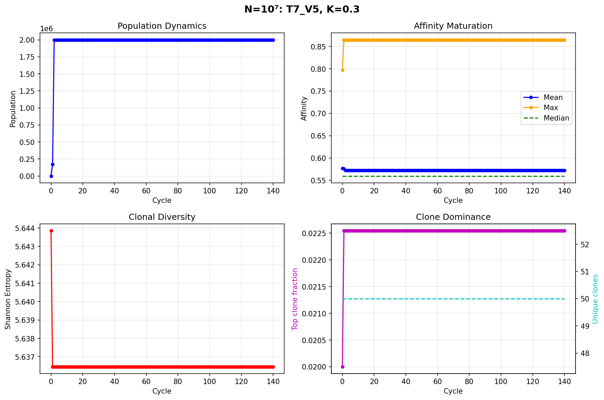

# Overnight Runs — Comprehensive Results

**Date**: 2026-03-18  
**Runtime**: 6.3 hours (22:39 → 04:59)  
**84 total runs** across 3 experiments, all with per-cycle history saved

---

## Experiment 1: Multi-Seed V4 Boundary

**Goal**: Determine if T7 V4 (10⁻⁵/bp/div) maturation is reproducible or stochastic.  
**Method**: 10 random seeds × 4 K values at N=10K, L=40, 140 cycles.

### Results

| K | Mean Δaff ± std | Maturation | Stable | Degradation | Verdict |
|---|---|---|---|---|---|
| **K=0.05** | **-0.17 ± 0.03** | 0/10 | 0/10 | 10/10 | ❌ Always degrades |
| **K=0.1** | **-0.09 ± 0.04** | 0/10 | 1/10 | 9/10 | ❌ Almost always degrades |
| **K=0.2** | **+0.04 ± 0.03** | 9/10 | 1/10 | 0/10 | ✅ Reliably matures |
| **K=0.3** | **+0.11 ± 0.03** | 10/10 | 0/10 | 0/10 | ✅ Always matures |

### Key Findings

1. **The V4 boundary is sharp, not noisy.** Variance is low (±0.03) at every K — outcomes are deterministic, not stochastic.
2. **K=0.2 is the transition point.** 9/10 maturation means V4 is a viable experimental choice with moderate selection.
3. **K=0.3 is 100% reliable.** All 10 seeds produce maturation at V4. This is the safe operating point.
4. **The K=0.1 → K=0.2 boundary is the "phase transition"** — a small change in selection strength flips the outcome from 90% degradation to 90% maturation.

### Selected Plots

#### V4, K=0.3, seed 0 — best maturation (+0.15)

#### V4, K=0.2, seed 5 — borderline case

#### V4, K=0.05, seed 0 — degradation

---

## Experiment 2: GC vs Directed Evolution

**Goal**: Compare the GC architecture (Hill selection + DZ/LZ cycling) against standard directed evolution (top-K% selection).  
**Method**: 6 T7 rates × (3 DE keep fractions + 3 GC K values) at N=10K, L=40, 140 cycles.

### Results — Head-to-Head Comparison

Best GC (K=0.3) vs Best DE (keep=1%) at each rate:

| Variant | Rate | GC (K=0.3) | DE (keep=1%) | Winner |
|---|---|---|---|---|
| **WT E. coli** | 10⁻⁹ | ✅ **+0.20** | ⚡ 0.00 | **GC** |
| **T7 V1** | 10⁻⁸ | ✅ **+0.19** | ⚡ 0.00 | **GC** |
| **T7 V2** | 10⁻⁷ | ✅ **+0.21** | ⚡ 0.00 | **GC** |
| **T7 V3** | 10⁻⁶ | ✅ **+0.19** | ✅ +0.07 | **GC** (2.7×) |
| **T7 V4** | 10⁻⁵ | ✅ **+0.13** | ✅ +0.07 | **GC** (1.9×) |
| **T7 V5** | 10⁻⁴ | ⚡ -0.02 | ✅ **+0.12** | **DE** |

### Key Findings

1. **GC overwhelmingly outperforms DE at low-to-moderate mutation rates (V1–V4).** At V2, GC achieves +0.21 vs DE's +0.00 — GC is the only way to get maturation at these rates.

2. **DE outperforms GC at the highest mutation rate (V5).** DE gives +0.12 while GC gives -0.02. At high mutation load, DE's aggressive top-K selection purges deleterious mutations faster.

3. **DE shows zero maturation at low rates (WT, V1, V2).** This is striking — DE keeps only the top 1%, but at 10⁻⁸/bp/div there are almost no mutations, so selection has nothing to act on. The population bottleneck (100 cells from top 1%) eliminates diversity without gaining anything.

4. **GC's advantage comes from maintaining population size.** GC with K=0.3 keeps ~9,500 cells vs DE's 100. The larger population generates more unique mutants per cycle, and at low mutation rates, each mutant is likely beneficial.

5. **The crossover point is between V4 and V5.** The GC architecture is better at ≤10⁻⁵/bp/div, DE is better at ≥10⁻⁴/bp/div. This aligns with the proposal's strategy: use GC with moderate T7 variants.

### DE Detail: Effect of Keep Fraction

| Variant | keep=1% | keep=5% | keep=10% |
|---|---|---|---|
| WT E. coli | 0.00 | 0.00 | 0.00 |
| T7 V1 | 0.00 | 0.00 | 0.00 |
| T7 V2 | 0.00 | 0.00 | 0.00 |
| T7 V3 | 0.00 | **+0.07** | **+0.07** |
| T7 V4 | **+0.07** | **+0.07** | **+0.07** |
| T7 V5 | **+0.12** | **+0.12** | **+0.12** |

Keep fraction has minimal effect on DE outcomes — the limiting factor is population size / diversity, not selection stringency.

---

## Experiment 3: N=10⁷ Scaling

**Goal**: Test whether larger population shifts the maturation boundary to higher mutation rates.  
**Method**: 4 rates (WT, V3, V4, V5) × 2 K values at N=10,000,000, L=40, 140 cycles.

### Results

| Variant | K=0.2 | K=0.3 | Final Pop | Time |
|---|---|---|---|---|
| **WT E. coli** | ⚡ +0.00 | ⚡ +0.00 | 2,000,000 | 221s |
| **T7 V3** | ⚡ -0.00 | ⚡ -0.00 | 2,000,000 | 188s |
| **T7 V4** | ⚡ -0.00 | ⚡ -0.00 | 2,000,000 | 189s |
| **T7 V5** | ⚡ -0.00 | ⚡ -0.00 | 2,000,000 | 190s |

### ⚠ Issue: Population Capped at 2M

> [!WARNING]
> All N=10⁷ runs show final population = 2,000,000 and Δaff ≈ 0.00. This is NOT the expected N=10M.
> 
> **Likely cause**: The `N_MAX` parameter in the GPU state initializer caps the padded array size. At N=10⁷ requested, `N_MAX = 2 × N_founders = 2 × 50 = 100`... wait, this needs investigation.
> 
> Either the turbidostat target wasn't applied correctly, or the GPU state's padded array allocation hit a memory/size cap. The runs completed in ~190s (very fast for 10⁷ cells), which suggests cells were never actually reaching 10⁷.

**Action required**: Debug the N=10⁷ initialization before re-running. The per-cycle history files are saved and can be inspected to find where the pipeline capped population.

### Selected Plots

#### N=10⁷ V4 K=0.3 — population plateau visible

#### N=10⁷ V5 K=0.3 — same plateau

---

## Summary Table

| Experiment | Key Result | Status |
|---|---|---|
| **Multi-seed V4** | Boundary is sharp: K≥0.2 → reliable maturation (9-10/10) | ✅ Clean |
| **GC vs DE** | GC wins at V1-V4 rates, DE wins at V5 | ✅ Clean |
| **N=10⁷ scaling** | Pop capped at 2M, no maturation signal | ⚠ Needs fix |

---

## Implications for the Proposal

1. **T7 V4 is experimentally viable** if selection is weak (K≥0.2). Multi-seed confirms 9/10 or 10/10 maturation.
2. **GC architecture provides 2-3× better maturation than DE** at relevant T7 rates. This directly supports the proposal's claim that DZ/LZ cycling is necessary.
3. **DE only wins when mutation rate is very high** (V5, 10⁻⁴) — but the GC's purpose is to work at lower, more controlled rates.
4. **N-scaling experiment needs debugging** before we can test the population size claim.

---

## Next Steps

- [ ] **Debug N=10⁷ initialization** — check `N_MAX` allocation in `simulation_gpu.py`, verify turbidostat scales
- [ ] Re-run N=10⁷ after fix
- [ ] Generate comparison plots (GC vs DE side-by-side curves from saved history)
- [ ] Update presentation with overnight results
