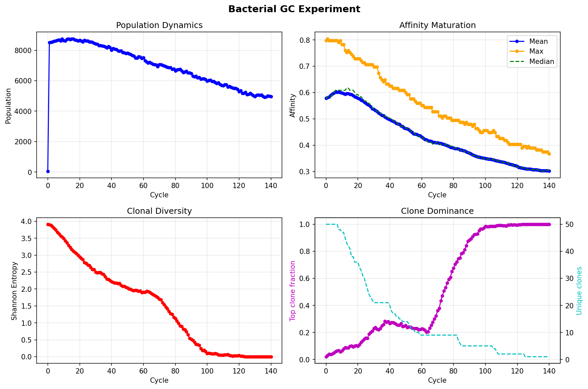
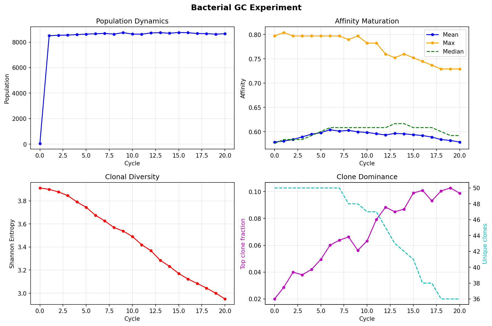
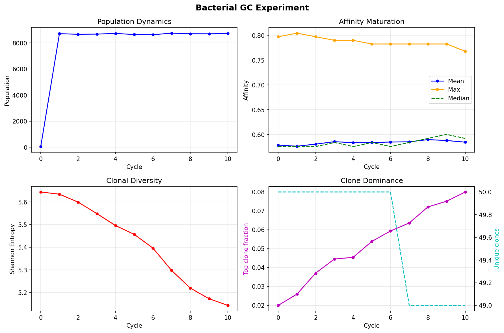
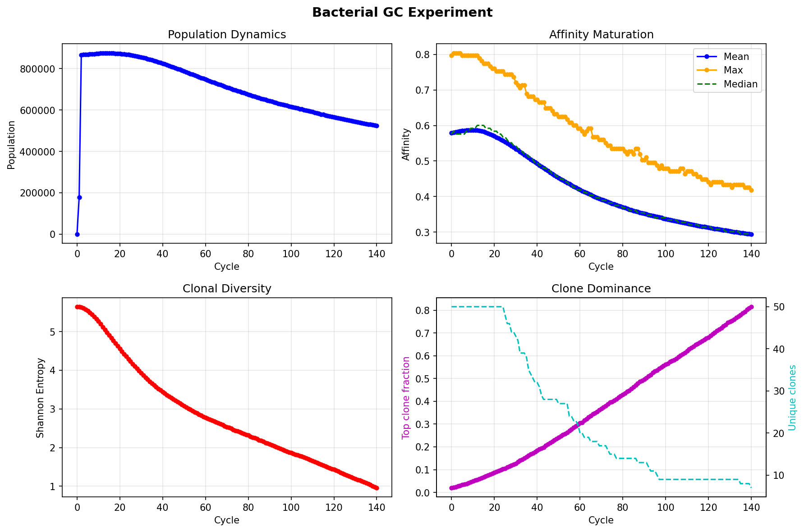

# EXP_002 — Previous Results Archive

All results from Phase 1 bacterial GC runs (2026-03-16/17).

---

## Run 1: L=400, N=10K, T7 Rate, No Unselected Return (140 cycles)

**Parameters:**
| Parameter | Value |
|---|---|
| N | 10,000 |
| L | 400 |
| mutation_rate | 0.0005/pos/div |
| Γ (affinity_gamma) | 105 |
| Hill K | 0.3 |
| Hill n | 3.0 |
| unselected_return | 0.0 |
| dz_growth_hours | 6.0 |
| doubling_time | 0.5h |
| dz_divisions | 6 |
| n_founders | 50 |

**Results:**
- Population: 8,800 → 5,000 (declining)
- Mean affinity: 0.58 → **0.30** (degradation)
- Max affinity: 0.80 → 0.30
- Diversity: 3.9 → **0** (single clone takeover by cycle 100)

---

## Run 2: L=400, N=10K, T7 Rate, 20 Cycles

**Same as Run 1 but only 20 cycles.** First calibration run at L=400.

**Results:**
- Population: stable at ~8,600
- Mean affinity: 0.58 → 0.60 (slight improvement then decline)
- Max affinity: 0.80
- Diversity: 3.9 → 3.0 (36/50 unique clones remain)
- Top clone: 10%

---

## Run 3: L=400, N=10K, GPU Code, Unselected Return 0.1 (10 cycles)

**Parameters:** Same as Run 1 except `unselected_return=0.1`.

**Results:**
- Population: stable at ~8,700
- Mean affinity: 0.58 → 0.59
- Max affinity: 0.80 → 0.77
- Diversity: 5.6 → **5.1** (much better than Run 1!)
- All 50 clones maintained

---

## Run 4: L=400, N=1M, Unselected Return 0.1 (140 cycles) ⭐

**Parameters:** Same as Run 1 except N=1,000,000 and `unselected_return=0.1`.

**Run time:** 108 minutes (45s/cycle), 64% RAM (20 GB)

**Results:**
| Metric | Start | End |
|---|---|---|
| Population | 875,000 | 524,000 |
| Mean affinity | 0.58 | **0.29** |
| Max affinity | 0.80 | **0.42** |
| Diversity (Shannon) | 5.63 | **0.96** |
| Top clone fraction | 2% | **80%** |

**Key finding:** No affinity maturation even at N=1M. Muller's ratchet — see [analysis_mullers_ratchet.md](/experiments/EXP_002/simulation/docs/analysis_mullers_ratchet.md).

---

## Summary Comparison

| Run | N | unsel_return | Cycles | Final diversity | Final affinity |
|---|---|---|---|---|---|
| 1 | 10K | 0.0 | 140 | **0** | 0.30 |
| 2 | 10K | 0.0 | 20 | 3.0 | 0.58 |
| 3 | 10K | 0.1 | 10 | 5.1 | 0.59 |
| 4 | 1M | 0.1 | 140 | 0.96 | **0.29** |

> **⚠️ Note**: Runs 2 and 3 used fewer cycles (20 and 10) — they were early exploratory tests. For fair comparison, see the **parameter sweep** in `results/sweep/SWEEP_RESULTS.md` where all runs use 140 cycles.

**Takeaway:** Affinity degrades in all long runs at mutation_rate=0.0005. Selection (Hill K=0.3) is too weak — 88% survival is insufficient to counter mutational load.
