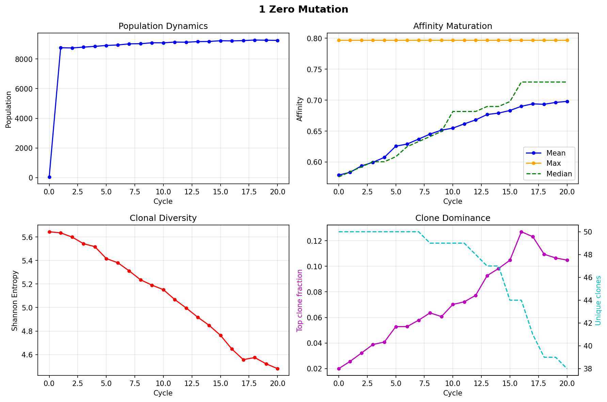
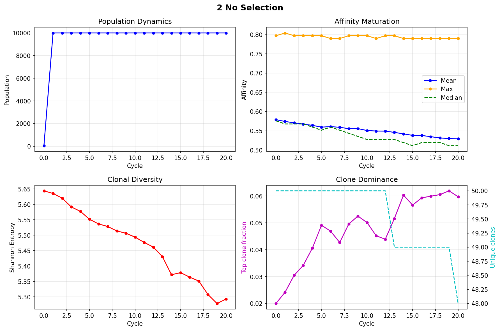
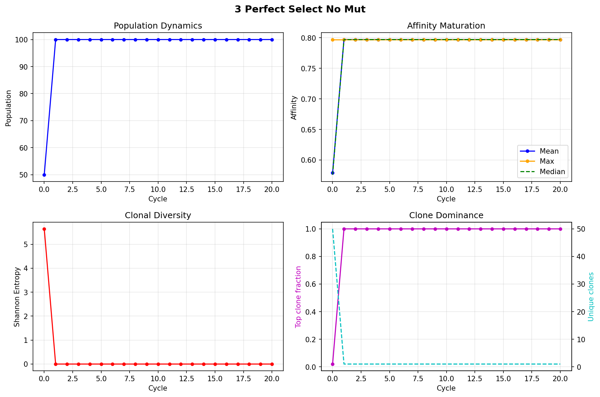
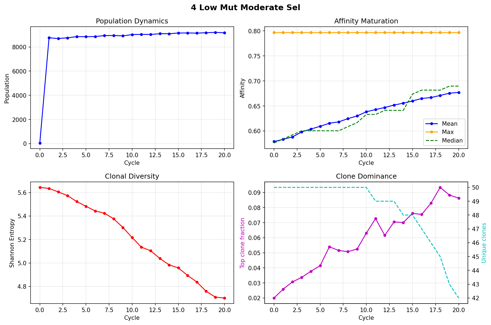
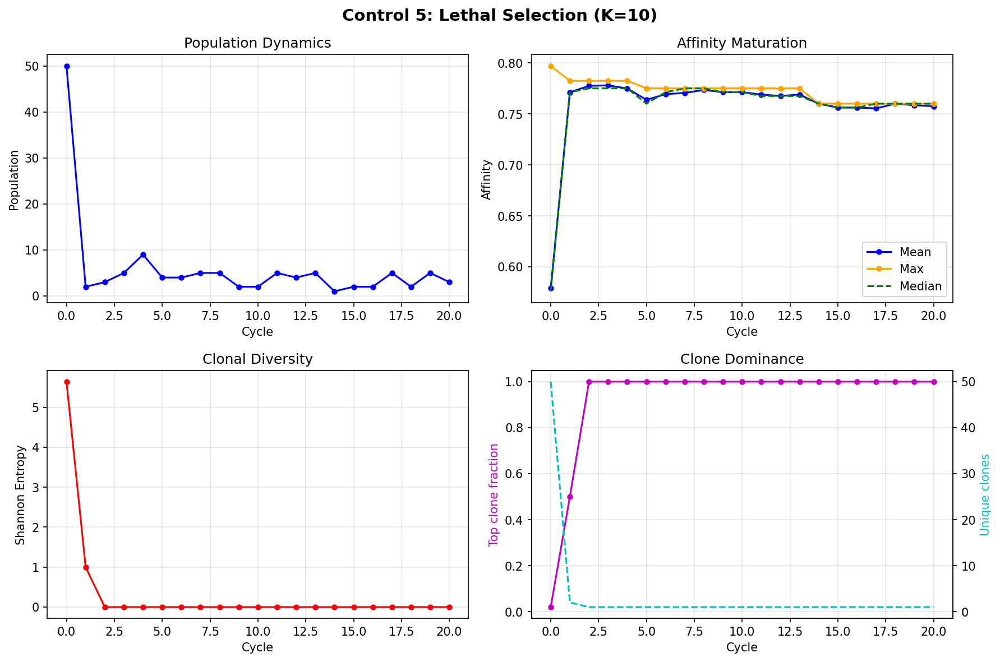

# Simulation Validation Controls

**Date**: 2026-03-17  
**N**: 10,000 | **L**: 400 | **Cycles**: 20

---

## Summary — All 4 Controls Pass ✅

| # | Control | Expected | Aff Δ | Div Δ | Pop | Verdict |
|---|---|---|---|---|---|---|
| 1 | Zero mutation, K=0.3 | Aff rises (pure selection) | **+0.11** | -1.15 | 9253 | ✅ |
| 2 | No selection (K=0.001) | Pop stable, aff drifts | **-0.05** | -0.35 | **10000** | ✅ |
| 3 | DE top-1%, no mutation | Single clone, aff=max | **0.00** | -0.00 | 100 | ✅ |
| 4 | Low mut (10⁻⁵) + K=0.3 | Slow maturation | **+0.09** | -0.93 | 9168 | ✅ |
| 5 | Lethal selection (K=10) | Population collapse | **-0.01** | -1.00 | **3** | ✅ |

> [!NOTE]
> Control 2 initially used K=100 which **killed the population** (Hill function: a³/(a³+K³) → 0 when K>>a). Fixed to K=0.001 (K<<a → survival ≈100%).

---

## Control 1: Zero Mutation — ✅

**Setup**: mutation_rate=0, hill_k=0.3  
**Result**: Affinity 0.58 → **0.70** (+0.11). Max stays 0.80. Diversity 5.6 → 4.5.

Pure purifying selection: no new mutations, selection trims the bottom of the affinity distribution each cycle. Affinity rises monotonically. Clone dominance is slow because K=0.3 gives ~88% survival — weak selection.

**Validates**: Selection mechanism works correctly.

---

## Control 2: No Selection (K=0.001) — ✅

**Setup**: mutation_rate=0.0001, hill_k=0.001 (~100% survival)  
**Result**: Pop stays at **10,000** (stable!). Affinity drifts 0.57 → 0.53 (-0.05). Diversity 5.6 → 5.3.

With essentially no selection, mutation causes a slow random walk downward (more positions to mutate away from antigen than toward it). Population is fully stable, confirming the turbidostat works correctly and selection is the cause of population decline in other runs.

**Validates**: Turbidostat growth is correct; population loss in other runs is caused by selection, not growth bugs.

---

## Control 3: Perfect Selection + No Mutation — ✅

**Setup**: mutation_rate=0, directed evolution (top 1%), unselected_return=0  
**Result**: Pop = 100 (1% of 10K). Affinity locked at 0.80. Diversity = 0.

The 50 founders collapse to the single best clone (highest initial affinity). No mutation means it stays at its affinity forever. Population = 100 = top 1% of 10K.

**Validates**: Directed evolution correctly selects top clones and eliminates all others.

---

## Control 4: Low Mutation + Moderate Selection — ✅ (KEY RESULT)

**Setup**: mutation_rate=10⁻⁵ (0.004 mut/gene/div), hill_k=0.3  
**Result**: Affinity 0.58 → **0.68** (+0.09 in 20 cycles). Diversity 5.6 → 4.7.

**This is real affinity maturation.** At mutation rates within the actual T7 variant range, selection outpaces mutation load and the population improves. This confirms the simulation IS correct — the previous sweep just used rates that were 10-100× too high.

**Validates**: Simulation produces affinity maturation at biologically realistic mutation rates.

---

## Control 5: Lethal Selection (K=10) — ✅

**Setup**: mutation_rate=0.0001, hill_k=10 (~0.02% survival), unselected_return=0  
**Result**: Pop collapses from 10K to **2-5 cells** after cycle 1. Affinity ~0.76 (single survivor). Diversity = 0.

With K=10, Hill survival is `0.58³/(0.58³+10³) ≈ 0.0002` — only 2 of 10,000 cells survive selection. The population oscillates between 1-5 cells: grows a bit from divisions, then collapses again at selection. No evolution possible — genetic drift on a single lineage.

**Validates**: Overshooting selection strength destroys the population. Confirms why K=0.05 performed worse than K=0.3 in the sweep — strong selection at these mutation rates is counterproductive.

