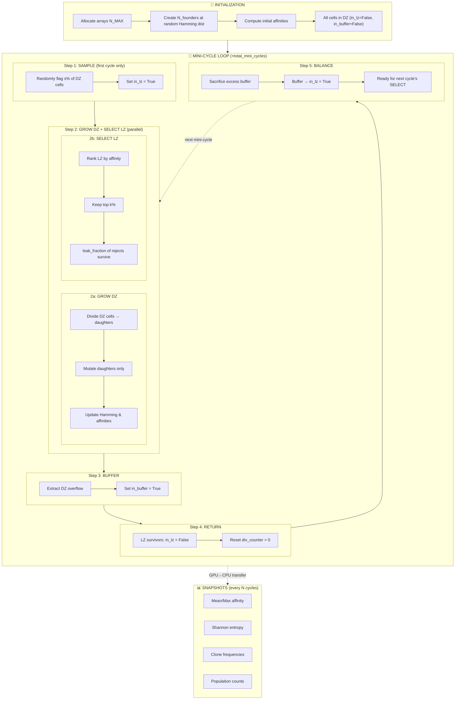

# Flow Diagram — Bacterial Synthetic GC v2 (Pipeline Model)

> **Purpose**: GPU-accelerated simulation of a bacterial synthetic germinal center using JAX.  
> **Key change from v1**: Continuous pipeline model — only a *random fraction* of DZ cells enter selection each mini-cycle, not all cells that completed N divisions.  
> **Selection model**: Competitive (top-fraction) by default, replaces independent Hill.  
> **Target hardware**: NVIDIA GPU, JAX with `jax.jit` static shapes.

---

## 1. Initialization

```
initialize(config, rng_key)
├── Create antigen: int8[L] — single fixed target sequence (random)
├── Allocate fixed-size arrays: N_MAX = int(target_n × (2^d + s) × 1.1)
│
├── Create N_founders (e.g. 50) at random Hamming distance from antigen
│   ├── sequences[i] = random int8[L], constrained to hamming(seq, antigen) ∈ [d_min, d_max]
│   ├── affinities[i] = exp(-(hamming/γ)^η)
│   ├── alive[i] = True
│   ├── in_lz[i] = False  (all start in DZ)
│   ├── in_buffer[i] = False
│   ├── div_counter[i] = 0
│   └── clone_id[i] = i  (each founder = unique clone)
│
├── Remaining N_MAX - N_founders slots: alive = False
│     (JAX requires fixed array sizes for JIT — we pre-allocate the max
│      and use alive=False to mark empty slots. These get reused when
│      cells divide and need space for daughters.)
│
└── Return: GCState(sequences, affinities, hamming_distances,
                     alive, in_lz, in_buffer, div_counter, clone_id, rng_key)
```

### Data Structures (all fixed-size for JIT)

```python
@dataclass
class GCState:
    # jnp = jax.numpy — JAX's GPU-accelerated NumPy (import jax.numpy as jnp)
    # All arrays are pre-allocated at N_MAX and live on GPU
    sequences:    jnp.int8[N_MAX, L]      # genotype per cell
    hamming:      jnp.int32[N_MAX]         # Hamming distance to antigen (cached)
    affinities:   jnp.float32[N_MAX]       # binding affinity (derived from hamming)
    alive:        jnp.bool_[N_MAX]         # slot is occupied
    in_lz:        jnp.bool_[N_MAX]         # cell is in LZ (awaiting/undergoing selection)
    in_buffer:    jnp.bool_[N_MAX]         # cell is in buffer (extracted from DZ overflow)
    div_counter:  jnp.int32[N_MAX]         # divisions since last selection
    clone_id:     jnp.int32[N_MAX]         # founder lineage ID
    rng_key:      jnp.uint32[2]            # JAX PRNG key

class Config:  # static — passed via static_argnums
    target_n:           int     # chemostat steady-state population (e.g. 10_000)
    n_max:              int     # ⚠️ must fit worst-case alive count (peak during growth):
                                #   In cycle 1+: DZ starts at N, grows to N×2^d.
                                #   LZ also has s×N cells. Peak = N×2^d + s×N.
                                #   n_max = int(N × (2^d + s) × 1.1)  (10% safety)
                                #   e.g. d=2, s=0.3: n_max = int(N × 4.3 × 1.1) ≈ 5×N
    L:                  int     # shape space dimensions (40)
    mutation_rate:      float   # per position per division (e.g. 1e-5)
    gamma:              float   # ⚠️ affinity Gaussian width (10.5) — how far from
                                #   the target a cell can be and still bind.
                                #   Larger γ = more forgiving. NOT derived from a
                                #   clean scaling law (Robert uses γ=2.8 at L=4 with
                                #   Manhattan distance; we use binary Hamming).
                                #   MUST CALIBRATE EARLY: γ is tightly coupled to
                                #   initial founder Hamming distance. At γ=10.5:
                                #     h=15 → aff≈0.13, h=20 → aff≈0.03, h=30 → aff≈0
                                #   Validate by plotting founder affinity distributions.
    eta:                float   # affinity exponent (2.0) — shape of drop-off.
                                #   η=2 gives a classic bell curve (quadratic Gaussian).
                                #   Standard value from GC literature.
    doubling_time:      float   # bacterial doubling time in minutes (30)
    incubation_time:    float   # LZ bead incubation time in minutes (60)
                                #   During this time DZ keeps growing.
                                #   Determines how much DZ overflows → buffer size.
    sample_fraction:    float   # fraction of DZ sampled to LZ (0.3–0.5)
    keep_fraction:      float   # fraction of LZ kept after selection (0.1–0.3)
    leak_fraction:      float   # fraction of non-selected LZ cells that survive
                                #   anyway (imperfect bead washout). Usually very
                                #   low (e.g. 0.001–0.01). Also mimics natural GC
                                #   where not all unselected cells apoptose.
    n_founders:         int     # initial library size (50)
    total_mini_cycles:  int     # total experiment length (560 → ~35 days)
    alphabet_size:      int     # values per position (default 4 for ACGT)
```

---

## 2. Main Loop — Mini-Cycle Pipeline

```
run_simulation(config)
│
├── state = initialize(config, rng_key)
│
├── metrics = []
│
└── for mc in range(config.total_mini_cycles):     ← PYTHON loop (not JIT'd)
    │
    ├── state = run_one_mini_cycle(state, config)   ← @jax.jit (static_argnums=config)
    │
    ├── if mc % snapshot_interval == 0:           ← save stats every Nth cycle
    │   └── metrics.append(collect_snapshot(state))  (GPU→CPU transfer is slow,
    │                                                  so we don't do it every cycle)
    │
    └── return metrics
```

> **JIT boundary**: `run_one_mini_cycle` is the main JIT-compiled function. It takes the full `GCState` as dynamic args and `Config` as static args. The outer Python loop handles snapshots and non-JIT bookkeeping.

---

## 3. `run_one_mini_cycle` — The Core Pipeline

This is the heart of the simulation. It models the robot's async workflow:
- DZ grows **continuously** (chemostat, no turbidostat)
- LZ incubation and DZ growth happen **in parallel**
- A **buffer** ensures cells don't go DZ→LZ→DZ→LZ in one cycle

### Population Balance

For the population to stay constant at N, the buffer step must absorb the DZ overflow.

**Cycle 0** (initial — Step 1 SAMPLE runs):
```
Start:          DZ = N,           LZ = 0
After sample:   DZ = (1-s)×N,     LZ = s×N
After growth:   DZ = (1-s)×N×2^d, LZ = s×N         (LZ doesn't grow)
After select:                      LZ_surv = k×s×N
BUFFER:         DZ_target = N - k×s×N               (make room for return)
                buffer = (1-s)×N×2^d - DZ_target
                       = N×[(1-s)×2^d - 1 + k×s]
After return:   DZ = N  ✓
BALANCE:        buffer → LZ (sacrifice excess beyond s×N)
```

**Cycle 1+** (Step 1 SKIPPED — LZ already populated from buffer):
```
Start:          DZ = N,          LZ = s×N  (from previous BALANCE)
After growth:   DZ = N×2^d,      LZ = s×N  (LZ doesn't grow)
After select:                     LZ_surv = k×s×N
BUFFER:         DZ_target = N - k×s×N
                buffer = N×2^d - DZ_target
                       = N×(2^d - 1 + k×s)
After return:   DZ = N  ✓
BALANCE:        buffer → LZ (sacrifice excess beyond s×N)
                sacrifice = buffer - s×N = N×(2^d - 1 + k×s - s)
                          = N×(2^d - 1 - s×(1-k))
```

**Key insight**: The sacrifice is always positive (DZ always overflows at 2+ doublings),
so `sample_fraction` is a **free parameter**. The sacrifice IS the chemostat dilution —
it's just applied discretely at the buffer step rather than continuously.

| d | k   | s    | Sacrifice per cycle (×N) | Interpretation |
|---|-----|------|--------------------------|----------------|
| 2 | 0.1 | 0.30 | 2.73                     | 73% of DZ sacrificed |
| 2 | 0.1 | 0.50 | 2.55                     | 55% of DZ sacrificed |
| 2 | 0.3 | 0.30 | 2.79                     | 79% of DZ sacrificed |
| 3 | 0.1 | 0.30 | 6.73                     | Most of DZ sacrificed |

> **The sacrifice fraction is large because exponential growth dominates.**
> At 2 doublings, DZ quadruples. At 3 doublings, DZ grows 8×. The buffer/sacrifice
> mechanism acts as the chemostat's dilution, maintaining constant population.

```
╔══════════════════════════════════════════════════════════════════════════════╗
║               run_one_mini_cycle(state, config) → state                     ║
║                        @jax.jit(static_argnums=(1,))                        ║
╠══════════════════════════════════════════════════════════════════════════════╣
║                                                                              ║
║  ┌─ STEP 1: SAMPLE (DZ → LZ) ── FIRST CYCLE ONLY ───────────────────────────┐ ║
║  │  sample_to_lz(state, config) → state                                    │ ║
║  │                                                                         │ ║
║  │  Only runs on CYCLE 0 to initially populate the LZ.                     │ ║
║  │  After that, BALANCE (Step 5) auto-feeds LZ from the buffer.            │ ║
║  │  Skipped if sum(in_lz) > 0 (LZ already has cells from buffer).         │ ║
║  │                                                                         │ ║
║  │  Robot aspirates sample_fraction of the DZ culture:                     │ ║
║  │  • mask_dz = alive & ~in_lz & ~in_buffer                               │ ║
║  │  • n_to_sample = floor(count(mask_dz) × config.sample_fraction)        │ ║
║  │  • Draw n_to_sample cells uniformly at random from mask_dz             │ ║
║  │  • Set in_lz[sampled] = True                                           │ ║
║  │                                                                         │ ║
║  │  Arrays modified: in_lz                                                 │ ║
║  └─────────────────────────────────────────────────────────────────────────┘ ║
║                                    │                                         ║
║                                    ▼                                         ║
║  ┌─ STEP 2: GROW DZ + SELECT LZ  (in parallel) ───────────────────────────┐ ║
║  │                                                                         │ ║
║  │  These happen simultaneously in the real experiment.                     │ ║
║  │  In simulation: we run them sequentially but both operate               │ ║
║  │  on separate cell populations (DZ vs LZ), so order doesn't matter.     │ ║
║  │                                                                         │ ║
║  │  ── 2a. GROW DZ ──────────────────────────────────────────────────────  │ ║
║  │  │  grow_dz(state, config) → state                                    │ │ ║
║  │  │                                                                    │ │ ║
║  │  │  DZ cells grow during LZ incubation time.                          │ │ ║
║  │  │  n_doublings = floor(incubation_time / doubling_time)              │ │ ║
║  │  │  (e.g. 60 min / 30 min = 2 doublings)                             │ │ ║
║  │  │                                                                    │ │ ║
║  │  │  Uses jax.lax.fori_loop for n_doublings iterations:                │ │ ║
║  │  │    ┌───────────────────────────────────────────────┐                │ │ ║
║  │  │    │  DIVIDE: each DZ cell (alive & !in_lz & !in_buffer)           │ │ ║
║  │  │    │    produces a daughter in a free slot                          │ │ ║
║  │  │    │  • Find free slots via argsort(alive)                         │ │ ║
║  │  │    │  • Copy sequence, clone_id; increment div_counter             │ │ ║
║  │  │    │                                                                │ │ ║
║  │  │    │  MUTATE DAUGHTERS ONLY (replication-coupled, VECTORIZED):     │ │ ║
║  │  │    │  (Parents keep original sequence — mutations occur during     │ │ ║
║  │  │    │   DNA replication by T7 polymerase, only new strand mutates)  │ │ ║
║  │  │    │  • mutation_mask = random(N_MAX, L) < mutation_rate           │ │ ║
║  │  │    │  • Apply random shifts to daughters only where mask is True   │ │ ║
║  │  │    │  • Update Hamming incrementally, recompute affinities         │ │ ║
║  │  │    └───────────────────────────────────────────────┘                │ │ ║
║  │  │                                                                    │ │ ║
║  │  │  No dilution during growth — DZ overflows beyond target_n.        │ │ ║
║  │  │  The overflow is handled in STEP 3 (BUFFER).                       │ │ ║
║  │  │                                                                    │ │ ║
║  │  │  Arrays modified: sequences, hamming, affinities, alive,           │ │ ║
║  │  │                   div_counter                                      │ │ ║
║  │  └────────────────────────────────────────────────────────────────────┘ │ ║
║  │                                                                         │ ║
║  │  ── 2b. SELECT LZ ────────────────────────────────────────────────────  │ ║
║  │  │  select_lz(state, config) → state                                  │ │ ║
║  │  │                                                                    │ │ ║
║  │  │  Bead incubation + magnetic pulldown + wash:                       │ │ ║
║  │  │  • mask_lz = alive & in_lz                                        │ │ ║
║  │  │  • n_lz = sum(mask_lz)                                            │ │ ║
║  │  │  • n_keep = floor(n_lz × config.keep_fraction)                   │ │ ║
║  │  │  • Sort LZ cells by affinity (descending)                         │ │ ║
║  │  │  • Top n_keep: SELECTED (survive)                                 │ │ ║
║  │  │  • Bottom (n_lz - n_keep): mostly die (alive = False)             │ │ ║
║  │  │    EXCEPT: leak_fraction of non-selected survive anyway           │ │ ║
║  │  │    (models imperfect bead washout + natural GC stochasticity)     │ │ ║
║  │  │                                                                    │ │ ║
║  │  │  Arrays modified: alive                                            │ │ ║
║  │  └────────────────────────────────────────────────────────────────────┘ │ ║
║  └─────────────────────────────────────────────────────────────────────────┘ ║
║                                    │                                         ║
║                                    ▼                                         ║
║  ┌─ STEP 3: BUFFER (extract DZ overflow) ──────────────────────────────────┐ ║
║  │  buffer_extract(state, config) → state                                   │ ║
║  │                                                                          │ ║
║  │  DZ has overgrown during incubation. Before returning LZ survivors,     │ ║
║  │  extract excess DZ cells into a buffer.                                  │ ║
║  │                                                                          │ ║
║  │  ASYNC GUARANTEE: the buffer is extracted BEFORE LZ survivors return.   │ ║
║  │  This ensures that on the next round, cells that just came back from    │ ║
║  │  the LZ are NOT immediately sent back to LZ — only cells that were     │ ║
║  │  in the DZ during incubation can be buffered. Returned cells get at     │ ║
║  │  least one full growth cycle in DZ before being eligible for LZ again.  │ ║
║  │                                                                          │ ║
║  │  • n_dz_now = count(alive & !in_lz)    (overgrown DZ)                   │ ║
║  │  • n_lz_returning = count(alive & in_lz) (LZ survivors — selected       │ ║
║  │                                            + leaked)                     │ ║
║  │  • n_dz_target = target_n - n_lz_returning                              │ ║
║  │  • n_to_buffer = n_dz_now - n_dz_target   (excess to remove)            │ ║
║  │                                                                          │ ║
║  │  • Randomly select n_to_buffer DZ cells → set in_buffer = True          │ ║
║  │                                                                          │ ║
║  │  Arrays modified: in_buffer                                              │ ║
║  └──────────────────────────────────────────────────────────────────────────┘ ║
║                                    │                                         ║
║                                    ▼                                         ║
║  ┌─ STEP 4: RETURN (LZ survivors → DZ) ───────────────────────────────────┐ ║
║  │  return_to_dz(state, config) → state                                    │ ║
║  │                                                                         │ ║
║  │  • LZ survivors (alive & in_lz): in_lz = False, div_counter = 0        │ ║
║  │    → They rejoin DZ, won't be buffered (buffer already extracted)      │ ║
║  │                                                                         │ ║
║  │  • Dead LZ cells already have alive = False → slots freed              │ ║
║  │                                                                         │ ║
║  │  Arrays modified: in_lz, div_counter                                   │ ║
║  └─────────────────────────────────────────────────────────────────────────┘ ║
║                                    │                                         ║
║                                    ▼                                         ║
║  ┌─ STEP 5: BALANCE (buffer → next LZ, sacrifice excess) ─────────────────┐ ║
║  │  balance(state, config) → state                                          │ ║
║  │                                                                          │ ║
║  │  Buffer cells become the next mini-cycle's LZ batch.                    │ ║
║  │  But if too many buffer cells, sacrifice some to prevent overflow:      │ ║
║  │                                                                          │ ║
║  │  • n_buffer = count(in_buffer)                                           │ ║
║  │  • n_next_lz = floor(target_n × sample_fraction) (desired LZ size)     │ ║
║  │  • if n_buffer > n_next_lz:                                             │ ║
║  │      randomly kill (n_buffer - n_next_lz) buffer cells (alive = False)  │ ║
║  │  • Remaining buffer cells: in_buffer = False, in_lz = True             │ ║
║  │    → These are pre-loaded into LZ, ready for next cycle's STEP 2b      │ ║
║  │                                                                          │ ║
║  │  After this step:                                                        │ ║
║  │    DZ has ~target_n cells (returned survivors + remaining DZ)           │ ║
║  │    LZ has ~n_next_lz cells (from buffer, awaiting selection)            │ ║
║  │                                                                          │ ║
║  │  Arrays modified: alive, in_buffer, in_lz                               │ ║
║  └──────────────────────────────────────────────────────────────────────────┘ ║
║                                                                              ║
╚══════════════════════════════════════════════════════════════════════════════╝
```

---

## 4. Robot Workflow Mapping

```
┌──────────────────────────────────────────────────────────────────────────┐
│                    PHYSICAL ROBOT WORKFLOW                               │
│                   (one mini-cycle, ~1–2 hours)                          │
├──────────────────────────────────────────────────────────────────────────┤
│                                                                         │
│  ┌───────────┐                                                          │
│  │  ASPIRATE │   Robot takes x% of DZ culture                          │
│  │  SAMPLE   │   → transfers to LZ plate with antigen beads            │
│  └─────┬─────┘                                                          │
│        │                                                                │
│        ▼                                                                │
│  ┌──────────────────────────────────────────┐                           │
│  │        PARALLEL (incubation_time)         │                           │
│  │  ┌──────────┐        ┌──────────────┐    │                           │
│  │  │ DZ GROWS │        │ LZ INCUBATES │    │                           │
│  │  │ (cells   │        │ (beads bind  │    │                           │
│  │  │  divide, │        │  top binders,│    │                           │
│  │  │  mutate) │        │  wash away   │    │                           │
│  │  │          │        │  rest)       │    │                           │
│  │  └──────────┘        └──────────────┘    │                           │
│  └──────────────────────────────────────────┘                           │
│        │                       │                                        │
│        ▼                       │                                        │
│  ┌───────────┐                 │                                        │
│  │  BUFFER   │  Take overflow  │                                        │
│  │  EXTRACT  │  out of DZ      │                                        │
│  │  (excess  │  (makes room    │                                        │
│  │   cells)  │   for returning │                                        │
│  └─────┬─────┘  LZ survivors)  │                                        │
│        │                       │                                        │
│        │               ┌───────▼────────┐                               │
│        │               │ RETURN selected│                               │
│        │               │ LZ survivors   │                               │
│        │               │ → back to DZ   │                               │
│        │               └────────────────┘                               │
│        │                                                                │
│        ▼                                                                │
│  ┌───────────┐                                                          │
│  │ BALANCE   │  Buffer becomes next LZ batch.                          │
│  │           │  Sacrifice excess to keep population constant.          │
│  └───────────┘                                                          │
│                                                                         │
│  SIM STEPS:    1:sample   2a:grow   2b:select   3:buffer   4:return    │
│                            ─────────────────                            │
│                              (parallel)         5:balance               │
└──────────────────────────────────────────────────────────────────────────┘
```

---

## 5. JIT Compilation Boundaries

```
PYTHON LEVEL (not JIT'd)                    JAX LEVEL (@jax.jit)
─────────────────────                       ─────────────────────
                                            
run_simulation()                            
  │                                         
  ├── initialize()  ──────────────────────▶ @jax.jit: create_founders()
  │                                            allocate arrays
  │                                         
  ├── for mc in range(total_mini_cycles):   
  │   │                                     
  │   ├── ─────────────────────────────────▶ @jax.jit: run_one_mini_cycle()
  │   │                                        ├── sample_to_lz()│ ALL inside
  │   │                                        ├── grow_dz()     │ single
  │   │                                        ├── select_lz()   │ JIT scope
  │   │                                        ├── buffer_       │
  │   │                                        │   extract()     │
  │   │                                        ├── return_to_dz()│
  │   │                                        └── balance()     ─┘
  │   │                                     
  │   └── collect_snapshot() ◀───────────── device_get (GPU→CPU transfer)
  │       └── mean_affinity, diversity,     
  │           population counts, clone stats
  │                                         
  └── save_results()                        
```

### What does "JIT compilation" mean?

When you put `@jax.jit` on a function, the **first time** you call it JAX:
1. **Traces** your Python code (runs it symbolically, not with real data)
2. **Converts** it into an optimized GPU program (via Google's XLA compiler)
3. **Caches** the compiled program

Every subsequent call **skips Python entirely** and runs the pre-compiled GPU program directly. This is why JAX is fast — Python overhead happens only once.

**"Recompile"** = if you change a `static_argnums` parameter (like `mini_cycle_doublings`), JAX has to redo steps 1–3 because the GPU program structure changed. This takes a few seconds. Changing dynamic args (like the state arrays) does NOT trigger recompilation.

### Why this JIT boundary?

- **One big JIT per mini-cycle**: avoids repeated GPU↔CPU transfers between steps
- **Config as `static_argnums`**: shape parameters (N_MAX, L) baked into compiled code
- **State arrays as dynamic args**: change every call but shapes are fixed
- **Snapshot collection on CPU**: only transfers summary stats, not full arrays

---

## 6. Snapshot & Metrics Collection

Collected at `snapshot_interval` (e.g. every 10 mini-cycles):

```
collect_snapshot(state) → SnapshotDict
│
├── Population metrics:
│   ├── n_alive:          sum(alive)
│   ├── n_in_dz:          sum(alive & ~in_lz)
│   └── n_unique_clones:  len(unique(clone_id[alive]))
│
├── Affinity metrics:
│   ├── mean_affinity:    mean(affinities[alive])
│   ├── max_affinity:     max(affinities[alive])
│   ├── min_affinity:     min(affinities[alive])
│   ├── std_affinity:     std(affinities[alive])
│   └── median_hamming:   median(hamming[alive])
│
├── Diversity metrics:
│   ├── shannon_entropy:  -Σ(p_i × log(p_i))  where p_i = fraction of clone i
│   ├── simpson_index:    Σ(p_i²)
│   ├── n_clones_above_threshold:  count of clones with mean_aff > 0.5
│   └── top_clone_fraction:  max(p_i)
│
├── Mutation metrics:
│   ├── mean_hamming:     mean(hamming[alive])
│   ├── hamming_histogram: bincount of hamming distances
│   └── mean_div_counter: mean(div_counter[alive])
│
└── Optional (every N snapshots):
    ├── affinity_distribution:  histogram of affinities
    ├── clone_size_distribution: sorted clone frequencies
    └── top_10_clones:  sequences of 10 most abundant clones
```

---

## 7. Detailed Data Flow per Step

### GROW: Array transformations

```
                    Before Grow                →           After Grow
                    ───────────                             ──────────
sequences:    [A A A _ _ _ _]  (N_MAX=7)       [A A A B C D _]  daughters fill dead slots
hamming:      [5 3 4 · · · ·]                  [5 3 4 5 3 4 ·]  copied from parents
affinities:   [.6 .8 .7 · · · ·]              [.6 .8 .7 .5 .9 .6 ·]  mutated → recalc
alive:        [T T T F F F F]                  [T T T T T T F]  daughters alive
in_lz:        [F F F · · · ·]                  [F F F F F F ·]  all in DZ
div_counter:  [2 1 0 · · · ·]                  [3 2 1 1 1 1 ·]  incremented

(DZ cells only — alive & !in_lz & !in_buffer. No dilution; overflow handled in BUFFER step)
```

### SAMPLE: Move random fraction to LZ

```
                    Before Sample              →           After Sample
                    ─────────────                          ────────────
alive:        [T T T T T T F]                  [T T T T T T F]  (unchanged)
in_lz:        [F F F F F F ·]                  [F T F T F F ·]  30% randomly flagged
in_buffer:    [F F F F F F ·]                  [F F F F F F ·]  (unchanged)
```

### GROW DZ (parallel with SELECT LZ)

```
                    Before Grow                →           After Grow
                    ───────────                             ──────────
  (only DZ cells — alive & !in_lz & !in_buffer — divide)
sequences:    [A _ A _ A A _]  (N_MAX=7)       [A _ A _ A A B]  1 daughter fills slot 6
affinities:   [.6 · .7 · .9 .6 ·]             [.6 · .7 · .9 .5 .7] mutated → recalc
alive:        [T T T T T T F]                  [T T T T T T T]  daughter alive
in_lz:        [F T F T F F ·]                  [F T F T F F F]  daughters in DZ
div_counter:  [2 · 0 · 1 1 ·]                  [3 · 1 · 2 2 1]  incremented
  (no dilution — DZ overflow handled in BUFFER step)
```

### SELECT LZ (parallel with GROW DZ)

```
                    Before Select              →           After Select
                    ─────────────                          ────────────
alive:        [T T T T T T T]                  [T T T F T T T]  cell 3 killed
in_lz:        [F T F T F F F]                  [F T F · F F F]  (unchanged for alive)
affinities:   [.6 .8 .7 .5 .9 .5 .7]          [.6 .8 .7 · .9 .5 .7]

  LZ cells: indices 1 (aff=.8) and 3 (aff=.5). keep_fraction=0.5→ keep 1, kill 1.
  Cell 3 dies. leak_fraction=0.01 → 1% chance cell 3 survives anyway (here it didn't).
```

### BUFFER: Extract DZ overflow

```
                    Before Buffer              →           After Buffer
                    ─────────────                          ────────────
alive:        [T T T F T T T]                  [T T T F T T T]  (unchanged)
in_lz:        [F T F · F F F]                  [F T F · F F F]  (unchanged)
in_buffer:    [F F F F F F F]                  [F F F F F T T]  cells 5,6 → buffer
  
  DZ has 5 cells, LZ returning 1 → need DZ at target_n=5 after return.
  DZ target = 5 - 1 = 4. DZ now has 5. Buffer 1 cell. (example simplified)
```

### RETURN: LZ survivors → DZ

```
                    Before Return              →           After Return
                    ─────────────                          ────────────
in_lz:        [F T F · F F F]                  [F F F · F F F]  survivors back to DZ
div_counter:  [3 2 1 · 2 2 1]                  [3 0 1 · 2 2 1]  cell 1 reset to 0
```

### BALANCE: Buffer → next LZ

```
                    Before Balance             →           After Balance
                    ──────────────                         ─────────────
in_buffer:    [F F F F F T T]                  [F F F F F F F]  buffer cleared
in_lz:        [F F F · F F F]                  [F F F · F T T]  buffer cells → LZ
  (if n_buffer > n_next_lz, excess killed before transfer)
  → Ready for next cycle's STEP 2b (SELECT)
```

---

## 8. Module Structure

```
EXP_003/
├── sim/
│   ├── __init__.py
│   ├── config.py          # Config dataclass + parameter presets
│   ├── state.py           # GCState dataclass + helper methods
│   ├── init.py            # initialize() — founder creation, array allocation
│   ├── grow.py            # grow_dz() — divide, mutate (chemostat, no dilution)
│   ├── sample.py          # sample_to_lz() — random DZ→LZ transfer
│   ├── select.py          # select_lz() — competitive + leak_fraction
│   ├── buffer.py          # buffer_extract() — DZ overflow → buffer
│   ├── return_dz.py       # return_to_dz() — LZ survivors → DZ
│   ├── balance.py         # balance() — buffer → next LZ, sacrifice excess
│   ├── pipeline.py        # run_one_mini_cycle() — orchestrates steps 1-5
│   ├── run.py             # run_simulation() — outer loop + snapshots
│   ├── metrics.py         # collect_snapshot(), diversity metrics
│   └── affinity.py        # affinity computation, incremental Hamming
│
├── scripts/
│   ├── run_single.py      # Run one simulation with given config
│   ├── sweep.py           # Parameter sweep across mutation_rate × keep_fraction etc.
│   └── plot_results.py    # Visualization of sweep results
│
├── results/               # Output directory for sweep results
├── docs/                  # Reference documents (this file lives here)
└── README.md
```

## 9. Hardware Constraints & Memory Budget

### Target GPU: RTX 2080 Ti (11 GB VRAM)

Server: `michael@172.16.1.80` (Ubuntu, CUDA, JAX).
Validated in EXP_002: N=10⁷ at L=40 fit in ~1.6 GB with the simpler v1 state.

### Memory per cell slot (N_MAX)

```
── STATE ARRAYS (persistent, always in VRAM) ──────────────────
  sequences     int8[N_MAX, L=40]     40 bytes/cell
  hamming       int32[N_MAX]           4
  affinities    float32[N_MAX]         4
  alive         bool[N_MAX]            1
  in_lz         bool[N_MAX]            1
  in_buffer     bool[N_MAX]            1
  div_counter   int32[N_MAX]           4
  clone_id      int32[N_MAX]           4
                                      ─────────
  State subtotal:                      59 bytes/cell

── TEMPORARY ARRAYS (peak during GROW step) ───────────────────
  mutation_mask   bool[N_MAX, L]       40
  random_shifts   int8[N_MAX, L]       40
  old_seqs copy   int8[N_MAX, L]       40
  score/rank      float32[N_MAX] ×3    12
  free_indices    int32[N_MAX]          4
  daughter masks  bool[N_MAX]           1
                                      ─────────
  Temp subtotal:                      ~137 bytes/cell

── TOTAL PER CELL SLOT ────────────────────────────────────────
  ~200 bytes/cell  (state + peak temps + JAX overhead margin)
```

### N_MAX formula

```
N_MAX = target_n × (2^d + s) × 1.1    (10% safety margin)

  d = n_doublings = floor(incubation_time / doubling_time)
  s = sample_fraction
```

### Max target_n on RTX 2080 Ti (11 GB, ~9 GB usable)

```
Max N_MAX = 9 GB / 200 bytes ≈ 45,000,000 slots
```

| Incubation | Doublings (d) | s    | N_MAX multiplier | **Max target_n** |
|---|---|---|---|---|
| 60 min  | 2 | 0.30 | 4.73× | **~9.5M** |
| 60 min  | 2 | 0.50 | 4.95× | **~9.1M** |
| 90 min  | 3 | 0.30 | 9.13× | **~4.9M** |
| 90 min  | 3 | 0.50 | 9.35× | **~4.8M** |

### EXP_002 validation data (same GPU, v1 model)

| N | L | VRAM used | Status | Notes |
|---|---|---|---|---|
| 100K | 40 | ~2 GB | ✅ | 6.1s/cycle |
| 1M | 400 | 9.6 GB | ❌ OOM | L=400 too large |
| 10M | 40 | ~1.6 GB | ✅ | v1 model (fewer arrays) |

> **Recommendation**: Start with `target_n = 1M` for development/debugging (fast iterations),
> then scale to `target_n = 10M` at `d=2` for production runs.
> At `d=3`, cap at ~5M.

### What if we need more?

| Option | Tradeoff |
|---|---|
| Reduce `sample_fraction` | Smaller N_MAX, but weaker selection pressure |
| Use `d=2` instead of `d=3` | Fewer doublings per cycle → smaller N_MAX but fewer mutations/cycle |
| Upgrade GPU (A100 80GB) | N_MAX = ~320M → target_n up to ~67M at d=2 |
| Multi-GPU `pmap` | Linear scaling but adds code complexity |
| `float16` affinities | ~10% VRAM savings (minor) |

---

## 10. Key Implementation Notes

### GPU/JAX Constraints

| Constraint | Solution |
|---|---|
| Fixed array shapes required for JIT | Pre-allocate N_MAX = int(N × (2^d + s) × 1.1); use `alive` mask for dynamic population |
| No data-dependent control flow in JIT | Use `jnp.where`, boolean masks, `jax.lax.cond` instead of Python `if` |
| No dynamic array resizing | Dead slots reused via `argsort(alive)` to find free indices |
| Random number generation | Split `rng_key` at each step; pass through state |
| Large population (10M) | `int8` sequences; incremental Hamming; avoid full NxL operations when possible |

### Incremental Hamming Update

```python
# When mutating position j of cell i:
old_val = sequences[i, j]
new_val = (old_val + jax.random.randint(key, (), 1, alphabet_size)) % alphabet_size
sequences = sequences.at[i, j].set(new_val)

# Incremental update (O(1) per mutation, not O(L)):
delta = (new_val != antigen[j]).astype(jnp.int32) - (old_val != antigen[j]).astype(jnp.int32)
hamming = hamming.at[i].add(delta)
affinities = affinities.at[i].set(jnp.exp(-(hamming[i] / gamma) ** eta))
```

### Free Slot Allocation for Daughters

```python
# Efficient free-slot finding:
# alive = [T, F, T, T, F, F, T]  (3 slots free)
# We need 3 free slots for 3 new daughters
free_indices = jnp.where(~alive, jnp.arange(n_max), n_max)
free_indices = jnp.sort(free_indices)[:n_daughters]
# free_indices = [1, 4, 5]
```

### Competitive Selection (Top-Fraction)

```python
def competitive_select(affinities, alive, in_lz, keep_fraction, leak_fraction, rng_key):
    # leak_fraction: fraction of non-selected cells that survive anyway
    #   (imperfect bead washout). Set to 0.0 to disable.
    lz_mask = alive & in_lz
    n_lz = jnp.sum(lz_mask)
    n_keep = jnp.floor(n_lz * keep_fraction).astype(jnp.int32)
    
    # Add tiny noise to break ties
    key1, key2 = jax.random.split(rng_key)
    noise = jax.random.uniform(key1, affinities.shape) * 1e-10
    scores = jnp.where(lz_mask, affinities + noise, -jnp.inf)
    
    # Rank and keep top n_keep
    ranked = jnp.argsort(-scores)  # descending
    keep_mask = jnp.zeros_like(alive)
    keep_mask = keep_mask.at[ranked[:n_keep]].set(True)
    
    # Non-selected LZ cells: each survives with probability leak_fraction
    # (models imperfect bead washout + natural GC stochasticity)
    leak_roll = jax.random.uniform(key2, alive.shape)
    leaked = lz_mask & ~keep_mask & (leak_roll < leak_fraction)
    
    # Kill non-selected, non-leaked LZ cells
    alive = jnp.where(lz_mask & ~keep_mask & ~leaked, False, alive)
    return alive
```

---

## 11. Biological ↔ Simulation Mapping

```
┌────────────────────────────────────────────────────────────────────────────────┐
│            BIOLOGICAL PROCESS                SIMULATION OPERATION             │
├────────────────────────────────────────────────────────────────────────────────┤
│                                                                               │
│  Robot aspirates x% of DZ well     →   sample_to_lz(): random fraction       │
│                                         sample_fraction = 0.3–0.5             │
│                                                                               │
│  DZ grows during LZ incubation     →   grow_dz(): divide + mutate (chemostat)│
│  (continuous, no dilution)              n_doublings = incubation_time /        │
│                                         doubling_time (e.g. 60/30 = 2)        │
│                                                                               │
│  T7 replisome mutates nanobody     →   mutate: per-position random ±1        │
│  gene during replication                mutation_rate = T7 variant rate       │
│                                         V3: 1e-6, V4: 1e-5, V5: 1e-4        │
│                                                                               │
│  Incubate with antigen beads       →   select_lz(): rank by affinity,        │
│  + magnetic pulldown + wash             keep top keep_fraction.               │
│  (only top binders captured)            leak_fraction of rejects survive     │
│                                         (imperfect washout)                   │
│                                                                               │
│  Take overflow out of DZ           →   buffer_extract(): remove excess DZ    │
│  before returning LZ survivors          cells before LZ return (async)       │
│                                                                               │
│  Return bead-bound bacteria        →   return_to_dz(): in_lz=False,          │
│  to growth well                         div_counter=0                         │
│                                                                               │
│  Buffer → next LZ batch            →   balance(): buffer cells become next   │
│  (sacrifice excess to maintain N)       LZ batch. Kill excess to fit.         │
│                                                                               │
│  Dead bacteria (washed away)       →   alive=False → slot freed for          │
│                                         daughters in next growth step         │
│                                                                               │
│  96-well compartmentalization      →   [Future] vmap over 96 configs         │
│                                                                               │
│  Nanobody sequencing at timepoints →   collect_snapshot(): diversity,         │
│                                         affinity stats, clone tracking        │
│                                                                               │
└────────────────────────────────────────────────────────────────────────────────┘
```

---

## 12. Analytical ODE Approximation

The discrete simulation can be approximated by continuous ODEs for sanity-checking.

### Population (chemostat equation)

```
dN/dt = (μ − D) × N

where:
  μ = ln(2) / doubling_time           (growth rate, e.g. ln2/30min ≈ 0.023 min⁻¹)
  D = effective dilution rate          (from buffer sacrifice)

At steady state: μ = D → dN/dt = 0    (constant population)
```

Our buffer/sacrifice mechanism enforces D = μ **by construction** — we remove
exactly the growth surplus each cycle. This IS the chemostat equation, applied discretely.

### Affinity dynamics (mean-field, per cycle)

For the mean Hamming distance h̄ of the population:

```
Δh̄_per_cycle = Δh̄_mutation + Δh̄_selection

── MUTATION DRIFT ──────────────────────────────────────────────
Δh̄_mutation ≈ μ_m × d × [(L − h̄)/L − h̄/(L×(a−1))]

  First term:  matched positions → mismatch  (deleterious, Hamming +1)
  Second term: mismatched → match            (beneficial, Hamming −1)
  Net drift is positive when: h̄ < L×(a−1)/a  (almost always true)
  → Mutations are on average DELETERIOUS (more ways to break than fix)

  Example: L=40, a=4, h̄=20, μ_m=1e-5, d=2
  Δh̄_mut ≈ 1e-5 × 2 × [(40-20)/40 − 20/(40×3)]
         = 2e-5 × [0.5 − 0.167] = 2e-5 × 0.333 ≈ 6.7e-6 per cell

── SELECTION PRESSURE ──────────────────────────────────────────
Δh̄_selection ≈ −k_eff × Var(h) / h̄    (Price equation / breeder's equation)

  Selection reduces h̄ proportional to:
    • Variance in Hamming (more diverse → more to select from)
    • Selection intensity (smaller keep_fraction → stronger pressure)
    • 1/h̄ (harder to improve when already good)

── COMBINED (continuous ODE form) ──────────────────────────────
dh̄/dt = (1/T) × [Δh̄_mutation + Δh̄_selection]

  If selection > mutation drift → h̄ decreases → affinity maturation ✓
  If mutation drift > selection → h̄ increases → Muller's ratchet ✗
```

### What the ODE misses (why we need the simulation)

| Effect | ODE | Simulation |
|---|---|---|
| Mean affinity trajectory | ✓ Predicted | ✓ Measured |
| Stochastic clone extinction | ✗ | ✓ |
| Lucky mutant jumps | ✗ | ✓ |
| Distribution shape (tails) | ✗ | ✓ |
| Muller's ratchet onset | ✗ (only mean-field) | ✓ (finite-pop effect) |
| Clonal competition / hitchhiking | ✗ | ✓ |
| Diversity dynamics | ✗ | ✓ |

> **Use the ODE as a sanity check**: if the simulation's mean affinity trajectory
> doesn't roughly match the ODE prediction, something is off in the implementation.

---

## 13. Mermaid Overview



---

## 14. Critical Design Decisions

| Decision | Rationale |
|---|---|
| **Pipeline (not batch)** | In the real experiment, the robot continuously samples and selects. Not all cells go through selection simultaneously — only the fraction that happens to be aspirated. |
| **Random sampling (not division-triggered)** | v1 sent cells to LZ after N divisions. v2 randomly samples X% of DZ, regardless of division count. This is more biologically accurate — the robot doesn't know how many times each cell divided. |
| **Competitive selection (default)** | EXP_002 showed competitive top-fraction at 10% is as effective as Hill K=0.3 for maturation, while better preserving population. Matches limited bead binding capacity. |
| **Chemostat (not turbidostat)** | No dilution during growth. DZ overflows naturally, and buffer/sacrifice acts as discrete chemostat dilution. Simpler and maps directly to the robot workflow. |
| **Buffer for async guarantee** | Buffer extracted BEFORE LZ return ensures cells returning from LZ get at least one full growth cycle before being eligible for LZ again. |
| **leak_fraction** | Small fraction of non-selected LZ cells survive (imperfect bead washout). Mimics natural GC stochasticity. |
| **div_counter reset on return** | When a cell returns from LZ to DZ, its division counter resets. This tracks "divisions since last selection" for metrics, not for migration triggering (which is now random). |
| **N_MAX = N × (2^d + s) × 1.1** | DZ grows to N×2^d during incubation + LZ has s×N. 10% safety margin. Fixed shapes required for JIT. |
| **int8 sequences** | Memory-efficient for L=40 with 4 symbols. At N=10M × L=40, sequences = 400 MB (int8) vs 1.6 GB (int32). |
| **Incremental Hamming** | Each mutation changes one position → O(1) Hamming update instead of O(L). Critical at N=10M. |
| **Daughters-only mutation** | Mutations are replication-coupled (T7 polymerase). Parent keeps original sequence; only daughter strand mutates. |

---

## 15. Parameter Presets

### "Natural GC" Preset
```python
Config(target_n=10_000, L=40, mutation_rate=1e-6, gamma=10.5, eta=2.0,
       doubling_time=30.0, incubation_time=60.0,
       sample_fraction=1.0, keep_fraction=0.10, leak_fraction=0.001,
       n_founders=50, total_mini_cycles=560, alphabet_size=4)
```

### "Bacterial GC — Conservative" Preset
```python
Config(target_n=1_000_000, L=40, mutation_rate=1e-5, gamma=10.5, eta=2.0,
       doubling_time=30.0, incubation_time=90.0,
       sample_fraction=0.30, keep_fraction=0.30, leak_fraction=0.005,
       n_founders=50, total_mini_cycles=560, alphabet_size=4)
```

### "Bacterial GC — Aggressive" Preset
```python
Config(target_n=10_000_000, L=40, mutation_rate=1e-4, gamma=10.5, eta=2.0,
       doubling_time=30.0, incubation_time=90.0,
       sample_fraction=0.50, keep_fraction=0.10, leak_fraction=0.001,
       n_founders=50, total_mini_cycles=560, alphabet_size=4)
```
